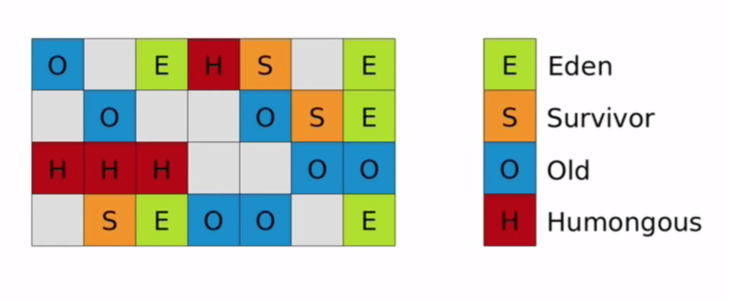
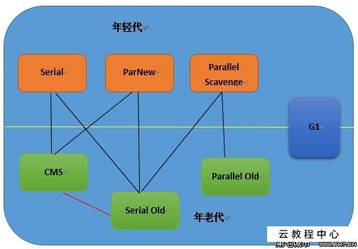

## 1. JVM内存分配和回收

在JVM中，垃圾回收分为两种分别是：**Minor GC**和**Major GC**。

- **Minor GC**：也叫**Young GC**，是指发生在年轻代的垃圾回收，Minor GC比较频繁，回收速度也较快；
- **Major GC**：也叫**Full GC**，一般回收老年代、年轻代、方法区的垃圾，频率较低，比Minor GC速度慢很多。


### 1.1 对象优先在Eden区分配

大多数情况下，对象在新生代Eden区分配内存。当Eden区没有足够的空间时，虚拟机将发起一次Minoc GC。


### 1.2 大对象直接进入老年代

大对象就是需要大量连续空间的对象（比如：字符串、数组），通过设置参数`-XX:PretenureSizeThreshold`可以设置大对象的大小，超过该值的对象会直接进入老年代，**这个参数只在 Serral 和 ParNew 两个收集器下有效**。

大对象直接进入老年代可以避免分配内存时复制操作降低效率。


### 1.3 长期存活的对象将进入老年代

每个对象都在头像中有一个年龄（Age）字段，若对象分配在Eden区，经过第一次Minor GC后仍然存活，且被移入Survivor区，对象年龄变为1，之后在Survivor区中每经过一次Minor GC且不被回收，年龄就会加一，当年龄达到某个阈值（默认15）后，就会被移入老年代。通过`-XX:MaxTenuringThreshold`可以设置阈值。


### 1.4 对象动态年龄判断

当Survivor中一批对象的总大小大于该区域内存大小的一半时，大于这批对象中最大年龄的对象将被移入老年代。

例如Survivor中年龄在 [1, n] 的对象总大小大于该区域一半，那么年龄大于 n 的对象将直接进入老年代。


### 1.5 Minor GC后存活的对象Survivor区放不下

这种情况会把存活的对象部分放入老年代，部分可能还放在Survivor区。


### 1.6 老年代空间分配担保机制

每次Minor GC前虚拟机都会计算下老年代剩余可用空间，如果可用空间小于年轻代所有对象大小之和（包括垃圾对象），会先查看是否设置了`-XX:HandlPrommotionFailure`参数（1.8中默认配置）参数，该参数为false时会进行Full GC，若设置了该参数，会先查看老年代剩余可用空间，是否大于之前Minor GC后移入老年代对象的平均大小，若小于则会进行Full GC，否则进行Minor GC。


## 2. 如何判断对象可以被回收


### 2.1 引用计数法

给对象添加一个引用，当有地方引用它时，计数器加1，引用失效时，计数器减1，当计数器为0时，代表该对象没有任何引用，该方法效率高，但是会有循环引用的问题。


### 2.2 可达性分析算法

可达性分析算法的基本思想就是通过一系列被称为`GC Roots`的对象作为起点，冲这些起点向下搜索，找到的对象都标记为非垃圾对象，没有标记的对象就是垃圾对象。

**可以作为`GC Roots`的对象包括：静态变量、常量引用的对象、虚拟机栈本地变量表中的引用的变量、本地方法栈中的变量引用的对象**。


### 2.3 finalize()最后判断对象是否存活

即使在可达性分析法中不可达的对象，也并非是“非死不可”的，这时候它们暂时处于“缓刑阶段”，要真正宣告一个对象死亡，至少要经历两次标记过程；

**1. 第一次标记进行筛选**

可达性分析法中不可达的对象被第一次标记并且进行一次筛选，筛选的条件是此对象是否有必要执行 finalize 方法。当对象没有覆盖 finalize 方法，或 finalize 方法已经被虚拟机调用过时，虚拟机将这两种情况视为没有必要执行。

**2. 第二次标记**

对象在finalize()方法中只要重新与引用链上的对象建立关联，那么就可以逃脱被回收的命运，否则只能被回收。


## 3. 引用类型

Jdk1.2之后，Java将引用类型分成了**强引用、软引用、弱引用、虚引用**四种。

- **强引用**：平时使用的就是强引用，对于强引用，垃圾回收器绝不会回收；
- **软引用**：被`SoftReference`软引用包裹的称为软引用，正常情况不会被回收，但是GC之后还是没有足够的空间存放新对象，则会把这些软引用的对象回收。软引用可以用来实现内存敏感的高速缓存。
- **弱引用**：被`WeakReference`弱引用包裹的称为弱引用，在GC时，不管是否有足够的空间，软引用都会被回收。
- **虚引用**：如果一个对象仅持有虚引用，那么它就和没有任何引用一样，在任何时候都可能被垃圾回收。


## 4. 判断一个类是无用类

方法区回收的主要是无用类，判断一个类是否是无用类需要满足以下3个条件：

1. 该类的所有实例都被回收；
2. 加载该类的 ClassLoader 已经被回收；
3. 该类对应的 Class 对象没有在任何地方被引用，无法通过反射方法访问到该类。


## 5. 垃圾回收算法

**垃圾回收算法包括：标记清理算法、复制算法、标记整理算法、分代收集算法**。

 


### 5.1 标记-清理算法

该算法分为“标记”和“清除”阶段：首先标记出所有不需要回收的对象，在标记完成后统一回收掉所有没有被标记的对象。它是最基础的收集算法，后续的算法都是对其不足进行改进得到。

这种垃圾收集算法会带来两个明显的问题：**效率问题**和**空间问题（标记清除后会产生大量的空间碎片）**。

  


### 5.2  复制算法

复制算法将内存分为大小相同的两块，每次使用其中一块，当其中一块使用完后，将存活的对象复制到另一块中，然后进行清理，提高了速度。

 


### 5.3 标记-整理算法

根据老年代的特点提出的一种标记算法，标记过程仍然与“标记-清除”算法一样，但后续步骤不是直接对可回收对象回收，而是让所有存活的对象向一端移动，然后直接清理掉端边界以外的内存。

 


### 5.4 分代收集算法

当前虚拟机的垃圾收集都采用分代收集算法，这种算法没有什么新的思想，只是根据对象存活周期的不同将内存分为几块。一般将 java 堆分为新生代和老年代，这样我们就可以根据各个年代的特点选择合适的垃圾收集算法。

**比如在新生代中，每次收集都会有大量对象死去，所以可以选择复制算法，只需要付出少量对象的复制成本就可以完成每次垃圾收集。而老年代的对象存活几率是比较高的，而且没有额外的空间对它进行分配担保，所以我们必须选择“标记-清除”或“标记-整理”算法进行垃圾收集。**


## 6.  垃圾回收器

 


### 6.1 Serial 收集器

Serial（串行）收集器是最基本、历史最悠久的垃圾收集器了。大家看名字就知道这个收集器是一个单线程收集器了。它的 **“单线程”** 的意义不仅仅意味着它只会使用一条垃圾收集线程去完成垃圾收集工作，更重要的是它在进行垃圾收集工作的时候必须暂停其他所有的工作线程（ **"Stop The World"** ），直到它收集结束。

**新生代采用复制算法，老年代采用标记整理算法。**

 

虚拟机的设计者们当然知道 Stop The World 带来的不良用户体验，所以在后续的垃圾收集器设计中停顿时间在不断缩短（仍然还有停顿，寻找最优秀的垃圾收集器的过程仍然在继续）。

但是 Serial 收集器有没有优于其他垃圾收集器的地方呢？当然有，它**简单而高效（与其他收集器的单线程相比）**。Serial 收集器由于没有线程交互的开销，自然可以获得很高的单线程收集效率。Serial 收集器对于运行在 Client 模式下的虚拟机来说是个不错的选择。


### 6.2 ParNew 收集器

**ParNew 收集器其实就是 Serial 收集器的多线程版本，除了使用多线程进行垃圾收集外，其余行为（控制参数、收集算法、回收策略等等）和 Serial 收集器完全一样。**

**新生代采用复制算法，老年代采用标记-整理算法。**

  

它是许多运行在 Server 模式下的虚拟机的首要选择，除了 Serial 收集器外，只有它能与 CMS 收集器（真正意义上的并发收集器，后面会介绍到）配合工作。


### 6.3 Parallel Scavenge 收集器

Parallel Scavenge 收集器也是使用复制算法的多线程收集器，它看上去几乎和 ParNew 都一样。 **那么它有什么特别之处呢？**

**Parallel Scavenge 收集器关注点是吞吐量（高效率的利用 CPU）。CMS 等垃圾收集器的关注点更多的是用户线程的停顿时间（提高用户体验）。所谓吞吐量就是 CPU 中用于运行用户代码的时间与 CPU 总消耗时间的比值。** Parallel Scavenge 收集器提供了很多参数供用户找到最合适的停顿时间或最大吞吐量，如果对于收集器运作不太了解，手工优化存在困难的时候，使用 Parallel Scavenge 收集器配合自适应调节策略，把内存管理优化交给虚拟机去完成也是一个不错的选择。

**新生代采用复制算法，老年代采用标记-整理算法。**

 


### 6.4 CMS 收集器

**CMS（Concurrent Mark Sweep）收集器是一种以获取最短回收停顿时间为目标的收集器。它非常符合在注重用户体验的应用上使用。**

**CMS（Concurrent Mark Sweep）收集器是 HotSpot 虚拟机第一款真正意义上的并发收集器，它第一次实现了让垃圾收集线程与用户线程（基本上）同时工作。**

从名字中的**Mark Sweep**这两个词可以看出，CMS 收集器是一种 **“标记-清除”算法**实现的，它的运作过程相比于前面几种垃圾收集器来说更加复杂一些。整个过程分为四个步骤：

- **初始标记：** 暂停所有的其他线程，并记录下直接与 root 相连的对象，速度很快 ；
- **并发标记：** 同时开启 GC 和用户线程，用一个闭包结构去记录可达对象。但在这个阶段结束，这个闭包结构并不能保证包含当前所有的可达对象。因为用户线程可能会不断的更新引用域，所以 GC 线程无法保证可达性分析的实时性。所以这个算法里会跟踪记录这些发生引用更新的地方。
- **重新标记：** 重新标记阶段就是为了修正并发标记期间因为用户程序继续运行而导致标记产生变动的那一部分对象的标记记录，这个阶段的停顿时间一般会比初始标记阶段的时间稍长，远远比并发标记阶段时间短。
- **并发清除：** 开启用户线程，同时 GC 线程开始对未标记的区域做清扫。

 

从它的名字就可以看出它是一款优秀的垃圾收集器，主要优点：**并发收集、低停顿**。但是它有下面三个明显的缺点：

- **对 CPU 资源敏感；**
- **无法处理浮动垃圾（即并发清理阶段产生的新垃圾）；**
- **它使用的回收算法-“标记-清除”算法会导致收集结束时会有大量空间碎片产生，可以通过参数配置，在收集结束后整理；**
- **执行过程中的不确定性，会存在上一次垃圾回收还没执行完，然后垃圾回收又被触 发的情况，特别是在并发标记和并发清理阶段会出现，一边回收，系统一边运行，也许没回 收完就再次触发full gc，也就是"concurrent mode failure"，此时会进入stop the world，用serial old垃圾收集器来回收**。

```java
// CMS参数：
1. -XX:+UseConcMarkSweepGC; // 启用CMS    
2. -XX:ConcGCThreads; //并发的GC线程数 
3. -XX:+UseCMSCompactAtFullCollection; // FullGC之后做压缩整理（减少碎片） 
4. -XX:CMSFullGCsBeforeCompaction; // 多少次FullGC之后压缩一次，默认是0，代表每次 FullGC后都会压缩一次 
5. -XX:CMSInitiatingOccupancyFraction; //当老年代使用达到该比例时会触发FullGC（默认 是92，这是百分比）
// 只使用设定的回收阈值(- XX:CMSInitiatingOccupancyFraction设定的值)，如果不指定，JVM仅在第一次使用设定 值，后续则会自动调整
6. -XX:+UseCMSInitiatingOccupancyOnly;  
// 在CMS GC前启动一次minor gc，目的在于减少 老年代对年轻代的引用，降低CMS GC的标记阶段时的开销，一般CMS的GC耗时 80%都在 remark阶段  
7. -XX:+CMSScavengeBeforeRemark;   
```


### 6.5 G1 收集器

**G1 (Garbage-First) 是一款面向服务器的垃圾收集器,主要针对配备多颗处理器及大容量内存的机器. 以极高概率满足 GC 停顿时间要求的同时,还具备高吞吐量性能特征.**

G1 收集器被视为 JDK1.7 中 HotSpot 虚拟机的一个重要进化特征。它具备一下特点：

- **并行与并发**：G1 能充分利用 CPU、多核环境下的硬件优势，使用多个 CPU（CPU 或者 CPU 核心）来缩短 Stop-The-World 停顿时间。部分其他收集器原本需要停顿 Java 线程执行的 GC 动作，G1 收集器仍然可以通过并发的方式让 java 程序继续执行。
- **分代收集**：虽然 G1 可以不需要其他收集器配合就能独立管理整个 GC 堆，但是还是保留了分代的概念。
- **空间整合**：与 CMS 的“标记--清理”算法不同，G1 从整体来看是基于“标记整理”算法实现的收集器；从局部上来看是基于“复制”算法实现的。
- **可预测的停顿**：这是 G1 相对于 CMS 的另一个大优势，降低停顿时间是 G1 和 CMS 共同的关注点，但 G1 除了追求低停顿外，还能建立可预测的停顿时间模型，能让使用者明确指定在一个长度为 M 毫秒的时间片段内。

 

G1 收集器将堆划分为许多大小相等的独立区域（Region），JVM最多可以有2048个Region，一般Region大小为堆的大小除以2048，可以通过参数`-XX:G1HeapRegionSize`指定Region的大小。

G1 收集器保留了年轻代和老年代的概念，默认年轻代占堆内存的5%，可以通过参数`-XX:G1NewSizeParent`设置年轻代的占比，在系统运行期间，JVM会不断给年轻代增加更多的Region，默认最多增加到60%，可以通过参数`-XX:G1MaxNewSizeParent`来设置占比。

G1 收集器对于年轻代的对象何时转移到老年代和CMS一致，但是对于大对象，G1 提供了专门的**Humongous**区域存储，在G1 收集器中对于大对象的判断是，超过Region的50%，只要超过50%，便会被认为是大对象，放入Humongous区域，较大的对象会横跨多个Region。大对象放入Humongous区，节省了老年代空间，减少了因为老年代空间不足产生的 GC。

**G1 收集器采用的复制算法，将一个Region存活的对象复制到另一个Region中。**

G1 收集器的一次 GC 运作过程大致分为以下几个步骤：

- **初始标记**：暂停所有的其他线程，并记录下 gc roots 直接能引用的对象，速度很快 ；
- **并发标记**：同CMS并发标记；
- **最终标记**：同CMS的重新标记；
- **筛选回收**：筛选回收阶段首先对各个Region的回收价值和成本进行排序，根据用户所期望的GC停顿时间(可以用JVM参数 -XX:MaxGCPauseMillis指定)来制定回收计划，比如说老年代此时有1000个Region都满了，但是因为根据预期停顿时间，本次垃圾回收可能只能停顿200毫秒，那么通过之前回收成本计算得知，可能回收其中800个Region刚好需要200ms，那么就只会回收800个Region，尽量把GC导致的停顿时间控制在
  我们指定的范围内。

G1收集器在后台维护了一个优先列表，每次根据允许的收集时间，优先选择回收价值最大的Region(这也就是它的名字Garbage-First的由来)，比如一个Region花200ms能回收10M垃圾，另外一个Region花50ms能回收20M垃圾，在回收时间有限情况下，G1当然会优先选择后面这个Region回收。

**G1 垃圾收集分类**

- **Young GC**：在 G1 收集器中，Eden区满了之后并一定会触发Young GC，G1 会计算现在Eden区回收大概所需的时间，若回收时间远小于参数`-XX:MaxGCPauseMils`设定的值，那么会先增加年轻代的Region，直到下一次触发Young GC，若所需时间接近设置的参数，则会进行 GC。
- **Mixed GC**：当老年代占比达到参数`-XX:InitiatingHeapOccuapncyPercen`设定的值触发，回收年轻代、部分老年代（根据期望 GC 停顿时间决定回收数量）和大对象区。当发现没有足够的空间复制对象时，会触发 Full GC。正常情况下会先进行 Mixed GC。

- **Full GC**：停止系统程序，然后采用单线程进行标记、清理和压缩整理。


```java
// G1收集器的一些参数
// 使用G1收集器
-XX:+UseG1GC; 
// 指定GC工作的线程数量
-XX:ParallelGCThreads;
// 指定分区大小(1MB~32MB，且必须是2的幂)，默认将整堆划分为2048个分区
-XX:G1HeapRegionSize;
// 目标暂停时间(默认200ms)
-XX:MaxGCPauseMillis;
// 新生代内存初始空间(默认整堆5%)
-XX:G1NewSizePercent;
// 新生代内存最大空间
-XX:G1MaxNewSizePercent;
// Survivor区的填充容量(默认50%)，Survivor区域里的一批对象(年龄1+年龄2+年龄n的多个年龄对象)总和超过了Survivor区域的50%，此时就会把年龄n(含)以上的对象都放入老年代
-XX:TargetSurvivorRatio;
// 最大年龄阈值(默认15)
-XX:MaxTenuringThreshold;
// 老年代占用空间达到整堆内存阈值(默认45%)，则执行新生代和老年代的混合收集(MixedGC)，比如我们之前说的堆默认有2048个region，如果有接近1000个region都是老年代的region，则可能就要触发MixedGC了
-XX:InitiatingHeapOccupancyPercent;
// gc过程中空出来的region是否充足阈值，在混合回收的时候，对Region回收都是基于复制算法进行的，都是把要回收的Region里的存活对象放入其他Region，然后这个Region中的垃圾对象全部清理掉，这样的话在回收过程就会不断空出来新的Region，一旦空闲出来的Region数量达到了堆内存的5%，此时就会立即停止混合回收，意味着本次混合回收就结束了,(默认5%); 。
-XX:G1HeapWastePercent;
// region中的存活对象低于这个值时才会回收(默认85%)，该 region 如果超过这个值，存活对象过多，回收的的意义不大。
-XX:G1MixedGCLiveThresholdPercent;
// 在一次回收过程中指定做几次筛选回收(默认8次)，在最后一个筛选回收阶段可以回收一会，然后暂停回收，恢复系统运行，一会再开始回收，这样可以让系统不至于单次停顿时间过长。
-XX:G1MixedGCCountTarget;
```


## 7. 垃圾回收器选择

1. 优先调整堆的大小让服务器自己来选择；
2. 如果内存小于100M，使用串行收集器；
3. 如果是单核，并且没有停顿时间的要求，串行或JVM自己选择；
4. 如果允许停顿时间超过1秒，选择并行或者JVM自己选；
5. 如果响应时间最重要，并且不能超过1秒，使用并发收集器；

 