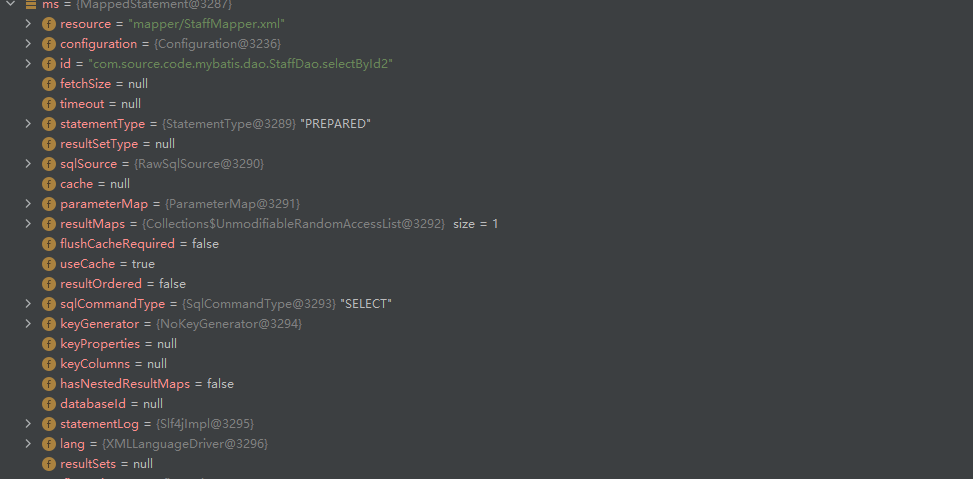
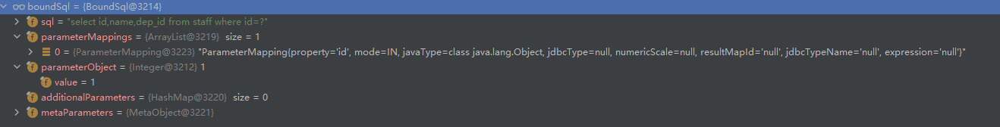

[TOC]


# mybatis缓存及原理

### 一. 一级缓存

在mybatis中，一级缓存是默认sqlSession级别的，默认开启，另一种级别是statement。

命中缓存的条件如下：

- 查询条件相同；
- 中间没有执行过更新操作(增/删/改)；


生成mapper的代理

```java
// MapperProxy.java
public Object invoke(Object proxy, Method method, Object[] args) throws Throwable {
    try {
        if (Object.class.equals(method.getDeclaringClass())) {
            return method.invoke(this, args);
        } else if (isDefaultMethod(method)) {
            return invokeDefaultMethod(proxy, method, args);
        }
    } catch (Throwable t) {
        throw ExceptionUtil.unwrapThrowable(t);
    }
    // 将方法包装成MapperMethod
    final MapperMethod mapperMethod = cachedMapperMethod(method);
    return mapperMethod.execute(sqlSession, args);
}
```


### 1. execute()

```java
// MapperMethod.java
public Object execute(SqlSession sqlSession, Object[] args) {
    Object result;
    // 判断执行操作的类型，以查询为例
    switch (command.getType()) {
        case INSERT: {
            Object param = method.convertArgsToSqlCommandParam(args);
            result = rowCountResult(sqlSession.insert(command.getName(), param));
            break;
        }
        case UPDATE: {
            Object param = method.convertArgsToSqlCommandParam(args);
            result = rowCountResult(sqlSession.update(command.getName(), param));
            break;
        }
        case DELETE: {
            Object param = method.convertArgsToSqlCommandParam(args);
            result = rowCountResult(sqlSession.delete(command.getName(), param));
            break;
        }
        case SELECT:
            if (method.returnsVoid() && method.hasResultHandler()) {
                executeWithResultHandler(sqlSession, args);
                result = null;
            } else if (method.returnsMany()) {
                result = executeForMany(sqlSession, args);
            } else if (method.returnsMap()) {
                result = executeForMap(sqlSession, args);
            } else if (method.returnsCursor()) {
                result = executeForCursor(sqlSession, args);
            } else {
                // 将传入的参数解析为param，一个参数的返回数组，多个参数的放回map
                Object param = method.convertArgsToSqlCommandParam(args);
                // 执行查询
                result = sqlSession.selectOne(command.getName(), param);
            }
            break;
        case FLUSH:
            result = sqlSession.flushStatements();
            break;
        default:
            throw new BindingException("Unknown execution method for: " + command.getName());
    }
    if (result == null && method.getReturnType().isPrimitive() && !method.returnsVoid()) {
        throw new BindingException("Mapper method '" + command.getName() 
                                   + " attempted to return null from a method with a primitive return type (" + method.getReturnType() + ").");
    }
    return result;
}
```


### 2. selectList()

> #### selectOne()

`selectOne()`在sqlSession中，查询方法最终都会走到`selectList()`中。

```java
public <T> T selectOne(String statement, Object parameter) {
    // Popular vote was to return null on 0 results and throw exception on too many.
    List<T> list = this.<T>selectList(statement, parameter);
    if (list.size() == 1) {
        return list.get(0);
    } else if (list.size() > 1) {
        throw new TooManyResultsException("Expected one result (or null) to be returned by selectOne(), but found: " + list.size());
    } else {
        return null;
    }
}
```


> ### selectList()

```java
// DefaultSqlSession.java
public <E> List<E> selectList(String statement, Object parameter, RowBounds rowBounds) {
    try {
        // 获取MappedStatement
        MappedStatement ms = configuration.getMappedStatement(statement);
        // wrapCollection(parameter)：将参数包装成集合
        return executor.query(ms, wrapCollection(parameter), rowBounds, Executor.NO_RESULT_HANDLER);
    } catch (Exception e) {
        throw ExceptionFactory.wrapException("Error querying database.  Cause: " + e, e);
    } finally {
        ErrorContext.instance().reset();
    }
```

 

 


### 3. 执行查询

```java
@Override
public <E> List<E> query(MappedStatement ms, Object parameterObject, RowBounds rowBounds, ResultHandler resultHandler) throws SQLException {
    // 绑定sql：
    BoundSql boundSql = ms.getBoundSql(parameterObject);
    // 构建缓存的key
    CacheKey key = createCacheKey(ms, parameterObject, rowBounds, boundSql);
    return query(ms, parameterObject, rowBounds, resultHandler, key, boundSql);
}
```




```java
// CachingExecutor.java
public <E> List<E> query(MappedStatement ms, Object parameterObject, RowBounds rowBounds, ResultHandler resultHandler, CacheKey key, BoundSql boundSql)
    throws SQLException {
    // 二级缓存
    Cache cache = ms.getCache();
    if (cache != null) {
        flushCacheIfRequired(ms);
        if (ms.isUseCache() && resultHandler == null) {
            ensureNoOutParams(ms, boundSql);
            @SuppressWarnings("unchecked")
            List<E> list = (List<E>) tcm.getObject(cache, key);
            if (list == null) {
                list = delegate.<E> query(ms, parameterObject, rowBounds, resultHandler, key, boundSql);
                tcm.putObject(cache, key, list); // issue #578 and #116
            }
            return list;
        }
    }
    return delegate.<E> query(ms, parameterObject, rowBounds, resultHandler, key, boundSql);
}
```


```java
// 
public <E> List<E> query(MappedStatement ms, Object parameter, RowBounds rowBounds, ResultHandler resultHandler, CacheKey key, BoundSql boundSql) throws SQLException {
    ErrorContext.instance().resource(ms.getResource()).activity("executing a query").object(ms.getId());
    if (closed) {
        throw new ExecutorException("Executor was closed.");
    }
    // 
    if (queryStack == 0 && ms.isFlushCacheRequired()) {
        clearLocalCache();
    }
    List<E> list;
    try {
        queryStack++;
        list = resultHandler == null ? (List<E>) localCache.getObject(key) : null;
        if (list != null) {
            handleLocallyCachedOutputParameters(ms, key, parameter, boundSql);
        } else {
            list = queryFromDatabase(ms, parameter, rowBounds, resultHandler, key, boundSql);
        }
    } finally {
        queryStack--;
    }
    if (queryStack == 0) {
        for (DeferredLoad deferredLoad : deferredLoads) {
            deferredLoad.load();
        }
        // issue #601
        deferredLoads.clear();
        if (configuration.getLocalCacheScope() == LocalCacheScope.STATEMENT) {
            // issue #482
            clearLocalCache();
        }
    }
    return list;
}
```

