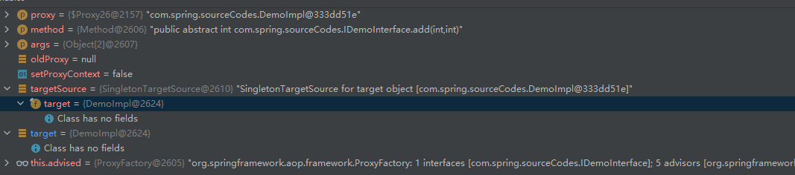
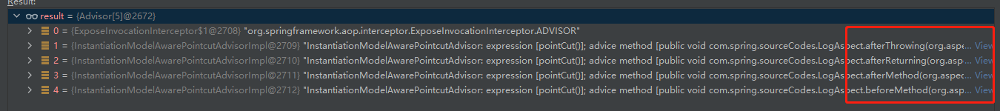
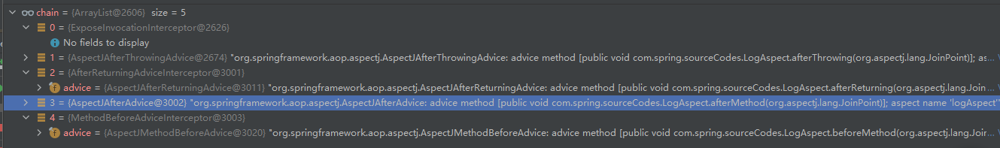
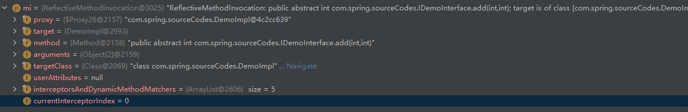

# SpringAOP（二）

被代理类方法的执行过程。

```java
// JdkDynamicAopProxy.java
public Object invoke(Object proxy, Method method, Object[] args) throws Throwable {
    Object oldProxy = null;
    boolean setProxyContext = false;

    // 获取被代理的对象
    TargetSource targetSource = this.advised.targetSource;
    Object target = null;

    try {
        // 是不是equals()方法
        if (!this.equalsDefined && AopUtils.isEqualsMethod(method)) {
            // The target does not implement the equals(Object) method itself.
            return equals(args[0]);
        }
        // 是不是hashCde()方法
        else if (!this.hashCodeDefined && AopUtils.isHashCodeMethod(method)) {
            // The target does not implement the hashCode() method itself.
            return hashCode();
        }
        // 判断接口类型是不是DecoratingProxy
        else if (method.getDeclaringClass() == DecoratingProxy.class) {
            // There is only getDecoratedClass() declared -> dispatch to proxy config.
            return AopProxyUtils.ultimateTargetClass(this.advised);
        }
        else if (!this.advised.opaque && method.getDeclaringClass().isInterface() &&
                 method.getDeclaringClass().isAssignableFrom(Advised.class)) {
            // Service invocations on ProxyConfig with the proxy config...
            return AopUtils.invokeJoinpointUsingReflection(this.advised, method, args);
        }

        Object retVal;

        if (this.advised.exposeProxy) {
            // Make invocation available if necessary.
            oldProxy = AopContext.setCurrentProxy(proxy);
            setProxyContext = true;
        }

        // Get as late as possible to minimize the time we "own" the target,
        // in case it comes from a pool.
        target = targetSource.getTarget();
        Class<?> targetClass = (target != null ? target.getClass() : null);

        // Get the interception chain for this method.
        List<Object> chain = this.advised.getInterceptorsAndDynamicInterceptionAdvice(method, targetClass);

        // Check whether we have any advice. If we don't, we can fallback on direct
        // reflective invocation of the target, and avoid creating a MethodInvocation.
        if (chain.isEmpty()) {
            // We can skip creating a MethodInvocation: just invoke the target directly
            // Note that the final invoker must be an InvokerInterceptor so we know it does
            // nothing but a reflective operation on the target, and no hot swapping or fancy proxying.
            Object[] argsToUse = AopProxyUtils.adaptArgumentsIfNecessary(method, args);
            retVal = AopUtils.invokeJoinpointUsingReflection(target, method, argsToUse);
        }
        else {
            // 创建方法调用
            MethodInvocation invocation =
                new ReflectiveMethodInvocation(proxy, target, method, args, targetClass, chain);
            // 责任链的+递归执行连接点方法
            retVal = invocation.proceed();
        }

        // Massage return value if necessary.
        Class<?> returnType = method.getReturnType();
        if (retVal != null && retVal == target &&
            returnType != Object.class && returnType.isInstance(proxy) &&
            !RawTargetAccess.class.isAssignableFrom(method.getDeclaringClass())) {
            // Special case: it returned "this" and the return type of the method
            // is type-compatible. Note that we can't help if the target sets
            // a reference to itself in another returned object.
            retVal = proxy;
        }
        else if (retVal == null && returnType != Void.TYPE && returnType.isPrimitive()) {
            throw new AopInvocationException(
                "Null return value from advice does not match primitive return type for: " + method);
        }
        return retVal;
    }
    finally {
        if (target != null && !targetSource.isStatic()) {
            // Must have come from TargetSource.
            targetSource.releaseTarget(target);
        }
        if (setProxyContext) {
            // Restore old proxy.
            AopContext.setCurrentProxy(oldProxy);
        }
    }
}
```





#### 1. getInterceptorsAndDynamicInterceptionAdvice()

获取方法拦截器列表

```java
// AdvisedSupport.java
public List<Object> getInterceptorsAndDynamicInterceptionAdvice(Method method, @Nullable Class<?> targetClass) {
    // 只有两个变量存储method和method的hashCode
    MethodCacheKey cacheKey = new MethodCacheKey(method);
    List<Object> cached = this.methodCache.get(cacheKey);
    if (cached == null) {
        cached = this.advisorChainFactory.getInterceptorsAndDynamicInterceptionAdvice(
            this, method, targetClass);
        this.methodCache.put(cacheKey, cached);
    }
    return cached;
}
```


> MethodCacheKey

```java
public MethodCacheKey(Method method) {
    this.method = method;
    this.hashCode = method.hashCode();
}
```


#### 2. getInterceptorsAndDynamicInterceptionAdvice()

```java
// DefaultAdvisorChainFactory.java
public List<Object> getInterceptorsAndDynamicInterceptionAdvice(
    Advised config, Method method, @Nullable Class<?> targetClass) {

    // This is somewhat tricky... We have to process introductions first,
    // but we need to preserve order in the ultimate list.
    AdvisorAdapterRegistry registry = GlobalAdvisorAdapterRegistry.getInstance();
    // 获取增强器中的所有通知
    Advisor[] advisors = config.getAdvisors();
    // 拦截器列表
    List<Object> interceptorList = new ArrayList<>(advisors.length);
    // 被代理bean的class
    Class<?> actualClass = (targetClass != null ? targetClass : method.getDeclaringClass());
    Boolean hasIntroductions = null;

    for (Advisor advisor : advisors) {
        if (advisor instanceof PointcutAdvisor) {
            // Add it conditionally.
            PointcutAdvisor pointcutAdvisor = (PointcutAdvisor) advisor;
            // 是否经过筛选（即增强器是否对被代理增强）或者class与被代理类是否匹配
            if (config.isPreFiltered() || pointcutAdvisor.getPointcut().getClassFilter().matches(actualClass)) {
                // 获取方法匹配器
                MethodMatcher mm = pointcutAdvisor.getPointcut().getMethodMatcher();
                boolean match;
                if (mm instanceof IntroductionAwareMethodMatcher) {
                    if (hasIntroductions == null) {
                        hasIntroductions = hasMatchingIntroductions(advisors, actualClass);
                    }
                    match = ((IntroductionAwareMethodMatcher) mm).matches(method, actualClass, hasIntroductions);
                }
                else {
                    // 直接返回true?
                    match = mm.matches(method, actualClass);
                }
                if (match) {
                    MethodInterceptor[] interceptors = registry.getInterceptors(advisor);
                    // 是不是动态的
                    if (mm.isRuntime()) {
                        // Creating a new object instance in the getInterceptors() method
                        // isn't a problem as we normally cache created chains.
                        for (MethodInterceptor interceptor : interceptors) {
                            interceptorList.add(new InterceptorAndDynamicMethodMatcher(interceptor, mm));
                        }
                    }
                    else {
                        interceptorList.addAll(Arrays.asList(interceptors));
                    }
                }
            }
        }
        else if (advisor instanceof IntroductionAdvisor) {
            IntroductionAdvisor ia = (IntroductionAdvisor) advisor;
            if (config.isPreFiltered() || ia.getClassFilter().matches(actualClass)) {
                Interceptor[] interceptors = registry.getInterceptors(advisor);
                interceptorList.addAll(Arrays.asList(interceptors));
            }
        }
        else {
            Interceptor[] interceptors = registry.getInterceptors(advisor);
            interceptorList.addAll(Arrays.asList(interceptors));
        }
    }

    return interceptorList;
}
```







> #### matches()

```java
public boolean matches(Method method, Class<?> targetClass, boolean hasIntroductions) {
    // 检查切入点是否匹配成功，惰性解析切点表达式
    obtainPointcutExpression();
    ShadowMatch shadowMatch = getTargetShadowMatch(method, targetClass);

    // Special handling for this, target, @this, @target, @annotation
    // in Spring - we can optimize since we know we have exactly this class,
    // and there will never be matching subclass at runtime.
    if (shadowMatch.alwaysMatches()) {
        return true;
    }
    else if (shadowMatch.neverMatches()) {
        return false;
    }
    else {
        // the maybe case
        if (hasIntroductions) {
            return true;
        }
        // A match test returned maybe - if there are any subtype sensitive variables
        // involved in the test (this, target, at_this, at_target, at_annotation) then
        // we say this is not a match as in Spring there will never be a different
        // runtime subtype.
        RuntimeTestWalker walker = getRuntimeTestWalker(shadowMatch);
        return (!walker.testsSubtypeSensitiveVars() || walker.testTargetInstanceOfResidue(targetClass));
    }
}
```


#### 3. proceed()

```java
public Object proceed() throws Throwable {
    // We start with an index of -1 and increment early.
    if (this.currentInterceptorIndex == this.interceptorsAndDynamicMethodMatchers.size() - 1) {
        return invokeJoinpoint();
    }

    Object interceptorOrInterceptionAdvice =
        this.interceptorsAndDynamicMethodMatchers.get(++this.currentInterceptorIndex);
    if (interceptorOrInterceptionAdvice instanceof InterceptorAndDynamicMethodMatcher) {
        // Evaluate dynamic method matcher here: static part will already have
        // been evaluated and found to match.
        InterceptorAndDynamicMethodMatcher dm =
            (InterceptorAndDynamicMethodMatcher) interceptorOrInterceptionAdvice;
        Class<?> targetClass = (this.targetClass != null ? this.targetClass : this.method.getDeclaringClass());
        if (dm.methodMatcher.matches(this.method, targetClass, this.arguments)) {
            return dm.interceptor.invoke(this);
        }
        else {
            // Dynamic matching failed.
            // Skip this interceptor and invoke the next in the chain.
            return proceed();
        }
    }
    else {
        // It's an interceptor, so we just invoke it: The pointcut will have
        // been evaluated statically before this object was constructed.
        return ((MethodInterceptor) interceptorOrInterceptionAdvice).invoke(this);
    }
}
```


> invoke（）

```java
// ExposeInvocationInterceptor.java
public Object invoke(MethodInvocation mi) throws Throwable {
    // invocation:ThreadLocal中
    MethodInvocation oldInvocation = invocation.get();
    invocation.set(mi);
    try {
        // 返回到外面的proceed()
        return mi.proceed();
    }
    finally {
        invocation.set(oldInvocation);
    }
}
```

