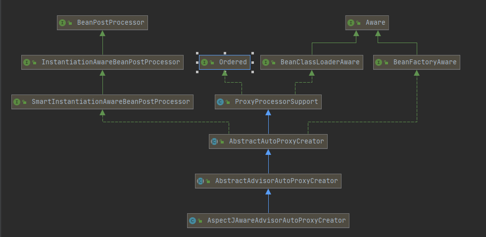

[TOC] 


# SpringAOP源码


## 一 前言

看过SpringIOC源码的应该知道，代理对象是通过后置处理器`InstantiationAwareBeanPostProcessor`生成的。

```java
// AbstractAutowireCapableBeanFactory.java
protected Object createBean(String beanName, RootBeanDefinition mbd, @Nullable Object[] args)
    throws BeanCreationException {

    // ..................
    try {
        // Give BeanPostProcessors a chance to return a proxy instead of the target bean instance.
        // 给后置处理一个返回代理而不是目标bean实例的机会。
        Object bean = resolveBeforeInstantiation(beanName, mbdToUse);
        if (bean != null) {
            return bean;
        }
    }
    // ............
}

protected Object resolveBeforeInstantiation(String beanName, RootBeanDefinition mbd) {
    Object bean = null;
    if (!Boolean.FALSE.equals(mbd.beforeInstantiationResolved)) {
        // Make sure bean class is actually resolved at this point.
        if (!mbd.isSynthetic() && hasInstantiationAwareBeanPostProcessors()) {
            Class<?> targetType = determineTargetType(beanName, mbd);
            if (targetType != null) {
                bean = applyBeanPostProcessorsBeforeInstantiation(targetType, beanName);
                if (bean != null) {
                    bean = applyBeanPostProcessorsAfterInitialization(bean, beanName);
                }
            }
        }
        mbd.beforeInstantiationResolved = (bean != null);
    }
    return bean;
}
```

查看`InstantiationAwareBeanPostProcessor`接口的实现，可以看到其中有一个`AbstractAutoProxyCreator`的实现类，根据名字可以推断出，这是一个代理创建器。


可以先看下该类的注释：

> {@link org.springframework.beans.factory.config.BeanPostProcessor} implementation that wraps each eligible bean with an AOP proxy, delegating to specified interceptors  before invoking the bean itself.

翻译后：

> 实现了BeanPostProcessor，用一个AOP代理包装每个合格的bean，在调用bean本身之前委托给指定的拦截器。

可以基本确定，代理是在该类或子类中创建的。


本文是基于注解的方式分析的，所以先看下`AspectJAwareAdvisorAutoProxyCreator`的类关系图。




可以看到`AbstractAutoProxyCreator`实现了`BeanFactoryAware`接口，在该接口中只有一个`setBeanFactory(BeanFactory beanFactory)`方法。

下面看下`AbstractAutoProxyCreator`在`setBeanFactory`方法中做了什么。

```java
// AbstractAutoProxyCreator.java
@Override
public void setBeanFactory(BeanFactory beanFactory) {
    // 给beanFactory赋值
    this.beanFactory = beanFactory;
}
```

可以看到`AbstractAutoProxyCreator`类中只是设置beanFactory，而在其子类`AbstractAdvisorAutoProxyCreator`重写了`setBeanFactory`方法。

```java
// AbstractAdvisorAutoProxyCreator.java
@Override
public void setBeanFactory(BeanFactory beanFactory) {
    // 调用父类setBeanFactory()方法
    super.setBeanFactory(beanFactory);
    if (!(beanFactory instanceof ConfigurableListableBeanFactory)) {
        throw new IllegalArgumentException(
            "AdvisorAutoProxyCreator requires a ConfigurableListableBeanFactory: " + beanFactory);
    }
    // 初始化bean工厂
    initBeanFactory((ConfigurableListableBeanFactory) beanFactory);
}
```

而`initBeanFactory()`方法又被子类`AnnotationAwareAspectJAutoProxyCreator`重写了，该方法主要是创建了AOP的增强器，以`AspectJ`注入。

```java
// AnnotationAwareAspectJAutoProxyCreator.java
@Override
protected void initBeanFactory(ConfigurableListableBeanFactory beanFactory) {
    super.initBeanFactory(beanFactory);
    if (this.aspectJAdvisorFactory == null) {
        this.aspectJAdvisorFactory = new ReflectiveAspectJAdvisorFactory(beanFactory);
    }
    this.aspectJAdvisorsBuilder =
        new BeanFactoryAspectJAdvisorsBuilderAdapter(beanFactory, this.aspectJAdvisorFactory);
}
```


同时`AbstractAutoProxyCreator`也实现了`BeanPostProcessor`，在`BeanPostProcessor`接口中只有两个方法，分别是`postProcessBeforeInitialization`()和`postProcessAfterInitialization()`，用于bean初始化前后操作bean。

先看下`postProcessBeforeInitialization()`方法做了什么。

```java
// AbstractAutoProxyCreator.java
public Object postProcessBeforeInstantiation(Class<?> beanClass, String beanName) {
    // 判断是否是FactoryBean，若是就为名字加上&前缀
    Object cacheKey = getCacheKey(beanClass, beanName);

    // beanName不为空或者targetSourcedBeans缓存中不包含该beanName
    if (!StringUtils.hasLength(beanName) || !this.targetSourcedBeans.contains(beanName)) {
        // 是否被代理过
        if (this.advisedBeans.containsKey(cacheKey)) {
            return null;
        }
        // 如果是基础类或指定类型的bean，表示不需要被代理，shouldSkip()方法被重写了，与IOC中的不一样
        // 基础类：Advice/Pointcut/Advisor/AopInfrastructureBean
        if (isInfrastructureClass(beanClass) || shouldSkip(beanClass, beanName)) {
            // 放入缓存
            this.advisedBeans.put(cacheKey, Boolean.FALSE);
            return null;
        }
    }

    // 获取自定义的TargetSource,若有的话，用自定义的TargetSource创建代理。
    // TargetSource：被代理对象的来源
    TargetSource targetSource = getCustomTargetSource(beanClass, beanName);
    if (targetSource != null) {
        if (StringUtils.hasLength(beanName)) {
            this.targetSourcedBeans.add(beanName);
        }
        // 获取增强器
        Object[] specificInterceptors = getAdvicesAndAdvisorsForBean(beanClass, beanName, targetSource);
        // 创建代理
        Object proxy = createProxy(beanClass, beanName, specificInterceptors, targetSource);
        this.proxyTypes.put(cacheKey, proxy.getClass());
        return proxy;
    }

    return null;
}
```


> ### 接下来，用一个简单的例子逐步看看Spring中是怎么生成代理的。

新建一个接口

```java
public interface IDemoInterface {
     int add(int numA, int numB);
}
```

创建接口的实现类

```java
public class DemoImpl implements IDemoInterface {
    
    public int add(int numA, int numB) {
        return numA + numB;
    }
}
```

创建一个切面类

```java
@Aspect
public class LogAspect {

    @Pointcut("execution(* com.spring.sourceCodes.DemoImpl.*(..))")
    public void pointCut(){}

    @Before(value = "pointCut()")
    public void beforeMethod(JoinPoint joinPoint){
        System.out.println(joinPoint.toString());
        System.out.println("===============[beforeMethod invoke!]====================");
    }

    @After(value = "pointCut()")
    public void afterMethod(JoinPoint joinPoint){
        System.out.println(joinPoint.toString());
        System.out.println("===============[afterMethod invoke!]====================");
    }

    @Around(value = "pointCut()")
    public void aroundMethod(JoinPoint joinPoint){
        System.out.println(joinPoint.toString());
        System.out.println("===============[aroundMethod invoke!]====================");
    }
}
```

创建配置类，将bean注入到容器中

```java
@Configuration
@EnableAspectJAutoProxy
public class DemoConfig {

    @Bean
    public IDemoInterface demoInterface() {
        return new DemoImpl();
    }

    @Bean
    public LogAspect logAspect(){
        return new LogAspect();
    }
}
```

测试启动类

```java
public class DemoMain {

    public static void main(String[] args) {
        AnnotationConfigApplicationContext context = new AnnotationConfigApplicationContext(DemoConfig.class);
        IDemoInterface demoInterface = (IDemoInterface) context.getBean("demoInterface");
      System.out.println(demoInterface.add(5, 6));
    }
}
```


可以看到在`postProcessBeforeInstantiation()`方法中，并没有走到`createProxy()`方法。

而且该方法其他返回都是null，所以在`createBean()`方法中执行后置处理的时候并不会执行`postProcessAfterInitialization()`方法。


但是在实例化bean的时候，重新调用一次`postProcessAfterInitialization()`方法，此时将代用到`AbstractAutoProxyCreator`中的after方法。

```java
// AbstractAutowireCapableBeanFactory.java
protected Object initializeBean(final String beanName, final Object bean, @Nullable RootBeanDefinition mbd) {
    // 省略
    if (mbd == null || !mbd.isSynthetic()) {
        wrappedBean = applyBeanPostProcessorsAfterInitialization(wrappedBean, beanName);
    }
    return wrappedBean;
}
```


接下来先看看`postProcessBeforeInstantiation()`方法做了什么。


## 二 解析@AspectJ

### 1. 查找候选的增强器：findCandidateAdvisors()

> #### shouldSkip()方法被子类AspectJAwareAdvisorAutoProxyCreator重写，在这里会查找增强器

```java
// AspectJAwareAdvisorAutoProxyCreator.java
protected boolean shouldSkip(Class<?> beanClass, String beanName) {
    // 查找增强器。
    List<Advisor> candidateAdvisors = findCandidateAdvisors();
    for (Advisor advisor : candidateAdvisors) {
        if (advisor instanceof AspectJPointcutAdvisor &&
            ((AspectJPointcutAdvisor) advisor).getAspectName().equals(beanName)) {
            return true;
        }
    }
    return super.shouldSkip(beanClass, beanName);
}
```


> #### 查找增强器：findCandidateAdvisors()

```java
// AnnotationAwareAspectJAutoProxyCreator.java	
@Override
protected List<Advisor> findCandidateAdvisors() {
    // ================ 1.1 findCandidateAdvisors() ================
    // 调用父类的获取增强器方法
    List<Advisor> advisors = super.findCandidateAdvisors();
    if (this.aspectJAdvisorsBuilder != null) {
        // ================ 1.2 buildAspectJAdvisors() ==================
        // 解析@AspectJ注解，获取增强器
        advisors.addAll(this.aspectJAdvisorsBuilder.buildAspectJAdvisors());
    }
    return advisors;
}

// AbstractAdvisorAutoProxyCreator.java
protected List<Advisor> findCandidateAdvisors() {
    Assert.state(this.advisorRetrievalHelper != null, "No BeanFactoryAdvisorRetrievalHelper available");
    return this.advisorRetrievalHelper.findAdvisorBeans();
}
```


#### 1.1 获取合适的增强器：findAdvisorBeans()

```java
// BeanFactoryAdvisorRetrievalHelper.java
public List<Advisor> findAdvisorBeans() {
    // 获取缓存中的增强器name
    String[] advisorNames = this.cachedAdvisorBeanNames;
    if (advisorNames == null) {
        // 1. 获取实现Advisor的增强器名称
        advisorNames = BeanFactoryUtils.beanNamesForTypeIncludingAncestors(
            this.beanFactory, Advisor.class, true, false);
        this.cachedAdvisorBeanNames = advisorNames;
    }
    if (advisorNames.length == 0) {
        return new ArrayList<>();
    }

    List<Advisor> advisors = new ArrayList<>();
    for (String name : advisorNames) {
        if (isEligibleBean(name)) {
            // 忽略创建中增强器
            if (this.beanFactory.isCurrentlyInCreation(name)) {
                if (logger.isTraceEnabled()) {
                    logger.trace("Skipping currently created advisor '" + name + "'");
                }
            }
            else {
                try {
                    // 调用getBean()方法，获取增强器
                    advisors.add(this.beanFactory.getBean(name, Advisor.class));
                }
                catch (BeanCreationException ex) {
                    // 省略
                }
            }
        }
    }
    return advisors;
}

```


#### 1.2 处理@AspectJ注解，创建增强器：buildAspectJAdvisors()

```java
// BeanFactoryAspectJAdvisorsBuilder.java
public List<Advisor> buildAspectJAdvisors() {
    // 获取带有@AspectJ注解的类名
    List<String> aspectNames = this.aspectBeanNames;

    if (aspectNames == null) {
        // 缓存中没有
        synchronized (this) {
            aspectNames = this.aspectBeanNames;
            // 再次检查，防止在第一次判断后，加锁前有放入缓存中的
            if (aspectNames == null) {
                // 存储创建出来的增强器
                List<Advisor> advisors = new ArrayList<>();
                aspectNames = new ArrayList<>();
                // 获取容器中所有的beanName
                String[] beanNames = BeanFactoryUtils.beanNamesForTypeIncludingAncestors(
                    this.beanFactory, Object.class, true, false);
                for (String beanName : beanNames) {
                    // 检查bean是否符合创建代理条件
                    // 会根据设置的includePatterns进行匹配检查
                    if (!isEligibleBean(beanName)) {
                        continue;
                    }
                    // 获取bean的类型
                    Class<?> beanType = this.beanFactory.getType(beanName);
                    if (beanType == null) {
                        continue;
                    }
                    // 有@Aspect注解，但不是ajc编译的
                    if (this.advisorFactory.isAspect(beanType)) {
                        aspectNames.add(beanName);
                        //  获取Aspect类的元数据
                        AspectMetadata amd = new AspectMetadata(beanType, beanName);
                        if (amd.getAjType().getPerClause().getKind() == PerClauseKind.SINGLETON) {
                            MetadataAwareAspectInstanceFactory factory =
                                new BeanFactoryAspectInstanceFactory(this.beanFactory, beanName);
                            // =========  1.3 getAdvisors() =========
                            // 1. 查询所有的增强器 
                            List<Advisor> classAdvisors = this.advisorFactory.getAdvisors(factory);
                            if (this.beanFactory.isSingleton(beanName)) {
                                // 单例的直接放入缓存中
                                this.advisorsCache.put(beanName, classAdvisors);
                            }
                            else {
                                // 非单例的，将工厂放入缓存中
                                this.aspectFactoryCache.put(beanName, factory);
                            }
                            advisors.addAll(classAdvisors);
                        }
                        else {
                            // Per target or per this.
                            if (this.beanFactory.isSingleton(beanName)) {
                              // 省略
                            }
                            MetadataAwareAspectInstanceFactory factory =
                                new PrototypeAspectInstanceFactory(this.beanFactory, beanName);
                            this.aspectFactoryCache.put(beanName, factory);
                            advisors.addAll(this.advisorFactory.getAdvisors(factory));
                        }
                    }
                }
                this.aspectBeanNames = aspectNames;
                return advisors;
            }
        }
    }

    // 在after方法中会走到这里，因为在befroe方法中已经解析了
    if (aspectNames.isEmpty()) {
        return Collections.emptyList();
    }
    // 缓存中不为空，即已解析过带有@AspectJ注解的类
    List<Advisor> advisors = new ArrayList<>();
    for (String aspectName : aspectNames) {
        // 从缓存中获取增强器，放入list中
        List<Advisor> cachedAdvisors = this.advisorsCache.get(aspectName);
        if (cachedAdvisors != null) {
            advisors.addAll(cachedAdvisors);
        }
        else {
            MetadataAwareAspectInstanceFactory factory = this.aspectFactoryCache.get(aspectName);
            advisors.addAll(this.advisorFactory.getAdvisors(factory));
        }
    }
    return advisors;
}
```

先看下` List<Advisor> classAdvisors = this.advisorFactory.getAdvisors(factory)`最终得到的是什么。


其实就是`@Aspect`注释的类中的方法，将其解析成了增强器。


#### 1.3 查询增强器：getAdvisors()

```java
// ReflectiveAspectJAdvisorFactory.java
public List<Advisor> getAdvisors(MetadataAwareAspectInstanceFactory aspectInstanceFactory) {
    // 获取切面的class
    Class<?> aspectClass = aspectInstanceFactory.getAspectMetadata().getAspectClass();
    // 获取切面名称
    String aspectName = aspectInstanceFactory.getAspectMetadata().getAspectName();
    validate(aspectClass);

    // 获取切面包装类
    MetadataAwareAspectInstanceFactory lazySingletonAspectInstanceFactory =
        new LazySingletonAspectInstanceFactoryDecorator(aspectInstanceFactory);
	
    List<Advisor> advisors = new ArrayList<>();
    // 获取切面类中的所有方法，同时排除带@PointCut注解，进行循环
    for (Method method : getAdvisorMethods(aspectClass)) {
        // =============  1.4 getAdvisor() =============
        // 获取每一个方法增强器
        Advisor advisor = getAdvisor(method, lazySingletonAspectInstanceFactory, advisors.size(), aspectName);
        if (advisor != null) {
            advisors.add(advisor);
        }
    }

    // If it's a per target aspect, emit the dummy instantiating aspect.
    if (!advisors.isEmpty() && lazySingletonAspectInstanceFactory.getAspectMetadata().isLazilyInstantiated()) {
        Advisor instantiationAdvisor = new SyntheticInstantiationAdvisor(lazySingletonAspectInstanceFactory);
        advisors.add(0, instantiationAdvisor);
    }

    // Find introduction fields.
    for (Field field : aspectClass.getDeclaredFields()) {
        Advisor advisor = getDeclareParentsAdvisor(field);
        if (advisor != null) {
            advisors.add(advisor);
        }
    }

    return advisors;
}
```


#### 1.4 切面类中方法增强器：getAdvisor()

 解析获取切点表达式，之后依据表达式创建增强器。

```java
// ReflectiveAspectJAdvisorFactory.java
public Advisor getAdvisor(Method candidateAdviceMethod, MetadataAwareAspectInstanceFactory aspectInstanceFactory,
                          int declarationOrderInAspect, String aspectName) {
	// 检查校验
    validate(aspectInstanceFactory.getAspectMetadata().getAspectClass());
	// 获取切点表达式
    AspectJExpressionPointcut expressionPointcut = getPointcut(
        candidateAdviceMethod, aspectInstanceFactory.getAspectMetadata().getAspectClass());
    if (expressionPointcut == null) {
        return null;
    } 
    // ===============  1.5 new InstantiationModelAwarePointcutAdvisorImpl() ===========
    // 创建advisor实现类
    return new InstantiationModelAwarePointcutAdvisorImpl(expressionPointcut, candidateAdviceMethod,
                                                          this, aspectInstanceFactory, declarationOrderInAspect, aspectName);
}
```


##### 1.4.1   获取切点表达式：getPointcut()

```java
// ReflectiveAspectJAdvisorFactory.java
private AspectJExpressionPointcut getPointcut(Method candidateAdviceMethod, Class<?> candidateAspectClass) {
    // 获取方法上注解信息
    AspectJAnnotation<?> aspectJAnnotation =
        AbstractAspectJAdvisorFactory.findAspectJAnnotationOnMethod(candidateAdviceMethod);
    if (aspectJAnnotation == null) {
        return null;
    }
	
    // 新建切点表达式对象
    AspectJExpressionPointcut ajexp =
        new AspectJExpressionPointcut(candidateAspectClass, new String[0], new Class<?>[0]);
    // 将切点表达式set进去
    ajexp.setExpression(aspectJAnnotation.getPointcutExpression());
    if (this.beanFactory != null) {
        // 设置bean工厂
        ajexp.setBeanFactory(this.beanFactory);
    }
    return ajexp;
}
```


#### 1.5  创建advisor实现类，实例化通知

```java
// InstantiationModelAwarePointcutAdvisorImpl.java
public InstantiationModelAwarePointcutAdvisorImpl
(AspectJExpressionPointcut declaredPointcut,  Method aspectJAdviceMethod, AspectJAdvisorFactoryaspectJAdvisorFactory,
 MetadataAwareAspectInstanceFactory aspectInstanceFactory, int declarationOrder, String aspectName) {
	
    // 设置属性
    this.declaredPointcut = declaredPointcut;
    this.declaringClass = aspectJAdviceMethod.getDeclaringClass();
    this.methodName = aspectJAdviceMethod.getName();
    this.parameterTypes = aspectJAdviceMethod.getParameterTypes();
    this.aspectJAdviceMethod = aspectJAdviceMethod;
    this.aspectJAdvisorFactory = aspectJAdvisorFactory;
    this.aspectInstanceFactory = aspectInstanceFactory;
    this.declarationOrder = declarationOrder;
    this.aspectName = aspectName;

    // 处理懒加载的
    if (aspectInstanceFactory.getAspectMetadata().isLazilyInstantiated()) {
        // Static part of the pointcut is a lazy type.
        Pointcut preInstantiationPointcut = Pointcuts.union(
            aspectInstanceFactory.getAspectMetadata().getPerClausePointcut(), this.declaredPointcut);

        this.pointcut = new PerTargetInstantiationModelPointcut(
            this.declaredPointcut, preInstantiationPointcut, aspectInstanceFactory);
        this.lazy = true;
    }
    else {
        // A singleton aspect.
        this.pointcut = this.declaredPointcut;
        this.lazy = false;
        // ============= 1.6 instantiateAdvice() =============
        // 实例化通知
        this.instantiatedAdvice = instantiateAdvice(this.declaredPointcut);
    }
}
```


> ####  实例化通知：instantiateAdvice()

```java
// InstantiationModelAwarePointcutAdvisorImpl.java
private Advice instantiateAdvice(AspectJExpressionPointcut pointcut) {
    // 获取通知
    Advice advice = this.aspectJAdvisorFactory.getAdvice(this.aspectJAdviceMethod, pointcut,
                                                         this.aspectInstanceFactory, this.declarationOrder, this.aspectName);
    return (advice != null ? advice : EMPTY_ADVICE);
}
```


#### 1.6 获取通知：getAdvice()

```java
public Advice getAdvice(Method candidateAdviceMethod, AspectJExpressionPointcut expressionPointcut,
                        MetadataAwareAspectInstanceFactory aspectInstanceFactory, int declarationOrder, String aspectName) {

    // 获取类型
    Class<?> candidateAspectClass = aspectInstanceFactory.getAspectMetadata().getAspectClass();
    validate(candidateAspectClass);

    // 获取注解信息
    AspectJAnnotation<?> aspectJAnnotation =
        AbstractAspectJAdvisorFactory.findAspectJAnnotationOnMethod(candidateAdviceMethod);
    if (aspectJAnnotation == null) {
        return null;
    }

    // 检查是否是@AspectJ注释的类
    if (!isAspect(candidateAspectClass)) {
       // 省略
    }

    if (logger.isDebugEnabled()) {
        logger.debug("Found AspectJ method: " + candidateAdviceMethod);
    }

    AbstractAspectJAdvice springAdvice;

    // 判断注解类型
    switch (aspectJAnnotation.getAnnotationType()) {
        case AtPointcut:
            if (logger.isDebugEnabled()) {
                logger.debug("Processing pointcut '" + candidateAdviceMethod.getName() + "'");
            }
            return null;
        // 环绕通知
        case AtAround:
            springAdvice = new AspectJAroundAdvice(
                candidateAdviceMethod, expressionPointcut, aspectInstanceFactory);
            break;
        // 前置通知    
        case AtBefore:
            springAdvice = new AspectJMethodBeforeAdvice(
                candidateAdviceMethod, expressionPointcut, aspectInstanceFactory);
            break;
        // 后置通知
        case AtAfter:
            springAdvice = new AspectJAfterAdvice(
                candidateAdviceMethod, expressionPointcut, aspectInstanceFactory);
            break;
        // 返回通知
        case AtAfterReturning:
            springAdvice = new AspectJAfterReturningAdvice(
                candidateAdviceMethod, expressionPointcut, aspectInstanceFactory);
            AfterReturning afterReturningAnnotation = (AfterReturning) aspectJAnnotation.getAnnotation();
            if (StringUtils.hasText(afterReturningAnnotation.returning())) {
                springAdvice.setReturningName(afterReturningAnnotation.returning());
            }
            break;
        // 异常通知
        case AtAfterThrowing:
            springAdvice = new AspectJAfterThrowingAdvice(
                candidateAdviceMethod, expressionPointcut, aspectInstanceFactory);
            AfterThrowing afterThrowingAnnotation = (AfterThrowing) aspectJAnnotation.getAnnotation();
            if (StringUtils.hasText(afterThrowingAnnotation.throwing())) {
                springAdvice.setThrowingName(afterThrowingAnnotation.throwing());
            }
            break;
        default:
            throw new UnsupportedOperationException(
                "Unsupported advice type on method: " + candidateAdviceMethod);
    }

    // Now to configure the advice...
    springAdvice.setAspectName(aspectName);
    springAdvice.setDeclarationOrder(declarationOrder);
    // 获取方法参数
    String[] argNames = this.parameterNameDiscoverer.getParameterNames(candidateAdviceMethod);
    if (argNames != null) {
        // 为通知设置参数
        springAdvice.setArgumentNamesFromStringArray(argNames);
    }
    springAdvice.calculateArgumentBindings();

    return springAdvice;
}
```


## 三. 创建代理

> #### postProcessAfterInitialization()

```java
public Object postProcessAfterInitialization(@Nullable Object bean, String beanName) {
    if (bean != null) {
        // 根据class和name获取缓存的key，普通bean直接返回名字，工厂bean加上前缀
        Object cacheKey = getCacheKey(bean.getClass(), beanName);
        if (this.earlyProxyReferences.remove(cacheKey) != bean) {
            // 如果需要则进行包装
            return wrapIfNecessary(bean, beanName, cacheKey);
        }
    }
    return bean;
}
```


### 1. wrapIfNecessary()

```java
// AbstractAutoProxyCreator.java
protected Object wrapIfNecessary(Object bean, String beanName, Object cacheKey) {
    // 已经处理过的，跳过
    if (StringUtils.hasLength(beanName) && this.targetSourcedBeans.contains(beanName)) {
        return bean;
    }
    // 不要被代理的，跳过
    if (Boolean.FALSE.equals(this.advisedBeans.get(cacheKey))) {
        return bean;
    }
    // 基础类或指定类型的bean，跳过
    if (isInfrastructureClass(bean.getClass()) || shouldSkip(bean.getClass(), beanName)) {
        this.advisedBeans.put(cacheKey, Boolean.FALSE);
        return bean;
    }
    
    // 获取增强器
    Object[] specificInterceptors = getAdvicesAndAdvisorsForBean(bean.getClass(), beanName, null);
    // 数组不为空，DO_NOT_PROXY是一个null的Object数组
    if (specificInterceptors != DO_NOT_PROXY) {
        this.advisedBeans.put(cacheKey, Boolean.TRUE);
        // ================= 2. createProxy() ================
        // 创建代理
        Object proxy = createProxy(
            bean.getClass(), beanName, specificInterceptors, new SingletonTargetSource(bean));
        this.proxyTypes.put(cacheKey, proxy.getClass());
        return proxy;
    }

    // 放入缓存
    this.advisedBeans.put(cacheKey, Boolean.FALSE);
    return bean;
}
```


> #### getAdvicesAndAdvisorsForBean()

```java
// AbstractAdvisorAutoProxyCreator.java
protected Object[] getAdvicesAndAdvisorsForBean(
    Class<?> beanClass, String beanName, @Nullable TargetSource targetSource) {
	// 查找增强器，上面已经分析过
    List<Advisor> advisors = findEligibleAdvisors(beanClass, beanName);
    // 如果是空的话,返回null
    // DO_NOT_PROXY：Object[] DO_NOT_PROXY = null
    if (advisors.isEmpty()) {
        return DO_NOT_PROXY;
    }
    return advisors.toArray();
}
```


### 2.  创建代理：createProxy（）

```java
// AbstractAutoProxyCreator.java
protected Object createProxy(Class<?> beanClass, @Nullable String beanName,
                             @Nullable Object[] specificInterceptors, TargetSource targetSource) {
	// 判断bean工厂类型
    if (this.beanFactory instanceof ConfigurableListableBeanFactory) {
        // 暴露目标类，为beanDefinition设置了一个属性：	  
        // key：org.springframework.aop.framework.autoproxy.AutoProxyUtils.originalTargetClass
        // value：目标类的class
        AutoProxyUtils.exposeTargetClass((ConfigurableListableBeanFactory) this.beanFactory, beanName, beanClass);
    }

    // 创建代理工厂
    ProxyFactory proxyFactory = new ProxyFactory();
    proxyFactory.copyFrom(this);

    // 设置ProxyTargetClass属性
    if (!proxyFactory.isProxyTargetClass()) {
        if (shouldProxyTargetClass(beanClass, beanName)) {
            proxyFactory.setProxyTargetClass(true);
        }
        else {
            evaluateProxyInterfaces(beanClass, proxyFactory);
        }
    }
	
    // 获取方法增强器
    Advisor[] advisors = buildAdvisors(beanName, specificInterceptors);
    proxyFactory.addAdvisors(advisors);
    proxyFactory.setTargetSource(targetSource);
    customizeProxyFactory(proxyFactory);

    proxyFactory.setFrozen(this.freezeProxy);
    if (advisorsPreFiltered()) {
        proxyFactory.setPreFiltered(true);
    }
	// 获取代理
    return proxyFactory.getProxy(getProxyClassLoader());
}
```


3.

```java
// ProxyFactory.java
public Object getProxy(@Nullable ClassLoader classLoader) {
    // 创建AOP代理
    return createAopProxy().getProxy(classLoader);
}

// ProxyCreatorSupport
protected final synchronized AopProxy createAopProxy() {
    if (!this.active) {
        // 激活代理配置
        activate();
    }
    // 获取AOP工厂，创建代理
    return getAopProxyFactory().createAopProxy(this);
}
```


##### 2.1 创建AOP代理：createAopProxy()

```java
// DefaultAopProxyFactory
public AopProxy createAopProxy(AdvisedSupport config) throws AopConfigException {
    //
    if (config.isOptimize() || config.isProxyTargetClass() || hasNoUserSuppliedProxyInterfaces(config)) {
        Class<?> targetClass = config.getTargetClass();
        if (targetClass == null) {
            throw new AopConfigException("TargetSource cannot determine target class: " +
                                         "Either an interface or a target is required for proxy creation.");
        }
        // 是否是接口或是否实现了接口
        if (targetClass.isInterface() || Proxy.isProxyClass(targetClass)) {
            // 创建JDK代理
            return new JdkDynamicAopProxy(config);
        }
        // 创建cglib代理
        return new ObjenesisCglibAopProxy(config);
    }
    else {
        return new JdkDynamicAopProxy(config);
    }
}
```

最终创建的代理

