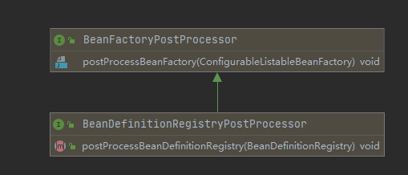
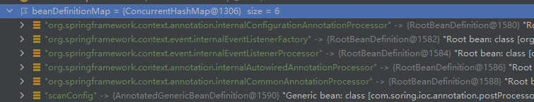
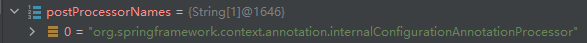
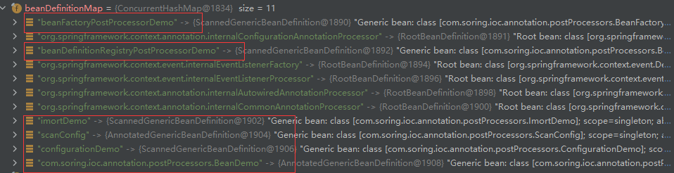
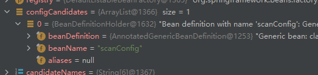
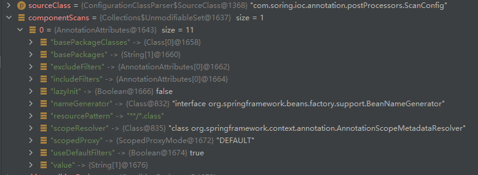
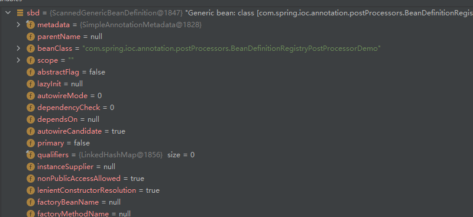
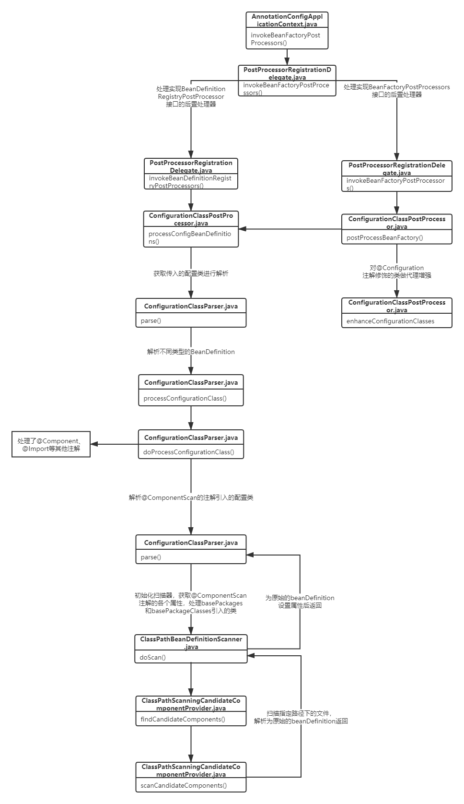

[TOC]

## Spring IOC源码（二）—— 监听器及后置处理器


## 1. Spring之ApplicationListener

> initApplicationEventMulticaster()：初始化上下文事件多播器。
>

```java
protected void initApplicationEventMulticaster() {
    // 获取bean工厂
    ConfigurableListableBeanFactory beanFactory = getBeanFactory();
    // 若bean工厂中存在多播器，则取出赋值给当前的多播器。
    if (beanFactory.containsLocalBean(APPLICATION_EVENT_MULTICASTER_BEAN_NAME)) {
        this.applicationEventMulticaster =
            beanFactory.getBean(APPLICATION_EVENT_MULTICASTER_BEAN_NAME, ApplicationEventMulticaster.class);
        if (logger.isTraceEnabled()) {
            logger.trace("Using ApplicationEventMulticaster [" + this.applicationEventMulticaster + "]");
        }
    }
    else {
        // 新建一个多播器
        this.applicationEventMulticaster = new SimpleApplicationEventMulticaster(beanFactory);
        // 把多播器注入到bean工程
        beanFactory.registerSingleton(APPLICATION_EVENT_MULTICASTER_BEAN_NAME, this.applicationEventMulticaster);
        if (logger.isTraceEnabled()) {
            logger.trace("No '" + APPLICATION_EVENT_MULTICASTER_BEAN_NAME + "' bean, using " +
                         "[" + this.applicationEventMulticaster.getClass().getSimpleName() + "]");
        }
    }
}

// ->DefaultListableBeanFactory.registerSingleton()
public void registerSingleton(String beanName, Object singletonObject) throws IllegalStateException {
    super.registerSingleton(beanName, singletonObject);
    // 该方法就是查看该beanDefinition是否被创建或在创建中，若在则将其名字放入manualSingletonNames中
    updateManualSingletonNames(set -> set.add(beanName), set -> !this.beanDefinitionMap.containsKey(beanName));
    // 清除按依赖类型的缓存map
    clearByTypeCache();
}

// ->DefaultSingletonBeanRegistry.registerSingleton()
public void registerSingleton(String beanName, Object singletonObject) throws IllegalStateException {
    Assert.notNull(beanName, "Bean name must not be null");
    Assert.notNull(singletonObject, "Singleton object must not be null");
    synchronized (this.singletonObjects) {
        // 检查当前bean工厂中是否存在该单例bean
        Object oldObject = this.singletonObjects.get(beanName);
        if (oldObject != null) {
            throw new IllegalStateException("Could not register object [" + singletonObject +
                                            "] under bean name '" + beanName + "': there is already object [" + oldObject + "] bound");
        }
        // 将多播器添加到bean工厂
        addSingleton(beanName, singletonObject);
    }
}

// 多播器放入singletonObjects中，同时移除二级与三级缓存中的多播器
protected void addSingleton(String beanName, Object singletonObject) {
    synchronized (this.singletonObjects) {
        this.singletonObjects.put(beanName, singletonObject);
        this.singletonFactories.remove(beanName);
        this.earlySingletonObjects.remove(beanName);
        this.registeredSingletons.add(beanName);
    }
}
```


初始化多播器的方法比较简单，就是讲多播器注册到了bean工厂中，接下来看下怎么注册监听。

```java
protected void registerListeners() {
    // 将静态的监听器(系统的)注册到多播器上。
    for (ApplicationListener<?> listener : getApplicationListeners()) {
        getApplicationEventMulticaster().addApplicationListener(listener);
    }

    // 获取自己实现ApplicationListener接口的监听器并注册到多播器上。
    String[] listenerBeanNames = getBeanNamesForType(ApplicationListener.class, true, false);
    for (String listenerBeanName : listenerBeanNames) {
        getApplicationEventMulticaster().addApplicationListenerBean(listenerBeanName);
    }

    // 发布早期的事件
    Set<ApplicationEvent> earlyEventsToProcess = this.earlyApplicationEvents;
    this.earlyApplicationEvents = null;
    if (earlyEventsToProcess != null) {
        for (ApplicationEvent earlyEvent : earlyEventsToProcess) {
            getApplicationEventMulticaster().multicastEvent(earlyEvent);
        }
    }
}

// SimpleApplicationEventMulticaster
public void multicastEvent(ApplicationEvent event) {
    multicastEvent(event, resolveDefaultEventType(event));
}

/**
* ResolvableType：spring提供的一个泛型类
*/
public void multicastEvent(final ApplicationEvent event, @Nullable ResolvableType eventType) {
    ResolvableType type = (eventType != null ? eventType : resolveDefaultEventType(event));
    Executor executor = getTaskExecutor();
    // 取出所有的监听器
    for (ApplicationListener<?> listener : getApplicationListeners(event, type)) {
        // 是否支持线程池异步发送
        if (executor != null) {
            executor.execute(() -> invokeListener(listener, event));
        }
        else {
            invokeListener(listener, event);
        }
    }
}

/**
* 中间的invokeListener跳过，没有什么逻辑
*/
private void doInvokeListener(ApplicationListener listener, ApplicationEvent event) {
    try {
        // 调用实现ApplicationListener接口类中的onApplicationEvent方法。
        listener.onApplicationEvent(event);
    }
    catch (ClassCastException ex) {
        String msg = ex.getMessage();
        if (msg == null || matchesClassCastMessage(msg, event.getClass())) {
            // 省略......
        }
        else {
            throw ex;
        }
    }
}
```


## 2. 后置处理器之BeanFactoryPostProcessor和BeanDefinitionRegistryPostProcessor

其实`BeanDefinitionRegistryPostProcessor`接口实现了`BeanFactoryPostProcessor`，但是子接口在父接口前执行。

`BeanFactoryPostProcessor`接口的执行时机是在bean定义加载完成后，实例初始化之前。

`BeanDefinitionRegistryPostProcessor`接口的执行时机是bean定义将要加载到容器中，实例初始化之前。

 


```java
// AnnotationConfigApplicationContext.java
protected void invokeBeanFactoryPostProcessors(ConfigurableListableBeanFactory beanFactory) {
    // 取出所有实现了BeanFactoryPostProcessors接口的bean并执行invokeBeanFactoryPostProcessors
    PostProcessorRegistrationDelegate.invokeBeanFactoryPostProcessors(beanFactory, getBeanFactoryPostProcessors());

    // 检测LoadTimeWeaver并准备编织(如果在此期间发现)，
    // LoadTimeWeaverAwareProcessor：对类加载操作
    if (beanFactory.getTempClassLoader() == null && beanFactory.containsBean(LOAD_TIME_WEAVER_BEAN_NAME)) {
        beanFactory.addBeanPostProcessor(new LoadTimeWeaverAwareProcessor(beanFactory));
        beanFactory.setTempClassLoader(new ContextTypeMatchClassLoader(beanFactory.getBeanClassLoader()));
    }
}

// 
/**
* PostProcessorRegistrationDelegate.java
* 
* beanFactoryPostProcessors：是getBeanFactoryPostProcessors()方法获取到的所有后置处理器
*/
public static void invokeBeanFactoryPostProcessors(
    ConfigurableListableBeanFactory beanFactory, List<BeanFactoryPostProcessor> beanFactoryPostProcessors) {

    // 创建一个Set用来存储已处理的后置处理器
    Set<String> processedBeans = new HashSet<>();

    // 先判断beanFactory是不是BeanDefinitionRegistry
    if (beanFactory instanceof BeanDefinitionRegistry) {
        //1. 进行类型强转
        BeanDefinitionRegistry registry = (BeanDefinitionRegistry) beanFactory;
        // 创建一个List存储BeanFactoryPostProcessor
        List<BeanFactoryPostProcessor> regularPostProcessors = new ArrayList<>();
        // 创建一个List存储BeanDefinitionRegistryPostProcessor
        List<BeanDefinitionRegistryPostProcessor> registryProcessors = new ArrayList<>();

        // 循环所有硬编码(new创建)注入的后置处理器
        for (BeanFactoryPostProcessor postProcessor : beanFactoryPostProcessors) {
            if (postProcessor instanceof BeanDefinitionRegistryPostProcessor) {
                BeanDefinitionRegistryPostProcessor registryProcessor =
                    (BeanDefinitionRegistryPostProcessor) postProcessor;
                // 1.-> 执行 postProcessBeanDefinitionRegistry()方法，后面讲
                registryProcessor.postProcessBeanDefinitionRegistry(registry);
                //  放入registryProcessors中
                registryProcessors.add(registryProcessor);
            }
            else {
                // 实现了BeanDefinitionRegistryPostProcessor接口的，放入regularPostProcessors中
                regularPostProcessors.add(postProcessor);
            }
        }

        // 2. 创建list存储实现BeanDefinitionRegistryPostProcessor接口的后置处理，之前未处理过的
        List<BeanDefinitionRegistryPostProcessor> currentRegistryProcessors = new ArrayList<>();

        // 第一步，取出所有实现BeanDefinitionRegistryPostProcessor接口的后置处理器
        String[] postProcessorNames =
            beanFactory.getBeanNamesForType(BeanDefinitionRegistryPostProcessor.class, true, false);
        for (String ppName : postProcessorNames) {
            // 判断是否实现了PriorityOrdered接口，并放入两个集合中
            if (beanFactory.isTypeMatch(ppName, PriorityOrdered.class)) {
                currentRegistryProcessors.add(beanFactory.getBean(ppName, BeanDefinitionRegistryPostProcessor.class));
                processedBeans.add(ppName);
            }
        }
        // 进行排序
        sortPostProcessors(currentRegistryProcessors, beanFactory);
        registryProcessors.addAll(currentRegistryProcessors);
        // 执行invokeBeanDefinitionRegistryPostProcessors方法
        invokeBeanDefinitionRegistryPostProcessors(currentRegistryProcessors, registry);
        // 清空list，避免在放入之后取出的重复
        currentRegistryProcessors.clear();

        // 第二步、取出所有实现BeanDefinitionRegistryPostProcessor接口的后置处理器
        // 我们自己带有@Component注解及其子注解、@Improt导入的类会被扫描取出
        postProcessorNames = beanFactory.getBeanNamesForType(BeanDefinitionRegistryPostProcessor.class, true, false);
        for (String ppName : postProcessorNames) {
            // 将第一次未处理且实现了Ordered接口的放入list中，进行下一步处理
            if (!processedBeans.contains(ppName) && beanFactory.isTypeMatch(ppName, Ordered.class)) {
                currentRegistryProcessors.add(beanFactory.getBean(ppName, BeanDefinitionRegistryPostProcessor.class));
                processedBeans.add(ppName);
            }
        }
        // 排序
        sortPostProcessors(currentRegistryProcessors, beanFactory);
        registryProcessors.addAll(currentRegistryProcessors);
        // 执行invokeBeanDefinitionRegistryPostProcessors
        invokeBeanDefinitionRegistryPostProcessors(currentRegistryProcessors, registry);
        // 清理list
        currentRegistryProcessors.clear();

        // 执行没有实现PriorityOrdered和Ordered的
        boolean reiterate = true;
        while (reiterate) {
            reiterate = false;
            // 取出所有的处理器
            postProcessorNames = beanFactory.getBeanNamesForType(BeanDefinitionRegistryPostProcessor.class, true, false);
            for (String ppName : postProcessorNames) {
                // 取出没有处理过的
                if (!processedBeans.contains(ppName)) {
                    currentRegistryProcessors.add(beanFactory.getBean(ppName, BeanDefinitionRegistryPostProcessor.class));
                    processedBeans.add(ppName);
                    reiterate = true;
                }
            }
            // 排序，有默认的排序方式
            sortPostProcessors(currentRegistryProcessors, beanFactory);
            registryProcessors.addAll(currentRegistryProcessors);
            // 执行invokeBeanDefinitionRegistryPostProcessors()
            invokeBeanDefinitionRegistryPostProcessors(currentRegistryProcessors, registry);
            // 清理list
            currentRegistryProcessors.clear();
        }

        // 执行同时实现了两个接口的后置处理器
        invokeBeanFactoryPostProcessors(registryProcessors, beanFactory);
        invokeBeanFactoryPostProcessors(regularPostProcessors, beanFactory);
    }

    else {
        // 执行实现BeanFactoryPostProcessors接口的
        invokeBeanFactoryPostPBeanFactoryPostProcessorsrocessors(beanFactoryPostProcessors, beanFactory);
    }

    // 取出实现BeanFactoryPostProcessor接口的后置处理器
    String[] postProcessorNames =
        beanFactory.getBeanNamesForType(BeanFactoryPostProcessor.class, true, false);

    // 存储实现PriorityOrdered接口的
    List<BeanFactoryPostProcessor> priorityOrderedPostProcessors = new ArrayList<>();
    // 存储实现Ordered接口的
    List<String> orderedPostProcessorNames = new ArrayList<>();
    // 存储未实现PriorityOrdered和Ordered接口的
    List<String> nonOrderedPostProcessorNames = new ArrayList<>();
    // 循环根据实现的接口放入不同的list中
    for (String ppName : postProcessorNames) {
        if (processedBeans.contains(ppName)) {
            // skip - already processed in first phase above
        }
        // 实现了PriorityOrdered接口放入priorityOrderedPostProcessors中
        else if (beanFactory.isTypeMatch(ppName, PriorityOrdered.class)) {
            priorityOrderedPostProcessors.add(beanFactory.getBean(ppName, BeanFactoryPostProcessor.class));
        }
        // 实现了Ordered接口放入orderedPostProcessorNames中
        else if (beanFactory.isTypeMatch(ppName, Ordered接口放入.class)) {
            orderedPostProcessorNames.add(ppName);
        }
        else {
            // 普通的放入nonOrderedPostProcessorNames中
            nonOrderedPostProcessorNames.add(ppName);
        }
    }

    // 排序
    sortPostProcessors(priorityOrderedPostProcessors, beanFactory);
    // 先执行实现PriorityOrdered接口的
    invokeBeanFactoryPostProcessors(priorityOrderedPostProcessors, beanFactory);

    // 从beanFactory中取出实现Ordered接口的
    List<BeanFactoryPostProcessor> orderedPostProcessors = new ArrayList<>(orderedPostProcessorNames.size());
    for (String postProcessorName : orderedPostProcessorNames) {
        orderedPostProcessors.add(beanFactory.getBean(postProcessorName, BeanFactoryPostProcessor.class));
    }
    // 排序
    sortPostProcessors(orderedPostProcessors, beanFactory);
    invokeBeanFactoryPostProcessors(orderedPostProcessors, beanFactory);

    // 实现普通的
    List<BeanFactoryPostProcessor> nonOrderedPostProcessors = new ArrayList<>(nonOrderedPostProcessorNames.size());
    for (String postProcessorName : nonOrderedPostProcessorNames) {
        nonOrderedPostProcessors.add(beanFactory.getBean(postProcessorName, BeanFactoryPostProcessor.class));
    }
    invokeBeanFactoryPostProcessors(nonOrderedPostProcessors, beanFactory);

    // 清除缓存中合并的bean定义，因为后置处理可能修改了元数据。
    beanFactory.clearMetadataCache();
}
```


1.  在执行完` BeanDefinitionRegistry registry = (BeanDefinitionRegistry) beanFactory`后，可以看到`BeanDefinitionRegistry`中只有在构造方法中注入的一些后置处理器以及自己传入配置类。

 


2. 因为没有硬编码注入的后置处理器，而`postProcessBeanDefinitionRegistry()`方法在接下来处理其他处理器时也会调用到，所以在调用到的时候再展开说。

   执行` beanFactory.getBeanNamesForType()`方法，获取bean工厂中实现`BeanDefinitionRegistryPostProcessor`接口的处理器，可以看到此时只有一个构造方法注入的`ConfigurationClassPostProcessor`配置类后置处理器。
   
    


3. 执行`invokeBeanDefinitionRegistryPostProcessors()`，解析出我们传入的配置类`ScanConfig`，通过该类上的`@ComponentScan(value = "com.soring.ioc.annotation.postProcessors")`注解，扫描包路径下有`@Component`及其子注解以及`@Improt注解`注入的类，注入到注册其中。

   

   

4. 处理完实现`PriorityOrdered`和`Ordered`接口的后置处理后，接下来就要处理我们自己实现`BeanDefinitionRegistryPostProcessor`接口的后置处理器了。

   

5. 在处理完实现`BeanDefinitionRegistryPostProcessor`接口的后置处理后，用类似的方式，处理实现`BeanFactoryPostProcessors`接口的后置处理器，对于其中的`geBean()`方法，之后的文章会详细讲。


### 2.1 postProcessBeanDefinitionRegistry()

```java
// PostProcessorRegistrationDelegate.java
private static void invokeBeanDefinitionRegistryPostProcessors(
    Collection<? extends BeanDefinitionRegistryPostProcessor> postProcessors, BeanDefinitionRegistry registry) {
	// 循环处理
    for (BeanDefinitionRegistryPostProcessor postProcessor : postProcessors) {
        postProcessor.postProcessBeanDefinitionRegistry(registry);
    }
}


// ConfigurationClassPostProcessor.java
public void postProcessBeanDefinitionRegistry(BeanDefinitionRegistry registry) {
    int registryId = System.identityHashCode(registry);
    if (this.registriesPostProcessed.contains(registryId)) {
        throw new IllegalStateException(
            "postProcessBeanDefinitionRegistry already called on this post-processor against " + registry);
    }
    if (this.factoriesPostProcessed.contains(registryId)) {
        throw new IllegalStateException(
            "postProcessBeanFactory already called on this post-processor against " + registry);
    }
    this.registriesPostProcessed.add(registryId);
    processConfigBeanDefinitions(registry);
}

// ConfigurationClassPostProcessor.java
public void processConfigBeanDefinitions(BeanDefinitionRegistry registry) {
    List<BeanDefinitionHolder> configCandidates = new ArrayList<>();
    // 从容器获取所有beanDefinition的名称
    String[] candidateNames = registry.getBeanDefinitionNames();

    for (String beanName : candidateNames) {
        // 从beanDefinitionMap中获取BeanDefinition
        BeanDefinition beanDef = registry.getBeanDefinition(beanName);
        // 判断是否当做配置类处理过
        if (beanDef.getAttribute(ConfigurationClassUtils.CONFIGURATION_CLASS_ATTRIBUTE) != null) {
            if (logger.isDebugEnabled()) {
                logger.debug("Bean definition has already been processed as a configuration class: " + beanDef);
            }
        }
        // 获取自己传入的配置类，检查是不是配置类
        else if (ConfigurationClassUtils.checkConfigurationClassCandidate(beanDef, this.metadataReaderFactory)) {
            configCandidates.add(new BeanDefinitionHolder(beanDef, beanName));
        }
    }

    // 不是配置类直接返回，不处理
    if (configCandidates.isEmpty()) {
        return;
    }

    // 排序
    configCandidates.sort((bd1, bd2) -> {
        int i1 = ConfigurationClassUtils.getOrder(bd1.getBeanDefinition());
        int i2 = ConfigurationClassUtils.getOrder(bd2.getBeanDefinition());
        return Integer.compare(i1, i2);
    });

    // bean名字生成策略
    SingletonBeanRegistry sbr = null;
    if (registry instanceof SingletonBeanRegistry) {
        sbr = (SingletonBeanRegistry) registry;
        if (!this.localBeanNameGeneratorSet) {
            BeanNameGenerator generator = (BeanNameGenerator) sbr.getSingleton(
                AnnotationConfigUtils.CONFIGURATION_BEAN_NAME_GENERATOR);
            if (generator != null) {
                this.componentScanBeanNameGenerator = generator;
                this.importBeanNameGenerator = generator;
            }
        }
    }

    //没有配置环境设置标准环境
    if (this.environment == null) {
        this.environment = new StandardEnvironment();
    }

    // 获取配置类的解析器
    // this.metadataReaderFactory = metadataReaderFactory; 元数据读取工厂
	// this.problemReporter = problemReporter; 问题报告器
	// this.environment = environment; 环境
	// this.resourceLoader = resourceLoader; 资源加载器
	// this.registry = registry; 注册器
	// this.componentScanParser = new ComponentScanAnnotationParser(environment, resourceLoader, componentScanBeanNameGenerator, registry); 组件扫描器
	// this.conditionEvaluator = new ConditionEvaluator(registry, environment, resourceLoader); 条件解析器
    ConfigurationClassParser parser = new ConfigurationClassParser(
        this.metadataReaderFactory, this.problemReporter, this.environment,
        this.resourceLoader, this.componentScanBeanNameGenerator, registry);

    // 存储下面循环中每次新解析出来的
    Set<BeanDefinitionHolder> candidates = new LinkedHashSet<>(configCandidates);
    // 存储循环中解析过的配置类
    Set<ConfigurationClass> alreadyParsed = new HashSet<>(configCandidates.size());
    do {
        // 真正的解析方法
        parser.parse(candidates);
        // 校验
        parser.validate();
		// 存储解析出来的配置类
        Set<ConfigurationClass> configClasses = new LinkedHashSet<>(parser.getConfigurationClasses());
        // 从中移除所有解析过的
        configClasses.removeAll(alreadyParsed);

        // 新建配置beanDefinition的读取器
        if (this.reader == null) {
            this.reader = new ConfigurationClassBeanDefinitionReader(
                registry, this.sourceExtractor, this.resourceLoader, this.environment,
                this.importBeanNameGenerator, parser.getImportRegistry());
        }
        // 将配置类加载进容器，最终调用的是registerBeanDefinition()
        this.reader.loadBeanDefinitions(configClasses);
        // 加入已解析的list中
        alreadyParsed.addAll(configClasses);
		
        candidates.clear();
        // 通过解析之后是否有新的配置类
        if (registry.getBeanDefinitionCount() > candidateNames.length) {
            // 容器中现在的bean定义名称集合
            String[] newCandidateNames = registry.getBeanDefinitionNames();
            // 旧的bean定义集合
            Set<String> oldCandidateNames = new HashSet<>(Arrays.asList(candidateNames));
            // 存放已解析的bean定义
            Set<String> alreadyParsedClasses = new HashSet<>();
            // 将刚刚解析出来的放入本次循环已解析的集合中
            for (ConfigurationClass configurationClass : alreadyParsed) {
                alreadyParsedClasses.add(configurationClass.getMetadata().getClassName());
            }
            // 循环检查容器中是否还有配置类且未解析过，放入集合用来下次循环解析
            for (String candidateName : newCandidateNames) {
                if (!oldCandidateNames.contains(candidateName)) {
                    BeanDefinition bd = registry.getBeanDefinition(candidateName);
                    if (ConfigurationClassUtils.checkConfigurationClassCandidate(bd, this.metadataReaderFactory) &&
                        !alreadyParsedClasses.contains(bd.getBeanClassName())) {
                        candidates.add(new BeanDefinitionHolder(bd, candidateName));
                    }
                }
            }
            // 替换旧的容器内bean定义集合
            candidateNames = newCandidateNames;
        }
    }
    while (!candidates.isEmpty());

    // Register the ImportRegistry as a bean in order to support ImportAware @Configuration classes
    if (sbr != null && !sbr.containsSingleton(IMPORT_REGISTRY_BEAN_NAME)) {
        sbr.registerSingleton(IMPORT_REGISTRY_BEAN_NAME, parser.getImportRegistry());
    }

    // 元数据读取工厂是缓存工厂，清除缓存
    if (this.metadataReaderFactory instanceof CachingMetadataReaderFactory) {
        // Clear cache in externally provided MetadataReaderFactory; this is a no-op
        // for a shared cache since it'll be cleared by the ApplicationContext.
        ((CachingMetadataReaderFactory) this.metadataReaderFactory).clearCache();
    }
}
```

1. `processConfigBeanDefinitions()`方法在经过对配置处理检查后，`configCandidates`最终只有传入的配置，进入循环，进行真正的解析。

    


> 真正的解析方法：parse()

```java
// ConfigurationClassParser.java
public void parse(Set<BeanDefinitionHolder> configCandidates) {
    for (BeanDefinitionHolder holder : configCandidates) {
        BeanDefinition bd = holder.getBeanDefinition();
        try {
            // 注解类AnnotatedBeanDefinition
            if (bd instanceof AnnotatedBeanDefinition) {
                parse(((AnnotatedBeanDefinition) bd).getMetadata(), holder.getBeanName());
            }
            // 抽象类AbstractBeanDefinition
            else if (bd instanceof AbstractBeanDefinition && ((AbstractBeanDefinition) bd).hasBeanClass()) {
                parse(((AbstractBeanDefinition) bd).getBeanClass(), holder.getBeanName());
            }
            else {
                // 普通的BeanDefinition
                parse(bd.getBeanClassName(), holder.getBeanName());
            }
        }
        catch (BeanDefinitionStoreException ex) {
            throw ex;
        }
        catch (Throwable ex) {
            throw new BeanDefinitionStoreException(
                "Failed to parse configuration class [" + bd.getBeanClassName() + "]", ex);
        }
    }
  
    // 执行找到的 DeferredImportSelector 
    this.deferredImportSelectorHandler.process();
}

上面无论哪一种类型的BeanDefinition，最终都会执行processConfigurationClass方法。
// ConfigurationClassParser.java
protected void processConfigurationClass(ConfigurationClass configClass) throws IOException {
    // 判断是否需要跳过，如果有@Conditional注解的话
    if (this.conditionEvaluator.shouldSkip(configClass.getMetadata(), ConfigurationPhase.PARSE_CONFIGURATION)) {
        return;
    }

    ConfigurationClass existingClass = this.configurationClasses.get(configClass);
    // 配置类已经处理过
    if (existingClass != null) {
    	// 判断是否是@Import导入的
    	// ConfigurationClass中有一个set集合importedBy，存储的是通过@Import导入该类的类
    	// 例如A通过注解@Import导入了B，则B的集合中存放的就是A
        if (configClass.isImported()) {
            if (existingClass.isImported()) {
            	// 将两个配置类的set集合合并
                existingClass.mergeImportedBy(configClass);
            }
            // Otherwise ignore new imported config class; existing non-imported class overrides it.
            return;
        }
        else {
            // configClass通过@Import导入了一次，之后又通过非@Import的方式注入了
            this.configurationClasses.remove(configClass);
            this.knownSuperclasses.values().removeIf(configClass::equals);
        }
    }

    // 解析配置类上的注解，并做了一些检查
    SourceClass sourceClass = asSourceClass(configClass);
    do {
    	// 解析注解中的属性并得到注解的包装类
        sourceClass = doProcessConfigurationClass(configClass, sourceClass);
    }
    while (sourceClass != null);
	
    this.configurationClasses.put(configClass, configClass);
}
```


> doProcessConfigurationClas()方法

`doProcessConfigurationClass`方法主要是解析注解的属性，并做一些处理。

```java
// ConfigurationClassParser.java
protected final SourceClass doProcessConfigurationClass(ConfigurationClass configClass, SourceClass sourceClass) throws IOException {

    // 处理@Component注解，主要是获取注解中的属性
    if (configClass.getMetadata().isAnnotated(Component.class.getName())) {
        // 处理内部类，若内部类也是注解类，则进行处理
        processMemberClasses(configClass, sourceClass);
    }

    // 处理@PropertySource注解
    for (AnnotationAttributes propertySource : AnnotationConfigUtils.attributesForRepeatable(sourceClass.getMetadata(), PropertySources.class, org.springframework.context.annotation.PropertySource.class)) {
        if (this.environment instanceof ConfigurableEnvironment) {
            // 处理@PropertySource注解的元数据
            processPropertySource(propertySource);
        }
        else {
            logger.info("Ignoring @PropertySource annotation on [" + sourceClass.getMetadata().getClassName() +
                        "]. Reason: Environment must implement ConfigurableEnvironment");
        }
    }

    // 处理@ComponentScan的注解
    Set<AnnotationAttributes> componentScans = AnnotationConfigUtils.attributesForRepeatable(sourceClass.getMetadata(), ComponentScans.class, ComponentScan.class);
    if (!componentScans.isEmpty() && !this.conditionEvaluator.shouldSkip(sourceClass.getMetadata(), ConfigurationPhase.REGISTER_BEAN)) {
        for (AnnotationAttributes componentScan : componentScans) {
            // 解析获取@ComponentScan引入的beanDefinition
            Set<BeanDefinitionHolder> scannedBeanDefinitions =
                this.componentScanParser.parse(componentScan, sourceClass.getMetadata().getClassName());
            // 查看是不是还有配置类
            for (BeanDefinitionHolder holder : scannedBeanDefinitions) {
                BeanDefinition bdCand = holder.getBeanDefinition().getOriginatingBeanDefinition();
                if (bdCand == null) {
                    bdCand = holder.getBeanDefinition();
                }
                // 有配置的话继续解析
                if (ConfigurationClassUtils.checkConfigurationClassCandidate(bdCand, this.metadataReaderFactory)) {
                    parse(bdCand.getBeanClassName(), holder.getBeanName());
                }
            }
        }
    }

    // 处理@Import注解
    processImports(configClass, sourceClass, getImports(sourceClass), true);

    // 处理@ImportResource注解
    AnnotationAttributes importResource =
        AnnotationConfigUtils.attributesFor(sourceClass.getMetadata(), ImportResource.class);
    if (importResource != null) {
        String[] resources = importResource.getStringArray("locations");
        Class<? extends BeanDefinitionReader> readerClass = importResource.getClass("reader");
        for (String resource : resources) {
            String resolvedResource = this.environment.resolveRequiredPlaceholders(resource);
            configClass.addImportedResource(resolvedResource, readerClass);
        }
    }

    // 处理@Bean注释的方法
    Set<MethodMetadata> beanMethods = retrieveBeanMethodMetadata(sourceClass);
    for (MethodMetadata methodMetadata : beanMethods) {
        configClass.addBeanMethod(new BeanMethod(methodMetadata, configClass));
    }

    // 处理接口的默认方法
    processInterfaces(configClass, sourceClass);

    // 处理父类
    if (sourceClass.getMetadata().hasSuperClass()) {
        String superclass = sourceClass.getMetadata().getSuperClassName();
        if (superclass != null && !superclass.startsWith("java") &&
            !this.knownSuperclasses.containsKey(superclass)) {
            this.knownSuperclasses.put(superclass, configClass);
            // Superclass found, return its annotation metadata and recurse
            return sourceClass.getSuperClass();
        }
    }

    // No superclass -> processing is complete
    return null;
}
```

接下来主要是看处理`@ComponentScan`注解的过程，

`AnnotationConfigUtils.attributesForRepeatable`主要是解析获取了`@ComponentScan`中属性，用来做后面的处理。

 


> 解析@ComponentScan注解的方法

```java
// ConfigurationClassParser.java
public Set<BeanDefinitionHolder> parse(AnnotationAttributes componentScan, final String declaringClass) {
    // 新建bean定义扫描器
    ClassPathBeanDefinitionScanner scanner = new ClassPathBeanDefinitionScanner(this.registry, componentScan.getBoolean("useDefaultFilters"), this.environment, this.resourceLoader);

    // 设置nameGenerator属性，bean名称生成器
    Class<? extends BeanNameGenerator> generatorClass = componentScan.getClass("nameGenerator");
    boolean useInheritedGenerator = (BeanNameGenerator.class == generatorClass);
    scanner.setBeanNameGenerator(useInheritedGenerator ? this.beanNameGenerator :
                                 BeanUtils.instantiateClass(generatorClass));
    
	// 设置scopedProxy属性,是否为检测到的组件生成代理类
    ScopedProxyMode scopedProxyMode = componentScan.getEnum("scopedProxy");
    if (scopedProxyMode != ScopedProxyMode.DEFAULT) {
        scanner.setScopedProxyMode(scopedProxyMode);
    }
    else {
        // 设置scopeResolver属性，处理bean的作用域
        Class<? extends ScopeMetadataResolver> resolverClass = componentScan.getClass("scopeResolver");
        scanner.setScopeMetadataResolver(BeanUtils.instantiateClass(resolverClass));
    }
	// 设置resourcePattern属性，筛选组件的条件，默认"**/*.class
    scanner.setResourcePattern(componentScan.getString("resourcePattern"));
	
    // 设置includeFilters属性，检测满足Filter条件的组件，即FilterType指定的类型
    for (AnnotationAttributes filter : componentScan.getAnnotationArray("includeFilters")) {
        for (TypeFilter typeFilter : typeFiltersFor(filter)) {
            scanner.addIncludeFilter(typeFilter);
        }
    }
    // 设置excludeFilters属性，根据条件排除组件
    for (AnnotationAttributes filter : componentScan.getAnnotationArray("excludeFilters")) {
        for (TypeFilter typeFilter : typeFiltersFor(filter)) {
            scanner.addExcludeFilter(typeFilter);
        }
    }
	
    // 设置lazyInit属性，扫描到的组件是否懒加载
    boolean lazyInit = componentScan.getBoolean("lazyInit");
    if (lazyInit) {
        scanner.getBeanDefinitionDefaults().setLazyInit(true);
    }

    // 获取设置的扫描包路径
    Set<String> basePackages = new LinkedHashSet<>();
    String[] basePackagesArray = componentScan.getStringArray("basePackages");
    for (String pkg : basePackagesArray) {
        String[] tokenized = StringUtils.tokenizeToStringArray(this.environment.resolvePlaceholders(pkg),
                                                               ConfigurableApplicationContext.CONFIG_LOCATION_DELIMITERS);
        Collections.addAll(basePackages, tokenized);
    }
    
    // 获取具体扫描的类
    for (Class<?> clazz : componentScan.getClassArray("basePackageClasses")) {
        basePackages.add(ClassUtils.getPackageName(clazz));
    }
    // 如果包路径为空，设置为配置类的包路径
    if (basePackages.isEmpty()) {
        basePackages.add(ClassUtils.getPackageName(declaringClass));
    }

    // 过滤抽象类
    scanner.addExcludeFilter(new AbstractTypeHierarchyTraversingFilter(false, false) {
        @Override
        protected boolean matchClassName(String className) {
            return declaringClass.equals(className);
        }
    });
    
    // 扫描包路径先的组件
    return scanner.doScan(StringUtils.toStringArray(basePackages));
}
```

`scopedProxy`是基于CGLIB代理生成的，主要作用就是生成引用的代理，例如在一个单例的bean中引用一个其他作用域的bean，如果不使用`scopedProxy`，那么单例bean所持有的引用永远是同一个，即在初始化的时候注入的。

需要注意的是，不能为单例bean设置`scopedProxy`属性，否则会跑错。


> doScan()

扫描`@ComponentScan`注解中设置的包路径下和指定的具体类

```java
// ClassPathBeanDefinitionScanner.java
protected Set<BeanDefinitionHolder> doScan(String... basePackages) {
    Assert.notEmpty(basePackages, "At least one base package must be specified");
    // 存放从包路径下扫描出来的beanDefinition
    Set<BeanDefinitionHolder> beanDefinitions = new LinkedHashSet<>();
    // 遍历传入的包路径
    for (String basePackage : basePackages) {
        // 扫描包路径下的组件得到其beanDefinition
        Set<BeanDefinition> candidates = findCandidateComponents(basePackage);
        for (BeanDefinition candidate : candidates) {
            // 给beanDefinition设置作用域
            ScopeMetadata scopeMetadata = this.scopeMetadataResolver.resolveScopeMetadata(candidate);
            candidate.setScope(scopeMetadata.getScopeName());
            String beanName = this.beanNameGenerator.generateBeanName(candidate, this.registry);
            // 抽象的beanDefinition进行处理
            if (candidate instanceof AbstractBeanDefinition) {
                // 设置beanDefinition的懒加载、初始化方法等属性
                postProcessBeanDefinition((AbstractBeanDefinition) candidate, beanName);
            }
            // 处理注解beanDefinition
            if (candidate instanceof AnnotatedBeanDefinition) {
                // 设置beanDefinition的懒加载、初始化方法等属性
                AnnotationConfigUtils.processCommonDefinitionAnnotations((AnnotatedBeanDefinition) candidate);
            }
            // 检查beanDefinition是否已经注册过，若注册过是不是同一个
            if (checkCandidate(beanName, candidate)) {
                BbHolder definitionHolder = new BeanDefinitionHolder(candidate, beanName);
                // 设置scopedProxy
                definitionHolder =
                    AnnotationConfigUtils.applyScopedProxyMode(scopeMetadata, definitionHolder, this.registry);
                beanDefinitions.add(definitionHolder);
                // 把beanDefinition注册到bean工厂
                registerBeanDefinition(definitionHolder, this.registry);
            }
        }
    }
    return beanDefinitions;
}
```

> findCandidateComponents()

把`@ComponentScans`扫描到的组件解析成BeanDefinition

```java
// ClassPathScanningCandidateComponentProvider.java
public Set<BeanDefinition> findCandidateComponents(String basePackage) {
    // 对META-INF/spring.components候选组件的访问处理
    if (this.componentsIndex != null && indexSupportsIncludeFilters()) {
        return addCandidateComponentsFromIndex(this.componentsIndex, basePackage);
    }
    else {
        return scanCandidateComponents(basePackage);
    }
}

// ClassPathScanningCandidateComponentProvider.java
private Set<BeanDefinition> scanCandidateComponents(String basePackage) {
    Set<BeanDefinition> candidates = new LinkedHashSet<>();
    try {
        // 处理要扫描的包路径下的文件，默认**/*.class
        String packageSearchPath = ResourcePatternResolver.CLASSPATH_ALL_URL_PREFIX +
            resolveBasePackage(basePackage) + '/' + this.resourcePattern;
        Resource[] resources = getResourcePatternResolver().getResources(packageSearchPath);
        boolean traceEnabled = logger.isTraceEnabled();
        boolean debugEnabled = logger.isDebugEnabled();
        for (Resource resource : resources) {
            if (traceEnabled) {
                logger.trace("Scanning " + resource);
            }
            if (resource.isReadable()) {
                try {
                    // 获取元数据读取器
                    MetadataReader metadataReader = getMetadataReaderFactory().getMetadataReader(resource);
                    // 检查扫描到的组件
                    if (isCandidateComponent(metadataReader)) {
                        ScannedGenericBeanDefinition sbd = new ScannedGenericBeanDefinition(metadataReader);
                        sbd.setResource(resource);
                        sbd.setSource(resource);
                        if (isCandidateComponent(sbd)) {
                            if (debugEnabled) {
                                logger.debug("Identified candidate component class: " + resource);
                            }
                            candidates.add(sbd);
                        }
                        else {
                           // 省略......
                        }
                    }
                    else {
                       // 省略......
                    }
                }
                catch (Throwable ex) {
                    throw new BeanDefinitionStoreException(
                        "Failed to read candidate component class: " + resource, ex);
                }
            }
            else {
                // 省略......
            }
        }
    }
    catch (IOException ex) {
        throw new BeanDefinitionStoreException("I/O failure during classpath scanning", ex);
    }
    return candidates;
}
```

可以看到经过处理后只拿到了beanDefinition的元数据信息和类型，一些属性还未完成初始化，所以这些beanDefinition的变量名是candidates(候选)。

 


### 2.2 postProcessBeanFactory

处理`BeanFactoryPostProcessor`的方法与`BeanDefinitionRegistryPostProcessor`大体上是相同的，只不过多了一些其他的处理。

```java
// PostProcessorRegistrationDelegate.java
private static void invokeBeanFactoryPostProcessors(
    Collection<? extends BeanFactoryPostProcessor> postProcessors, ConfigurableListableBeanFactory beanFactory) {

    for (BeanFactoryPostProcessor postProcessor : postProcessors) {
        postProcessor.postProcessBeanFactory(beanFactory);
    }
}

// ConfigurationClassPostProcessor.java
public void postProcessBeanFactory(ConfigurableListableBeanFactory beanFactory) {
    int factoryId = System.identityHashCode(beanFactory);
    if (this.factoriesPostProcessed.contains(factoryId)) {
        throw new IllegalStateException(
            "postProcessBeanFactory already called on this post-processor against " + beanFactory);
    }
    this.factoriesPostProcessed.add(factoryId);
    if (!this.registriesPostProcessed.contains(factoryId)) {
        // 与处理BeanDefinitionRegistryPostProcessor中相同
        processConfigBeanDefinitions((BeanDefinitionRegistry) beanFactory);
    }
   
    // 生成@Configuration注释类的代理，以做增强
    enhanceConfigurationClasses(beanFactory);
    // beanFactory
    beanFactory.addBeanPostProcessor(new ImportAwareBeanPostProcessor(beanFactory));
}
```


> enhanceConfigurationClasses()方法

```java
// 
public void enhanceConfigurationClasses(ConfigurableListableBeanFactory beanFactory) {
    Map<String, AbstractBeanDefinition> configBeanDefs = new LinkedHashMap<>();
    // 循环bean工厂中所有的beanDefinition
    for (String beanName : beanFactory.getBeanDefinitionNames()) {
        // 获取BeanDefinition
        BeanDefinition beanDef = beanFactory.getBeanDefinition(beanName);
        // 获取配置类的属性
        Object configClassAttr = beanDef.getAttribute(ConfigurationClassUtils.CONFIGURATION_CLASS_ATTRIBUTE);
        MethodMetadata methodMetadata = null;
        if (beanDef instanceof AnnotatedBeanDefinition) {
            // 如果是注解beanDefinition，获取工厂方法元数据
            methodMetadata = ((AnnotatedBeanDefinition) beanDef).getFactoryMethodMetadata();
        }
        if ((configClassAttr != null || methodMetadata != null) && beanDef instanceof AbstractBeanDefinition) {
            // Configuration class (full or lite) or a configuration-derived @Bean method
            // -> resolve bean class at this point...
            AbstractBeanDefinition abd = (AbstractBeanDefinition) beanDef;
            if (!abd.hasBeanClass()) {
                try {
                    abd.resolveBeanClass(this.beanClassLoader);
                }
                catch (Throwable ex) {
                    throw new IllegalStateException(
                        "Cannot load configuration class: " + beanDef.getBeanClassName(), ex);
                }
            }
        }
        if (ConfigurationClassUtils.CONFIGURATION_CLASS_FULL.equals(configClassAttr)) {
            // 省略
            configBeanDefs.put(beanName, (AbstractBeanDefinition) beanDef);
        }
    }
    if (configBeanDefs.isEmpty()) {
        // nothing to enhance -> return immediately
        return;
    }

    // 被@Configuration注释的类做增强
    ConfigurationClassEnhancer enhancer = new ConfigurationClassEnhancer();
    for (Map.Entry<String, AbstractBeanDefinition> entry : configBeanDefs.entrySet()) {
        AbstractBeanDefinition beanDef = entry.getValue();
        // 设置属性，@Configuration注释的类，必须生成代理类
        beanDef.setAttribute(AutoProxyUtils.PRESERVE_TARGET_CLASS_ATTRIBUTE, Boolean.TRUE);
        Class<?> configClass = beanDef.getBeanClass();
        Class<?> enhancedClass = enhancer.enhance(configClass, this.beanClassLoader);
        if (configClass != enhancedClass) {
            if (logger.isTraceEnabled()) {
                logger.trace(String.format("Replacing bean definition '%s' existing class '%s' with " +
                                           "enhanced class '%s'", entry.getKey(), configClass.getName(), enhancedClass.getName()));
            }
            beanDef.setBeanClass(enhancedClass);
        }
    }
}


public Class<?> enhance(Class<?> configClass, @Nullable ClassLoader classLoader) {
    if (EnhancedConfiguration.class.isAssignableFrom(configClass)) {
        // 省略
        return configClass;
    }
   	// 创建代理类
    Class<?> enhancedClass = createClass(newEnhancer(configClass, classLoader));
    // 省略
    return enhancedClass;
}

// ConfigurationClassEnhancer.java
private Enhancer newEnhancer(Class<?> configSuperClass, @Nullable ClassLoader classLoader) {
    Enhancer enhancer = new Enhancer();
    // 设置父类
    enhancer.setSuperclass(configSuperClass);
    // 设置接口
    enhancer.setInterfaces(new Class<?>[] {EnhancedConfiguration.class});
    // 不继承工厂接口
    enhancer.setUseFactory(false);
    // 设置自定义扩展的CGLIB，避免其他库和spring中的冲突
    enhancer.setNamingPolicy(SpringNamingPolicy.INSTANCE);
	// 设置生成策略，
	// CGLIB DefaultGeneratorStrategy的自定义扩展，引入一个{@link BeanFactory}字段。
    enhancer.setStrategy(new BeanFactoryAwareGeneratorStrategy(classLoader));
    // 设置过滤器
    enhancer.setCallbackFilter(CALLBACK_FILTER);
    enhancer.setCallbackTypes(CALLBACK_FILTER.getCallbackTypes());
    return enhancer;
}
```


### 2.3 后置处理的流程

