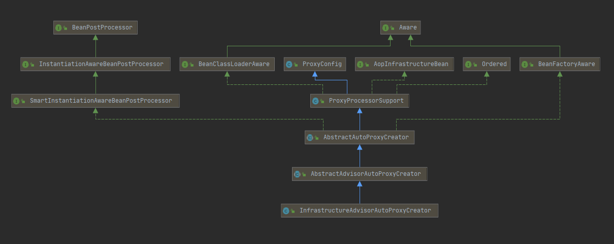
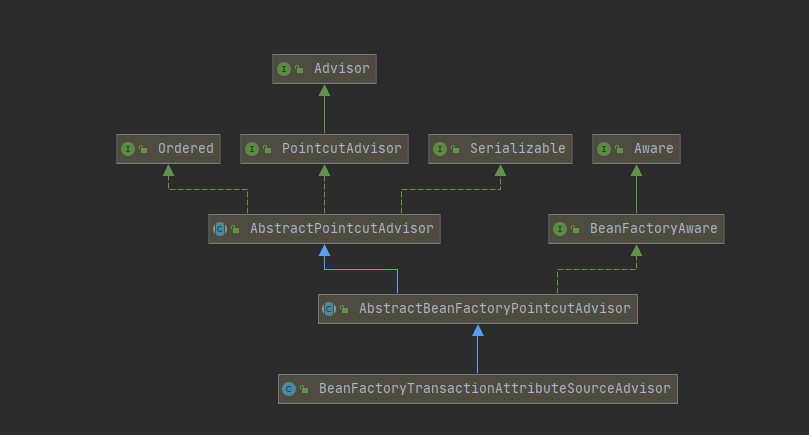

# Spring事务源码学习


## 一  Spring事务三大核心接口

### 1. PlatformTransactionManager：事务管理器

Spring通过这个接口向第三方（例如：Jdbc）提供了管理事务的功能。

```java
public interface PlatformTransactionManager extends TransactionManager {

   	/**
   	* 获取事务状态
   	*/
    TransactionStatus getTransaction(@Nullable TransactionDefinition definition)
        throws TransactionException;

    /**
    * 提交事务
    */
    void commit(TransactionStatus status) throws TransactionException;

    /**
    * 回滚事务
    */ 
    void rollback(TransactionStatus status) throws TransactionException;
}
```


### 2. TransactionDefinition：事务定义

在该接口中定了事务的常量，例如隔离界别、传播行为。

```java
public interface TransactionDefinition {

	// 支持当前事务，没有则新建一个事务
	int PROPAGATION_REQUIRED = 0;

	// 如果当前有事务，加入当前事务；若没有，则以非事务的方式执行官
	int PROPAGATION_SUPPORTS = 1;

	// 如果挡墙有事务，加入当前事务；若没有则抛出异常
	int PROPAGATION_MANDATORY = 2;

	// 创建一个新的事务，若当前有事务，则将当前事务挂起
	int PROPAGATION_REQUIRES_NEW = 3;

	// 以非事务的方式执行，若当前有事务则将事务挂起
	int PROPAGATION_NOT_SUPPORTED = 4;

	// 以非事务方式运行，当前存在事务抛错
	int PROPAGATION_NEVER = 5;

	// 若当前存在事务，则在嵌套事务中执行，否则类似于PROPAGATION_REQUIRED
	int PROPAGATION_NESTED = 6;


	// 使用数据库默认隔离级别；MySQL:可重复读；Oracle：读已提交
	int ISOLATION_DEFAULT = -1;

	// 读未提交；允许读取未提交的事务，可能会导致脏读、幻读、不可重复读
	int ISOLATION_READ_UNCOMMITTED = 1;  // same as java.sql.Connection.TRANSACTION_READ_UNCOMMITTED;

	// 读已提交，可以防止脏读，但可能会有幻读、不可重复读
	int ISOLATION_READ_COMMITTED = 2;  // same as java.sql.Connection.TRANSACTION_READ_COMMITTED;

	// 可重复度；防止脏读和不可重复读，但可能有幻读
	int ISOLATION_REPEATABLE_READ = 4;  // same as java.sql.Connection.TRANSACTION_REPEATABLE_READ;

	// 防止脏读、不可重读读、幻读
	int ISOLATION_SERIALIZABLE = 8;  // same as java.sql.Connection.TRANSACTION_SERIALIZABLE;


	// 超时时间
	int TIMEOUT_DEFAULT = -1;


	/**
	 * 获取事务传播行为
	 */
	default int getPropagationBehavior() {
		return PROPAGATION_REQUIRED;
	}

	/**
	 * 获取事务隔离级别
	 */
	default int getIsolationLevel() {
		return ISOLATION_DEFAULT;
	}

	/**
	 * 获取超时时间
	 */
	default int getTimeout() {
		return TIMEOUT_DEFAULT;
	}

	/**
	 * 当前是否是只读事务
	 */
	default boolean isReadOnly() {
		return false;
	}

	/**
	 * 获取事务名称
	 */
	@Nullable
	default String getName() {
		return null;
	}


	// Static builder methods

	/**
	 * 获取默认值的事务定义
	 */
	static TransactionDefinition withDefaults() {
		return StaticTransactionDefinition.INSTANCE;
	}

}
```


### 3. TransactionStatus/TransactionExecution：事务状态

该接口用于获取或判断事务状态，从5.2版本开始将通用部分抽取到了`TransactionExecution`。

```java
public interface TransactionStatus extends TransactionExecution, SavepointManager, Flushable {

    //============================ TransactionExecution ==================
    /**
	 * 是否是新事务
	 */
	boolean isNewTransaction();

	/**
	 * 设置为只回滚
	 */
	void setRollbackOnly();

	/**
	 * 是否只回滚
	 */
	boolean isRollbackOnly();

	/**
	 * 是否已提交
	 */
	boolean isCompleted();
    //============================ TransactionExecution ==================
    
	/**
	 * 是否有保留点，用于事务嵌套
	 */
	boolean hasSavepoint();

	/**
	 * 刷新
	 */
	@Override
	void flush();
}
```


## 二  @EnableTransactionManagement 注解

通过`@EnableTransactionManagement`注解，可以开启事务。

```java
@Target({ElementType.TYPE})
@Retention(RetentionPolicy.RUNTIME)
@Documented
@Import({TransactionManagementConfigurationSelector.class})
public @interface EnableTransactionManagement {
    // 指定代理模式：true为cglib，false为JDK代理
    boolean proxyTargetClass() default false;

   	// 通知模式，使用ASPECTJ或PROXY
    AdviceMode mode() default AdviceMode.PROXY;

    int order() default 2147483647;
}
```


该注解中最主要的是通过`@Import`导入`TransactionManagementConfigurationSelector`

```java
public class TransactionManagementConfigurationSelector extends AdviceModeImportSelector<EnableTransactionManagement> {

    @Override
    protected String[] selectImports(AdviceMode adviceMode) {
        // 选择通知模式
        switch (adviceMode) {
            case PROXY:
                return new String[] {AutoProxyRegistrar.class.getName(),
                                     ProxyTransactionManagementConfiguration.class.getName()};
            case ASPECTJ:
                return new String[] {determineTransactionAspectClass()};
            default:
                return null;
        }
    }

    private String determineTransactionAspectClass() {
        return (ClassUtils.isPresent("javax.transaction.Transactional", getClass().getClassLoader()) ?
                TransactionManagementConfigUtils.JTA_TRANSACTION_ASPECT_CONFIGURATION_CLASS_NAME :
                TransactionManagementConfigUtils.TRANSACTION_ASPECT_CONFIGURATION_CLASS_NAME);
    }

}
```


### 1. 代理注册器：AutoProxyRegistrar

```java
public class AutoProxyRegistrar implements ImportBeanDefinitionRegistrar {

    private final Log logger = LogFactory.getLog(getClass());

    @Override
    public void registerBeanDefinitions(AnnotationMetadata importingClassMetadata, BeanDefinitionRegistry registry) {
        boolean candidateFound = false;
        // 获取配置类上所有的注解
        Set<String> annTypes = importingClassMetadata.getAnnotationTypes();
        for (String annType : annTypes) {
            // 获取注解的属性值
            AnnotationAttributes candidate = AnnotationConfigUtils.attributesFor(importingClassMetadata, annType);
            if (candidate == null) {
                continue;
            }
            // 容器中注入组件
            Object mode = candidate.get("mode");
            Object proxyTargetClass = candidate.get("proxyTargetClass");
            if (mode != null && proxyTargetClass != null && AdviceMode.class == mode.getClass() &&
                Boolean.class == proxyTargetClass.getClass()) {
                candidateFound = true;
                if (mode == AdviceMode.PROXY) {
                    AopConfigUtils.registerAutoProxyCreatorIfNecessary(registry);
                    if ((Boolean) proxyTargetClass) {
                        AopConfigUtils.forceAutoProxyCreatorToUseClassProxying(registry);
                        return;
                    }
                }
            }
        }
        if (!candidateFound && logger.isInfoEnabled()) {
            String name = getClass().getSimpleName();
            // 省略
        }
    }

}
```


```java
// AopConfigUtils.java
public static BeanDefinition registerAutoProxyCreatorIfNecessary(
    BeanDefinitionRegistry registry, @Nullable Object source) {

    return registerOrEscalateApcAsRequired(InfrastructureAdvisorAutoProxyCreator.class, registry, source);
}

// AopConfigUtils.java
private static BeanDefinition registerOrEscalateApcAsRequired(
    Class<?> cls, BeanDefinitionRegistry registry, @Nullable Object source) {

    Assert.notNull(registry, "BeanDefinitionRegistry must not be null");

    // AUTO_PROXY_CREATOR_BEAN_NAME:org.springframework.aop.config.internalAutoProxyCreator
    // 容器中原来有的环，
    if (registry.containsBeanDefinition(AUTO_PROXY_CREATOR_BEAN_NAME)) {
        BeanDefinition apcDefinition = registry.getBeanDefinition(AUTO_PROXY_CREATOR_BEAN_NAME);
        if (!cls.getName().equals(apcDefinition.getBeanClassName())) {
            int currentPriority = findPriorityForClass(apcDefinition.getBeanClassName());
            int requiredPriority = findPriorityForClass(cls);
            if (currentPriority < requiredPriority) {
                apcDefinition.setBeanClassName(cls.getName());
            }
        }
        return null;
    }

    // 新注册名为org.springframework.aop.config.internalAutoProxyCreator的组件
    RootBeanDefinition beanDefinition = new RootBeanDefinition(cls);
    beanDefinition.setSource(source);
    beanDefinition.getPropertyValues().add("order", Ordered.HIGHEST_PRECEDENCE);
    beanDefinition.setRole(BeanDefinition.ROLE_INFRASTRUCTURE);
    registry.registerBeanDefinition(AUTO_PROXY_CREATOR_BEAN_NAME, beanDefinition);
    return beanDefinition;
}
```


#### 1.2 向容器中注入了一个名为org.springframework.aop.config.internalAutoProxyCreator的InfrastructureAdvisorAutoProxyCreator的组件。




### 2. ProxyTransactionManagementConfiguration

`ProxyTransactionManagementConfiguration`代理事务管理器配置是一个配置类，向容器中注入了一个事务属性源`TransactionAttributeSource`、事务拦截器`TransactionInterceptor`和增强器`BeanFactoryTransactionAttributeSourceAdvisor`.

```java
@Configuration(proxyBeanMethods = false)
@Role(BeanDefinition.ROLE_INFRASTRUCTURE)
public class ProxyTransactionManagementConfiguration extends AbstractTransactionManagementConfiguration {

    // TRANSACTION_ADVISOR_BEAN_NAME:org.springframework.transaction.config.internalTransactionAdvisor
    // 事务增强器
    @Bean(name = TransactionManagementConfigUtils.TRANSACTION_ADVISOR_BEAN_NAME)
    @Role(BeanDefinition.ROLE_INFRASTRUCTURE)
    public BeanFactoryTransactionAttributeSourceAdvisor transactionAdvisor(
        TransactionAttributeSource transactionAttributeSource, TransactionInterceptor transactionInterceptor) {

        BeanFactoryTransactionAttributeSourceAdvisor advisor = new BeanFactoryTransactionAttributeSourceAdvisor();
        // 事务属性源
        advisor.setTransactionAttributeSource(transactionAttributeSource);
        // 事务拦截器
        advisor.setAdvice(transactionInterceptor);
        if (this.enableTx != null) {
            advisor.setOrder(this.enableTx.<Integer>getNumber("order"));
        }
        return advisor;
    }

    // 事务属性源，主要用来处理@Transactional注解
    @Bean
    @Role(BeanDefinition.ROLE_INFRASTRUCTURE)
    public TransactionAttributeSource transactionAttributeSource() {
        return new AnnotationTransactionAttributeSource();
    }

    // 事务拦截器
    @Bean
    @Role(BeanDefinition.ROLE_INFRASTRUCTURE)
    public TransactionInterceptor transactionInterceptor(TransactionAttributeSource transactionAttributeSource) {
        TransactionInterceptor interceptor = new TransactionInterceptor();
        interceptor.setTransactionAttributeSource(transactionAttributeSource);
        if (this.txManager != null) {
            interceptor.setTransactionManager(this.txManager);
        }
        return interceptor;
    }

}
```

 


从UML关系图中可以看到，`BeanFactoryTransactionAttributeSourceAdvisor`实现的`Advisor`接口，而实现这个接口的增强器会在``AbstractAutoProxyCreator`中的`postProcessBeforeInstantiation()`方法里创建获取。


## 三 获取增强器，创建代理

在AOP源码解析中，我们知道真正创建代理的操作是在`postProcessAfterInitialization()`方法中，而事务代理的创建与AOP流程十分相似。

```java
// AopUtils.java
public static boolean canApply(Pointcut pc, Class<?> targetClass, boolean hasIntroductions) {
    
    /**
    * 前面这些流程与AOP中一致，直接跳过
    * AbstractAutoProxy#CreatorpostProcessAfterInitialization(@Nullable Object bean, String beanName) 
    * --> AbstractAutoProxy#wrapIfNecessary(Object bean, String beanName, Object cacheKey)
    * --> shouldSkip(bean.getClass(), beanName)
    * --> getAdvicesAndAdvisorsForBean(bean.getClass(), beanName, null)
    * --> findEligibleAdvisors(beanClass, beanName) 
    * --> findCandidateAdvisors();
    * --> findAdvisorsThatCanApply(candidateAdvisors, beanClass, beanName);
    * --> canApply(pca.getPointcut(), targetClass, hasIntroductions);
    */
	
    // 与AOP中不同，在方法匹配中走到的是methodMatcher.matches(method, targetClass)
    for (Class<?> clazz : classes) {
        Method[] methods = ReflectionUtils.getAllDeclaredMethods(clazz);
        for (Method method : methods) {
            if (introductionAwareMethodMatcher != null ?
                introductionAwareMethodMatcher.matches(method, targetClass, hasIntroductions) :
                methodMatcher.matches(method, targetClass)) {
                return true;
            }
        }
    }

    return false;
}
```


> #### 通过方法和class进行匹配：matches()

```java
// TransactionAttributeSourcePointcut.java
public boolean matches(Method method, Class<?> targetClass) {
    // 获取事务属性源
    TransactionAttributeSource tas = getTransactionAttributeSource();
    // ============= 1. getTransactionAttribute() =======
    // 获取事务属性
    return (tas == null || tas.getTransactionAttribute(method, targetClass) != null);
}
```


### 1. 获取事务属性

```java
// AbstractFallbackTransactionAttributeSource.java
public TransactionAttribute getTransactionAttribute(Method method, @Nullable Class<?> targetClass) {
    // 包含方法的类时Object直接返回
    if (method.getDeclaringClass() == Object.class) {
        return null;
    }

    // 根据目标类和方法构建MethodClassKey
    Object cacheKey = getCacheKey(method, targetClass);
    // 尝试从缓存中获取事务属性信息
    TransactionAttribute cached = this.attributeCache.get(cacheKey);
    if (cached != null) {
        // 事务属性为空
        if (cached == NULL_TRANSACTION_ATTRIBUTE) {
            return null;
        }
        else {
            return cached;
        }
    }
    else {
        // ============== 2. computeTransactionAttribute() =========
        // 缓存中没有，进行解析
        TransactionAttribute txAttr = computeTransactionAttribute(method, targetClass);
        // 空的也放入缓存中，下次解析时，可以直接跳过，返回null
        if (txAttr == null) {
            this.attributeCache.put(cacheKey, NULL_TRANSACTION_ATTRIBUTE);
        }
        else {
            // 获取方法的完整名字，类路径.类名.方法名
            String methodIdentification = ClassUtils.getQualifiedMethodName(method, targetClass);
            if (txAttr instanceof DefaultTransactionAttribute) {
                // 为属性设置名称
                ((DefaultTransactionAttribute) txAttr).setDescriptor(methodIdentification);
            }
            if (logger.isTraceEnabled()) {
                logger.trace("Adding transactional method '" + methodIdentification + "' with attribute: " + txAttr);
            }
            // 放入缓存
            this.attributeCache.put(cacheKey, txAttr);
        }
        return txAttr;
    }
}
```


`getTransactionAttribute()`方法的主要工作就是将事务属性解析出来放入缓存中。


#### 2. 解析事务属性：computeTransactionAttribute()

```java
// AbstractFallbackTransactionAttributeSource.java
protected TransactionAttribute computeTransactionAttribute(Method method, @Nullable Class<?> targetClass) {
    // 判断是不是Public方法
    if (allowPublicMethodsOnly() && !Modifier.isPublic(method.getModifiers())) {
        return null;
    }

    // 如果当前method是接口中的方法，则获取其实现类中的方法
    Method specificMethod = AopUtils.getMostSpecificMethod(method, targetClass);

    // ============== 3.1 findTransactionAttribute() =======
    // 第一步，从实现类方法上尝试获取，@transaction在方法
    TransactionAttribute txAttr = findTransactionAttribute(specificMethod);
    if (txAttr != null) {
        return txAttr;
    }

    // 第二步，尝试从实现类上获取，@transaction在实现类上
    txAttr = findTransactionAttribute(specificMethod.getDeclaringClass());
    if (txAttr != null && ClassUtils.isUserLevelMethod(method)) {
        return txAttr;
    }

    if (specificMethod != method) {
        // 从接口的方法上找
        txAttr = findTransactionAttribute(method);
        if (txAttr != null) {
            return txAttr;
        }
        // 接口上找
        txAttr = findTransactionAttribute(method.getDeclaringClass());
        if (txAttr != null && ClassUtils.isUserLevelMethod(method)) {
            return txAttr;
        }
    }

    return null;
}
```


解析事务属性的步骤：

1. 先从实现类的方法上找注解；
2. 若实现类方法上没有，则去实现类上找；
3. 没找到，从接口方法上找；
4. 最后从接口上找。


### 3. 解析注解属性

#### 3.1 查找注解属性： findTransactionAttribute()

```java
// AnnotationTransactionAttributeSource.java
protected TransactionAttribute findTransactionAttribute(Method method) {
    return determineTransactionAttribute(method);
}

protected TransactionAttribute determineTransactionAttribute(AnnotatedElement element) {
    // 获取注解解析器，解析事务注解
    for (TransactionAnnotationParser parser : this.annotationParsers) {
        TransactionAttribute attr = parser.parseTransactionAnnotation(element);
        if (attr != null) {
            return attr;
        }
    }
    return null;
}
```


> #### 解析注解：parseTransactionAnnotation

```java
// SpringTransactionAnnotationParser.java
public TransactionAttribute parseTransactionAnnotation(AnnotatedElement element) {
    // 查找带@Transactional注解属性，并进行注解属性合并
    AnnotationAttributes attributes = AnnotatedElementUtils.findMergedAnnotationAttributes(
        element, Transactional.class, false, false);
    if (attributes != null) {
        // ========= 3.2 parseTransactionAnnotation() ========
        // 解析注解
        return parseTransactionAnnotation(attributes);
    }
    else {
        return null;
    }
}
```


> ####  解析属性属性：parseTransactionAnnotation()
>

```java
protected TransactionAttribute parseTransactionAnnotation(AnnotationAttributes attributes) {
    RuleBasedTransactionAttribute rbta = new RuleBasedTransactionAttribute();

    // 传播行为
    Propagation propagation = attributes.getEnum("propagation");
    rbta.setPropagationBehavior(propagation.value());
    // 隔离级别
    Isolation isolation = attributes.getEnum("isolation");
    rbta.setIsolationLevel(isolation.value());
    // 超时
    rbta.setTimeout(attributes.getNumber("timeout").intValue());
    // 是否只读
    rbta.setReadOnly(attributes.getBoolean("readOnly"));
    // 事务名称
    rbta.setQualifier(attributes.getString("value"));

    // 回滚规则
    List<RollbackRuleAttribute> rollbackRules = new ArrayList<>();
    for (Class<?> rbRule : attributes.getClassArray("rollbackFor")) {
        rollbackRules.add(new RollbackRuleAttribute(rbRule));
    }
    // 哪些类回滚
    for (String rbRule : attributes.getStringArray("rollbackForClassName")) {
        rollbackRules.add(new RollbackRuleAttribute(rbRule));
    }
    // 那些异常不会滚
    for (Class<?> rbRule : attributes.getClassArray("noRollbackFor")) {
        rollbackRules.add(new NoRollbackRuleAttribute(rbRule));
    }
    // 那些类不会滚
    for (String rbRule : attributes.getStringArray("noRollbackForClassName")) {
        rollbackRules.add(new NoRollbackRuleAttribute(rbRule));
    }
    rbta.setRollbackRules(rollbackRules);

    return rbta;
}
```


#### 4. 创建代理：createProxy()

创建代理的流程与AOP中一致，不展开分析。


## 四 执行

事务的执行方法与AOP一样，都是获取方法立链，然后递归执行。

```java
/**
* TransactionInterceptor.java
*
* invoke() --> proceed() --> (MethodInterceptor) interceptorOrInterceptionAdvice).invoke(this) 
*/
public Object invoke(MethodInvocation invocation) throws Throwable {
    
    // 获取目标类class
    Class<?> targetClass = (invocation.getThis() != null ? AopUtils.getTargetClass(invocation.getThis()) : null);

    // 执行带有事务的方法
    return invokeWithinTransaction(invocation.getMethod(), targetClass, invocation::proceed);
}
```


> ####   执行带事务的方法：invokeWithinTransaction()

```java
// TransactionAspectSupport.java
protected Object invokeWithinTransaction(Method method, @Nullable Class<?> targetClass,
                                         final InvocationCallback invocation) throws Throwable {

    // 获取事务属性源
    TransactionAttributeSource tas = getTransactionAttributeSource();
    final TransactionAttribute txAttr = (tas != null ? tas.getTransactionAttribute(method, targetClass) : null);
    // 获取事务管理器
    final TransactionManager tm = determineTransactionManager(txAttr);

    if (this.reactiveAdapterRegistry != null && tm instanceof ReactiveTransactionManager) {
       // 此部分不展开分析，只看主流程内容
    }

    // 事务管理器转换类型
    PlatformTransactionManager ptm = asPlatformTransactionManager(tm);
    // 获取切入点，即@Transaction注释的（以注释的方法为例）
    final String joinpointIdentification = methodIdentification(method, targetClass, txAttr);

    if (txAttr == null || !(ptm instanceof CallbackPreferringPlatformTransactionManager)) {
        // ============ 1. createTransactionIfNecessary() ==============
        // 创建事务
        TransactionInfo txInfo = createTransactionIfNecessary(ptm, txAttr, joinpointIdentification);

        Object retVal;
        try {
           	// 执行目标方法
            retVal = invocation.proceedWithInvocation();
        }
        catch (Throwable ex) {
            // 回滚
            completeTransactionAfterThrowing(txInfo, ex);
            throw ex;
        }
        finally {
            // 清理事务信息
            cleanupTransactionInfo(txInfo);
        }

        if (retVal != null && vavrPresent && VavrDelegate.isVavrTry(retVal)) {
            // Set rollback-only in case of Vavr failure matching our rollback rules...
            TransactionStatus status = txInfo.getTransactionStatus();
            if (status != null && txAttr != null) {
                retVal = VavrDelegate.evaluateTryFailure(retVal, txAttr, status);
            }
        }
		// 提交事务，最终调用的是Connection的提交方法
        commitTransactionAfterReturning(txInfo);
        return retVal;
    }
	
    // 对带有回调方法的处理，不展开分析，只看主流程。
    else {
       // 省略
}

```


#### 1.  创建事务：createTransactionIfNecessary()

```java
// TransactionAspectSupport.java
protected TransactionInfo createTransactionIfNecessary(@Nullable PlatformTransactionManager tm,
                                                       @Nullable TransactionAttribute txAttr, final String joinpointIdentification) {

    // 事务没有名称时，用方法名作为事务名称
    if (txAttr != null && txAttr.getName() == null) {
        txAttr = new DelegatingTransactionAttribute(txAttr) {
            @Override
            public String getName() {
                return joinpointIdentification;
            }
        };
    }

    TransactionStatus status = null;
    if (txAttr != null) {
        if (tm != null) {
            // ============ 1.1 tm.getTransaction(txAttr) ======
            // 获取事务状态
            status = tm.getTransaction(txAttr);
        }
        else {
            if (logger.isDebugEnabled()) {
                logger.debug("Skipping transactional joinpoint [" + joinpointIdentification +
                             "] because no transaction manager has been configured");
            }
        }
    }
    //  ================ 1.2 ==============
    // 准备事务信息
    return prepareTransactionInfo(tm, txAttr, joinpointIdentification, status);
}
```


##### 1.1 获取事务状态: tm.getTransaction(txAttr)

```java
// AbstractPlatformTransactionManager.java
public final TransactionStatus getTransaction(@Nullable TransactionDefinition definition)
    throws TransactionException {

    // 获取事务定义
    TransactionDefinition def = (definition != null ? definition : TransactionDefinition.withDefaults());

    // 获取事务
    Object transaction = doGetTransaction();
    boolean debugEnabled = logger.isDebugEnabled();

    // 当前是否存在事务
    if (isExistingTransaction(transaction)) {
        // Existing transaction found -> check propagation behavior to find out how to behave.
        return handleExistingTransaction(def, transaction, debugEnabled);
    }

    // 当前没有事务，上面只是获取了事务，还没有开始
    // 事务是否超时
    if (def.getTimeout() < TransactionDefinition.TIMEOUT_DEFAULT) {
        throw new InvalidTimeoutException("Invalid transaction timeout", def.getTimeout());
    }

    // 获取事务传播行为
    if (def.getPropagationBehavior() == TransactionDefinition.PROPAGATION_MANDATORY) {
        throw new IllegalTransactionStateException(
            "No existing transaction found for transaction marked with propagation 'mandatory'");
    }
    else if (def.getPropagationBehavior() == TransactionDefinition.PROPAGATION_REQUIRED ||
             def.getPropagationBehavior() == TransactionDefinition.PROPAGATION_REQUIRES_NEW ||
             def.getPropagationBehavior() == TransactionDefinition.PROPAGATION_NESTED) {
        // 挂起事务
        SuspendedResourcesHolder suspendedResources = suspend(null);
        if (debugEnabled) {
            logger.debug("Creating new transaction with name [" + def.getName() + "]: " + def);
        }
        try {
            // 开启事务
            return startTransaction(def, transaction, debugEnabled, suspendedResources);
        }
        catch (RuntimeException | Error ex) {
            resume(null, suspendedResources);
            throw ex;
        }
    }
    else {
        // Create "empty" transaction: no actual transaction, but potentially synchronization.
        if (def.getIsolationLevel() != TransactionDefinition.ISOLATION_DEFAULT && logger.isWarnEnabled()) {
            logger.warn("Custom isolation level specified but no actual transaction initiated; " +
                        "isolation level will effectively be ignored: " + def);
        }
        boolean newSynchronization = (getTransactionSynchronization() == SYNCHRONIZATION_ALWAYS);
        return prepareTransactionStatus(def, null, true, newSynchronization, debugEnabled, null);
    }
}
```


创建事务的流程：

1.  先获取事务；
2.  判断当前有没有事务，若有，则执行`handleExistingTransaction()`方法，之后直接返回
3.  若当前没事务，挂起空事务，然后则开启事务。


> 获取事务：doGetTransaction()

```java
// DataSourceTransactionManager.java
protected Object doGetTransaction() {
    // 获取数据源事务
    DataSourceTransactionManager.DataSourceTransactionObject txObject = new DataSourceTransactionManager.DataSourceTransactionObject();
    // 设置保存点，用于嵌套事务
    txObject.setSavepointAllowed(this.isNestedTransactionAllowed());
    // 获取连接持有器，此时是空的
    ConnectionHolder conHolder = (ConnectionHolder)TransactionSynchronizationManager.getResource(this.obtainDataSource());
    txObject.setConnectionHolder(conHolder, false);
    return txObject;
}
```


获取到的事务

 


##### 1.2  准备事务信息：prepareTransactionInfo()

```java
// TransactionAspectSupport.java
protected TransactionInfo prepareTransactionInfo(@Nullable PlatformTransactionManager tm,
                                                 @Nullable TransactionAttribute txAttr, String joinpointIdentification,
                                                 @Nullable TransactionStatus status) {
	// 新建一个事务信息
    TransactionInfo txInfo = new TransactionInfo(tm, txAttr, joinpointIdentification);
    if (txAttr != null) {
        // We need a transaction for this method...
        if (logger.isTraceEnabled()) {
            logger.trace("Getting transaction for [" + txInfo.getJoinpointIdentification() + "]");
        }
        // 设置事务状态
        txInfo.newTransactionStatus(status);
    }
    else {
        // The TransactionInfo.hasTransaction() method will return false. We created it only
        // to preserve the integrity of the ThreadLocal stack maintained in this class.
        if (logger.isTraceEnabled()) {
            logger.trace("No need to create transaction for [" + joinpointIdentification +
                         "]: This method is not transactional.");
        }
    }

    // 将事务信息和线程绑定
    txInfo.bindToThread();
    return txInfo;
}
```


#### 2. 当前存在事务

若当前存在事务时，根据新事物的传播行为，进行不同的处理流程。

```java
// AbstractPlatformTransactionManager.java
private TransactionStatus handleExistingTransaction(
    TransactionDefinition definition, Object transaction, boolean debugEnabled)
    throws TransactionException {

    // 事务传播行为是无事务，抛错
    if (definition.getPropagationBehavior() == TransactionDefinition.PROPAGATION_NEVER) {
        throw new IllegalTransactionStateException(
            "Existing transaction found for transaction marked with propagation 'never'");
    }

    // PROPAGATION_NOT_SUPPORTED：当前有事务，将事务挂起
    if (definition.getPropagationBehavior() == TransactionDefinition.PROPAGATION_NOT_SUPPORTED) {
        if (debugEnabled) {
            logger.debug("Suspending current transaction");
        }
        // ================= 2.1 suspend() ==============
        // 挂起事务
        Object suspendedResources = suspend(transaction);
        boolean newSynchronization = (getTransactionSynchronization() == SYNCHRONIZATION_ALWAYS);
        return prepareTransactionStatus(
            definition, null, false, newSynchronization, debugEnabled, suspendedResources);
    }

    // PROPAGATION_REQUIRES_NEW：当前有事务，新建事务，将当前事务挂起
    if (definition.getPropagationBehavior() == TransactionDefinition.PROPAGATION_REQUIRES_NEW) {
        if (debugEnabled) {
            logger.debug("Suspending current transaction, creating new transaction with name [" +
                         definition.getName() + "]");
        }
        // 挂起事务
        SuspendedResourcesHolder suspendedResources = suspend(transaction);
        try {
            // 新建一个事务
            return startTransaction(definition, transaction, debugEnabled, suspendedResources);
        }
        catch (RuntimeException | Error beginEx) {
            resumeAfterBeginException(transaction, suspendedResources, beginEx);
            throw beginEx;
        }
    }

    // 嵌套事务
    if (definition.getPropagationBehavior() == TransactionDefinition.PROPAGATION_NESTED) {
        if (!isNestedTransactionAllowed()) {
           // 抛错省略
        }
        if (debugEnabled) {
            logger.debug("Creating nested transaction with name [" + definition.getName() + "]");
        }
        if (useSavepointForNestedTransaction()) {
            DefaultTransactionStatus status =
                prepareTransactionStatus(definition, transaction, false, false, debugEnabled, null);
            status.createAndHoldSavepoint();
            return status;
        }
        else {
            // ================  2.2 startTransaction() ======
            // 开始事务
            return startTransaction(definition, transaction, debugEnabled, null);
        }
    }

    // Assumably PROPAGATION_SUPPORTS or PROPAGATION_REQUIRED.
    if (debugEnabled) {
        logger.debug("Participating in existing transaction");
    }
    if (isValidateExistingTransaction()) {
        if (definition.getIsolationLevel() != TransactionDefinition.ISOLATION_DEFAULT) {
            Integer currentIsolationLevel = TransactionSynchronizationManager.getCurrentTransactionIsolationLevel();
            if (currentIsolationLevel == null || currentIsolationLevel != definition.getIsolationLevel()) {
                Constants isoConstants = DefaultTransactionDefinition.constants;
                // 省略抛错
            }
        }
        if (!definition.isReadOnly()) {
            if (TransactionSynchronizationManager.isCurrentTransactionReadOnly()) {
                // 省略抛错
            }
        }
    }
    boolean newSynchronization = (getTransactionSynchronization() != SYNCHRONIZATION_NEVER);
    return prepareTransactionStatus(definition, transaction, false, newSynchronization, debugEnabled, null);
}
```


##### 2.1 挂起事务

```java
// AbstractPlatformTransactionManager.java
protected final SuspendedResourcesHolder suspend(@Nullable Object transaction) throws TransactionException {
    if (TransactionSynchronizationManager.isSynchronizationActive()) {
        // 获取事务同步管理器中的事务挂起，然后清空。
        List<TransactionSynchronization> suspendedSynchronizations = doSuspendSynchronization();
        try {
            Object suspendedResources = null;
            if (transaction != null) {
                suspendedResources = doSuspend(transaction);
            }
            // 获取事务名称，清空
            String name = TransactionSynchronizationManager.getCurrentTransactionName();
            TransactionSynchronizationManager.setCurrentTransactionName(null);
            // 获取只读状态，设为false
            boolean readOnly = TransactionSynchronizationManager.isCurrentTransactionReadOnly();
            TransactionSynchronizationManager.setCurrentTransactionReadOnly(false);
            // 获取隔离，清空
            Integer isolationLevel = TransactionSynchronizationManager.getCurrentTransactionIsolationLevel();
            TransactionSynchronizationManager.setCurrentTransactionIsolationLevel(null);
            // 获取存活状态，设为false
            boolean wasActive = TransactionSynchronizationManager.isActualTransactionActive();
            TransactionSynchronizationManager.setActualTransactionActive(false);
            // 将被挂起的事务保存信息起来
            return new SuspendedResourcesHolder(
                suspendedResources, suspendedSynchronizations, name, readOnly, isolationLevel, wasActive);
        }
        catch (RuntimeException | Error ex) {
            // doSuspend failed - original transaction is still active...
            doResumeSynchronization(suspendedSynchronizations);
            throw ex;
        }
    }
    else if (transaction != null) {
        // Transaction active but no synchronization active.
        Object suspendedResources = doSuspend(transaction);
        return new SuspendedResourcesHolder(suspendedResources);
    }
    else {
        // Neither transaction nor synchronization active.
        return null;
    }
}
```


#### 3.  事务开始

> #### startTransaction()

```java
// AbstractPlatformTransactionManager.java
private TransactionStatus startTransaction(TransactionDefinition definition, Object transaction,
                                           boolean debugEnabled, @Nullable SuspendedResourcesHolder suspendedResources) {
 
    // 是不是同步事务
    boolean newSynchronization = (getTransactionSynchronization() != SYNCHRONIZATION_NEVER);
    // 新建一个事务状态
    DefaultTransactionStatus status = newTransactionStatus(
        definition, transaction, true, newSynchronization, debugEnabled, suspendedResources);
    // 开始事务
    doBegin(transaction, definition);
    // 准备同步事务
    prepareSynchronization(status, definition);
    return status;
}
```


##### 3.1 doBegin()

```java
protected void doBegin(Object transaction, TransactionDefinition definition) {
    DataSourceTransactionObject txObject = (DataSourceTransactionObject) transaction;
    Connection con = null;

    try {
        // 没有数据库连接持有器或者
        if (!txObject.hasConnectionHolder() ||
            txObject.getConnectionHolder().isSynchronizedWithTransaction()) {
            // 获取一个数据库连接，给数据库连接持有器初始化
            Connection newCon = obtainDataSource().getConnection();
            if (logger.isDebugEnabled()) {
                logger.debug("Acquired Connection [" + newCon + "] for JDBC transaction");
            }
            txObject.setConnectionHolder(new ConnectionHolder(newCon), true);
        }
		// 将该链接中的事务设置为同步
        txObject.getConnectionHolder().setSynchronizedWithTransaction(true);
        // 从连接持有器中获取连接
        con = txObject.getConnectionHolder().getConnection();
		
        // 设置是否只读，更新数据库连接的隔离级别
        Integer previousIsolationLevel = DataSourceUtils.prepareConnectionForTransaction(con, definition);
        txObject.setPreviousIsolationLevel(previousIsolationLevel);
        txObject.setReadOnly(definition.isReadOnly());

        if (con.getAutoCommit()) {
            // 恢复自动提交设置为true
            txObject.setMustRestoreAutoCommit(true);
            if (logger.isDebugEnabled()) {
                logger.debug("Switching JDBC Connection [" + con + "] to manual commit");
            }
            // 关闭自动提交
            con.setAutoCommit(false);
        }
		// 如果是只读事务，将Statement
        prepareTransactionalConnection(con, definition);
        txObject.getConnectionHolder().setTransactionActive(true);
		
        // 获取超时时间
        int timeout = determineTimeout(definition);
        if (timeout != TransactionDefinition.TIMEOUT_DEFAULT) {
            // 不是默认的超时时间，更改连接中的超时时间
            txObject.getConnectionHolder().setTimeoutInSeconds(timeout);
        }

        // Bind the connection holder to the thread.
        if (txObject.isNewConnectionHolder()) {
            // 连接持有器是新建的，将它与数据源绑定
            TransactionSynchronizationManager.bindResource(obtainDataSource(), txObject.getConnectionHolder());
        }
    }

    catch (Throwable ex) {
        if (txObject.isNewConnectionHolder()) {
            DataSourceUtils.releaseConnection(con, obtainDataSource());
            txObject.setConnectionHolder(null, false);
        }
        throw new CannotCreateTransactionException("Could not open JDBC Connection for transaction", ex);
    }
}
```


> ####  prepareConnectionForTransaction()

```java
// DataSourceUtils.java
public static Integer prepareConnectionForTransaction(Connection con, @Nullable TransactionDefinition definition)
    throws SQLException {

    Assert.notNull(con, "No Connection specified");

    boolean debugEnabled = logger.isDebugEnabled();
    // 事务定义不为空且为只读
    if (definition != null && definition.isReadOnly()) {
        try {
            if (debugEnabled) {
                logger.debug("Setting JDBC Connection [" + con + "] read-only");
            }
            // 将连接也设置为只读
            con.setReadOnly(true);
        }
        catch (SQLException | RuntimeException ex) {
           // 省略
        }
    }

    // Apply specific isolation level, if any.
    Integer previousIsolationLevel = null;
    // 事务定义不为空，且不是使用的默认数据库隔离级别
    if (definition != null && definition.getIsolationLevel() != TransactionDefinition.ISOLATION_DEFAULT) {
        if (debugEnabled) {
            logger.debug("Changing isolation level of JDBC Connection [" + con + "] to " +
                         definition.getIsolationLevel());
        }
		// 获取数据库连接的默认隔离级别
        int currentIsolation = con.getTransactionIsolation();
        if (currentIsolation != definition.getIsolationLevel()) {
            // 事务定义的隔离级别和数据库默认的不同，将数据库连接中的隔离级别替换为事务中定义的
            previousIsolationLevel = currentIsolation;
            con.setTransactionIsolation(definition.getIsolationLevel());
        }
    }

    return previousIsolationLevel;
}
```


> ####  prepareSynchronization()

同步事务的一些准备工作，主要一些属性放入ThreadLocal中。

```java
// AbstractPlatformTransactionManager.java
protected void prepareSynchronization(DefaultTransactionStatus status, TransactionDefinition definition) {
    if (status.isNewSynchronization()) {
        // 向事务同步管理器中设值
        TransactionSynchronizationManager.setActualTransactionActive(status.hasTransaction());
        TransactionSynchronizationManager.setCurrentTransactionIsolationLevel(
            definition.getIsolationLevel() != TransactionDefinition.ISOLATION_DEFAULT ?
            definition.getIsolationLevel() : null);
        TransactionSynchronizationManager.setCurrentTransactionReadOnly(definition.isReadOnly());
        TransactionSynchronizationManager.setCurrentTransactionName(definition.getName());
        TransactionSynchronizationManager.initSynchronization();
    }
}
```


> #### TransactionSynchronizationManager

事务同步管理器

```java
public abstract class TransactionSynchronizationManager {

	private static final Log logger = LogFactory.getLog(TransactionSynchronizationManager.class);

    // 事务资源
	private static final ThreadLocal<Map<Object, Object>> resources =
			new NamedThreadLocal<>("Transactional resources");

    // 同步事务
	private static final ThreadLocal<Set<TransactionSynchronization>> synchronizations =
			new NamedThreadLocal<>("Transaction synchronizations");
	
    // 当前事务名称
	private static final ThreadLocal<String> currentTransactionName =
			new NamedThreadLocal<>("Current transaction name");

    // 当前事务只读状态
	private static final ThreadLocal<Boolean> currentTransactionReadOnly =
			new NamedThreadLocal<>("Current transaction read-only status");

    // 当前事务隔离级别
	private static final ThreadLocal<Integer> currentTransactionIsolationLevel =
			new NamedThreadLocal<>("Current transaction isolation level");

    // 存货的事务
	private static final ThreadLocal<Boolean> actualTransactionActive =
			new NamedThreadLocal<>("Actual transaction active");
    
    /**
    *  ........... 省略 ...........
    */ 
    
}   
```


#### 


