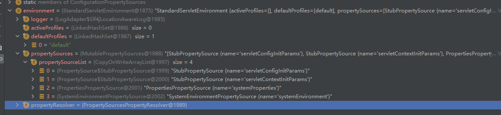
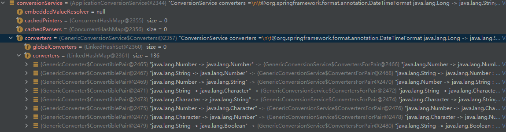

## SpringBoot启动


## 一  @SpringBootApplication

`@SpringBootApplication`是springboot的核心注解，它主要的功能就是开启自动装配。

```java
@Target(ElementType.TYPE)
@Retention(RetentionPolicy.RUNTIME)
@Documented
@Inherited
@SpringBootConfiguration
@EnableAutoConfiguration
@ComponentScan(excludeFilters = { @Filter(type = FilterType.CUSTOM, classes = TypeExcludeFilter.class),
		@Filter(type = FilterType.CUSTOM, classes = AutoConfigurationExcludeFilter.class) })
public @interface SpringBootApplication {

	@AliasFor(annotation = EnableAutoConfiguration.class)
	Class<?>[] exclude() default {};
	
	@AliasFor(annotation = EnableAutoConfiguration.class)
	String[] excludeName() default {};

	@AliasFor(annotation = ComponentScan.class, attribute = "basePackages")
	String[] scanBasePackages() default {};

	@AliasFor(annotation = ComponentScan.class, attribute = "basePackageClasses")
	Class<?>[] scanBasePackageClasses() default {};

	@AliasFor(annotation = ComponentScan.class, attribute = "nameGenerator")
	Class<? extends BeanNameGenerator> nameGenerator() default BeanNameGenerator.class;

	@AliasFor(annotation = Configuration.class)
	boolean proxyBeanMethods() default true;
}
```


其中最重要的三个注解分别是：

- <font color="red">@SpringBootConfiguration</font>：定义配置类，包含了`@Configuration`注解；
- <font color="red">@EnableAutoConfiguration</font>：开启自动装配功能，springboot中很重要的一个注解，通过`@Import`注解导入了`AutoConfigurationImportSelector`，该类会去扫描`META-INF/spring.factories`中的组件，注入到容器中；
- <font color="red">@ComponentScan</font>：扫描包的注解，默认的路径是启动类下的包，这也是为什么启动类一般会放在最外层包。


### 1. 自动装配：@EnableAutoConfiguration

`AutoConfigurationImportSelector`实现了`ImprotSelector`接口，其中重要的方法是`getAutoConfigurationEntry`，在该方法中，会去扫描`META-INF/spring.factories`下的组件。

```java
protected AutoConfigurationEntry getAutoConfigurationEntry(AnnotationMetadata annotationMetadata) {
    if (!isEnabled(annotationMetadata)) {
        return EMPTY_ENTRY;
    }
    // 获取@EnableAutoConfiguration注解中exclude和excludeName的值，用来排除组件
    AnnotationAttributes attributes = getAttributes(annotationMetadata);
    // 扫描META-INF/spring.factories下的组件
    List<String> configurations = getCandidateConfigurations(annotationMetadata, attributes);
    // 删除重复的组件
    configurations = removeDuplicates(configurations);
    // 获取需要排除的组件配置
    Set<String> exclusions = getExclusions(annotationMetadata, attributes);
    // 检查需要排除的组件配置
    checkExcludedClasses(configurations, exclusions);
    // 移除需要排除的
    configurations.removeAll(exclusions);
    // 获取配置类过滤器进行过滤，移除pom文件未引入且不需要的组件
    configurations = getConfigurationClassFilter().filter(configurations);
    // 触发自动装配导入的监听事件，
    // 如果有实现BeanClassLoaderAware、BeanFactoryAware、EnvironmentAware、ResourceLoaderAware接口的，会在这里执行
    fireAutoConfigurationImportEvents(configurations, exclusions);
    return new AutoConfigurationEntry(configurations, exclusions);
}
```


> ### getCandidateConfigurations()

根绝断言也可以看出，该方法会去扫描META-INF/spring.factories下的组件配置

```java
// org.springframework.boot.autoconfigure.AutoConfigurationImportSelector#getCandidateConfigurations
protected List<String> getCandidateConfigurations(AnnotationMetadata metadata, AnnotationAttributes attributes) {
    List<String> configurations = SpringFactoriesLoader.loadFactoryNames(getSpringFactoriesLoaderFactoryClass(),
                                                                         getBeanClassLoader());
    Assert.notEmpty(configurations, "No auto configuration classes found in META-INF/spring.factories. If you "
                    + "are using a custom packaging, make sure that file is correct.");
    return configurations;
}

// org.springframework.core.io.support.SpringFactoriesLoader#loadFactoryNames
public static List<String> loadFactoryNames(Class<?> factoryType, @Nullable ClassLoader classLoader) {
    // 从上面方法进来时，factoryTypeName的值
    // factoryTypeName：org.springframework.boot.autoconfigure.EnableAutoConfiguration
    String factoryTypeName = factoryType.getName();
    // 扫描META-INF/加载spring.factories下的组件配置
    return loadSpringFactories(classLoader).getOrDefault(factoryTypeName, Collections.emptyList());
}
```


> #### 加载spring.factories组件配置：loadSpringFactories()

```java
// org.springframework.core.io.support.SpringFactoriesLoader#loadFactoryNames
private static Map<String, List<String>> loadSpringFactories(@Nullable ClassLoader classLoader) {
    // 先尝试从缓存中取
    MultiValueMap<String, String> result = cache.get(classLoader);
    if (result != null) {
        return result;
    }

    try {
        // FACTORIES_RESOURCE_LOCATION：META-INF/spring.factories
        // 从META-INF/spring.factories加载组件配置，
        Enumeration<URL> urls = (classLoader != null ?
                                 classLoader.getResources(FACTORIES_RESOURCE_LOCATION) :
                                 ClassLoader.getSystemResources(FACTORIES_RESOURCE_LOCATION));
        result = new LinkedMultiValueMap<>();
        // 循环获取路径中的配置组件
        while (urls.hasMoreElements()) {
            URL url = urls.nextElement();
            UrlResource resource = new UrlResource(url);
            Properties properties = PropertiesLoaderUtils.loadProperties(resource);
            for (Map.Entry<?, ?> entry : properties.entrySet()) {
                String factoryTypeName = ((String) entry.getKey()).trim();
                for (String factoryImplementationName : StringUtils.commaDelimitedListToStringArray((String) entry.getValue())) {
                    result.add(factoryTypeName, factoryImplementationName.trim());
                }
            }
        }
        cache.put(classLoader, result);
        return result;
    }
    catch (IOException ex) {
        throw new IllegalArgumentException("Unable to load factories from location [" +
                                           FACTORIES_RESOURCE_LOCATION + "]", ex);
    }
}
```


## 二 启动类的run()方法

在启动类中，出了`@SpringBootApplication`注解之外，还有一个就是`run()`方法，接下来就看一下`run()`方法做了什么。

```java
// SpringApplication.java
public static ConfigurableApplicationContext run(Class<?> primarySource, String... args) {
    // primarySource：传进来的启动类
    return run(new Class<?>[] { primarySource }, args);
}

// SpringApplication.java
public static ConfigurableApplicationContext run(Class<?>[] primarySources, String[] args) {
    return new SpringApplication(primarySources).run(args);
}
```


### 1 new SpringApplication()

新建spring上下文中主要功能：

- 获取webApplication类型；
- 扫描META-INF/spring.factories下的组件（主要是一些组件的初始化器和监听器），创建实例；
- 找到main方法所在类的类型。

```java
// SpringApplication.java
public SpringApplication(Class<?>... primarySources) {
    this(null, primarySources);
}

// SpringApplication.java
public SpringApplication(ResourceLoader resourceLoader, Class<?>... primarySources) {
    this.resourceLoader = resourceLoader;
    Assert.notNull(primarySources, "PrimarySources must not be null");
    this.primarySources = new LinkedHashSet<>(Arrays.asList(primarySources));
    // 获取WebApplication的类型
    // NONE：不作为web应用运行，也不启动内嵌web服务器
    // SERVLET：作为基于Servlet的web应用程序运行，并启动嵌入的Servlet web服务
    // REACTIVE：作为反应式Web服务器，并启动嵌入的反应式wbe服务器
    // 这种模式应该是spring5.0中新提出的webflux，该部分不在主流程中，笔者也未深入研究。
    this.webApplicationType = WebApplicationType.deduceFromClasspath();
    // 扫描META-INF/spring.factories下的组件，通过反射方法获取构造方法构建实例，放入springApplication中
    // key：org.springframework.context.ApplicationContextInitializer
    setInitializers((Collection) getSpringFactoriesInstances(ApplicationContextInitializer.class));
    // 扫描META-INF/spring.factories下的组件
    // key：org.springframework.context.ApplicationListener
    setListeners((Collection) getSpringFactoriesInstances(ApplicationListener.class));
    // 获取main方法的class
    this.mainApplicationClass = deduceMainApplicationClass();
}
```


> ### 获取扫描到的组件实例：getSpringFactoriesInstances()

```java
// SpringApplication.java
private <T> Collection<T> getSpringFactoriesInstances(Class<T> type) {
    return getSpringFactoriesInstances(type, new Class<?>[] {});
}

// SpringApplication.java
private <T> Collection<T> getSpringFactoriesInstances(Class<T> type, Class<?>[] parameterTypes, Object... args) {
    // 获取类加载器
    ClassLoader classLoader = getClassLoader();
    // loadFactoryNames(type, classLoader)方法已经分析过
    Set<String> names = new LinkedHashSet<>(SpringFactoriesLoader.loadFactoryNames(type, classLoader));
    // 通过反射创建实例
    List<T> instances = createSpringFactoriesInstances(type, parameterTypes, classLoader, args, names);
    // 排序
    AnnotationAwareOrderComparator.sort(instances);
    return instances;
}
```


> #### 创建实例：createSpringFactoriesInstances（

```java
// SpringApplication.java
private <T> List<T> createSpringFactoriesInstances(Class<T> type, Class<?>[] parameterTypes,
       ClassLoader classLoader, Object[] args, Set<String> names) {
    List<T> instances = new ArrayList<>(names.size());
    for (String name : names) {
        try {
            // 通过反射回去class
            Class<?> instanceClass = ClassUtils.forName(name, classLoader);
            Assert.isAssignable(type, instanceClass);
            // 获取构造器
            Constructor<?> constructor = instanceClass.getDeclaredConstructor(parameterTypes);
            // 创建实例
            T instance = (T) BeanUtils.instantiateClass(constructor, args);
            instances.add(instance);
        }
        catch (Throwable ex) {
            throw new IllegalArgumentException("Cannot instantiate " + type + " : " + name, ex);
        }
    }
    return instances;
}
```


> #### 获取含main方法的class：deduceMainApplicationClass

```java
// SpringApplication.java
private Class<?> deduceMainApplicationClass() {
    try {
        // 获取堆栈中的元素，循环判断
        StackTraceElement[] stackTrace = new RuntimeException().getStackTrace();
        for (StackTraceElement stackTraceElement : stackTrace) {
            if ("main".equals(stackTraceElement.getMethodName())) {
                return Class.forName(stackTraceElement.getClassName());
            }
        }
    }
    catch (ClassNotFoundException ex) {
        // Swallow and continue
    }
    return null;
}
```


### 2. run()方法

```java
// SpringApplication.java
public ConfigurableApplicationContext run(String... args) {
    // 创建stopwatch记录当前任务的名称和起始时间
    StopWatch stopWatch = new StopWatch();
    stopWatch.start();
    ConfigurableApplicationContext context = null;
    Collection<SpringBootExceptionReporter> exceptionReporters = new ArrayList<>();
    // 设置java.awt.headless属性
    configureHeadlessProperty();
    // 扫描META-INF/spring.factories获取监听
    SpringApplicationRunListeners listeners = getRunListeners(args);
    // 通过多播器发布容器启动事件
    listeners.starting();
    try {
        // 处理参数
        ApplicationArguments applicationArguments = new DefaultApplicationArguments(args);
        // 准备容器环境
        // 1. 获取或创建环境,2.设置命令行参数 3.发布环境准备事件
        ConfigurableEnvironment environment = prepareEnvironment(listeners, applicationArguments);
        configureIgnoreBeanInfo(environment);
        // 打印图标
        Banner printedBanner = printBanner(environment);
        // 根据webApplicationType反射创建容器
        context = createApplicationContext();
        // 获取META-INF/spring.factories中异常报告组件
        exceptionReporters = getSpringFactoriesInstances(SpringBootExceptionReporter.class,
                                                         new Class[] { ConfigurableApplicationContext.class }, context);
        //准备环境
		// 1：把环境设置到容器中
		// 2: 循环调用AppplicationInitnazlier 进行容器初始化工作
		// 3:发布容器上下文准备完成事件
		// 4:注册关于springboot特性的相关单例Bean；springApplicationArguments/springBootBanner
        // 5.加载资源；就是把启动类加载进去
		// 5:发布容器上下文加载完毕事件
        prepareContext(context, environment, listeners, applicationArguments, printedBanner);
        // 最终会调用到IOC中的refresh()方法
        refreshContext(context);
        afterRefresh(context, applicationArguments);
        stopWatch.stop();
        if (this.logStartupInfo) {
            new StartupInfoLogger(this.mainApplicationClass).logStarted(getApplicationLog(), stopWatch);
        }
        // 发布容器启动事件
        listeners.started(context);
        // 运行ApplicationRunner和CommandLineRunner；可以在容器启动后处理一些内容
        callRunners(context, applicationArguments);
    }
    catch (Throwable ex) {
        handleRunFailure(context, ex, exceptionReporters, listeners);
        throw new IllegalStateException(ex);
    }

    try {
        // 发布容器启动事件
        listeners.running(context);
    }
    catch (Throwable ex) {
        handleRunFailure(context, ex, exceptionReporters, null);
        throw new IllegalStateException(ex);
    }
    return context;
}
```


#### 2.1 准备环境：prepareEnvironment()

```java
private ConfigurableEnvironment prepareEnvironment(SpringApplicationRunListeners listeners,
                                                   ApplicationArguments applicationArguments) {
    // 根据获取到的webApplicationType，创建ConfigurableEnvironment
    ConfigurableEnvironment environment = getOrCreateEnvironment();
    // 处理defaultProperties、commandLine及active-prifiles属性
    // 第一次进来的时候全部是空的，什么也没做
    configureEnvironment(environment, applicationArguments.getSourceArgs());
    // 新建configurationProperties类型PropertySource，放入环境中用于之后的处理
    ConfigurationPropertySources.attach(environment);
    // 发布环境准备事件，获取SpringApplicationRunListener,用于处理实现EnvironmentPostProcessor接口的后置处理器
    // 配置中spring.profiles.active指定激活的环境，将在这里通过ConfigFileApplicationListener后置处理器被解析加载
    listeners.environmentPrepared(environment);
    // 将环境与spring上下文绑定
    bindToSpringApplication(environment); 
    if (!this.isCustomEnvironment) {
        // 不是自定义环境，进行转换
        environment = new EnvironmentConverter(getClassLoader()).convertEnvironmentIfNecessary(environment, deduceEnvironmentClass());
    }
    // 移除环境中的configurationProperties类型的PropertySource
    ConfigurationPropertySources.attach(environment);
    return environment;
}
```


> #### **environment**




> ### 配置环境：configureEnvironment()

```java
protected void configureEnvironment(ConfigurableEnvironment environment, String[] args) {
    if (this.addConversionService) {
        // 获取ConversionService实例，用于处理格式化
        ConversionService conversionService = ApplicationConversionService.getSharedInstance();
        environment.setConversionService((ConfigurableConversionService) conversionService);
    }
    // 添加默认的配置以及args传接进来的配置
    configurePropertySources(environment, args);
    // 配置Profil，即spring.profiles.active，指定环境
    // 但是此时是空的，真正加载进来是在之后的发布环境准备事件中
    configureProfiles(environment, args);
}
```

**conversionService**




### 2.2 refreshContext()

`refreshContext()`最终回到用到`org.springframework.context.support.AbstractApplicationContext#refresh`方法，而`refresh()`正式IOC中的核心方法。

```java
public void refresh() throws BeansException, IllegalStateException {
    synchronized (this.startupShutdownMonitor) {
        // 准备容器刷新
    	// 1. 清空metadataReaderCache，标记applicationContext状态为激活
   		// 2. 判断是否需要用ServletContextPropertySource替换当前环境中的同步配置源
        // 3. 检验属性，确保必要的属性都可以被解析
        // 4. 设置早期监听
        prepareRefresh();

        // 设置beanFactory的序列化ID，获取BeanFactory
        ConfigurableListableBeanFactory beanFactory = obtainFreshBeanFactory();

        // 准备BeanFactory，给beanFactory注册一些属性，例如：BeanPostProcessor、BeanClassLoader等等
        prepareBeanFactory(beanFactory);

        try {
            // 处理bean
            postProcessBeanFactory(beanFactory);

            // 处理BeanFactoryPostProcessor和BeanDefinitionRegistryPostProcessor后置处理器在IOC中分析过	
            invokeBeanFactoryPostProcessors(beanFactory);

            // 创建并注册BeanPostProcessor
            registerBeanPostProcessors(beanFactory);

            // 初始化MessageSource
            initMessageSource();

            // 初始化多播器
            initApplicationEventMulticaster();

            // IOC内嵌tomcat在这里初始化启动
            onRefresh();

            // 注册监听器，执行早期监听
            registerListeners();

            // 实例化bean
            finishBeanFactoryInitialization(beanFactory);

            // Last step: publish corresponding event.
            finishRefresh();
        }

        catch (BeansException ex) {
            if (logger.isWarnEnabled()) {
                logger.warn("Exception encountered during context initialization - " +
                            "cancelling refresh attempt: " + ex);
            }

            // 销毁所有的单例bean
            destroyBeans();

            // 取消刷新
            cancelRefresh(ex);

            // Propagate exception to caller.
            throw ex;
        }

        finally {
            // 重置缓存
            resetCommonCaches();
        }
    }
}
```


### 2.3  创建内嵌tomcat：onRefresh()

如果是springboot打成jar包，是IOC容器带动内嵌tomcat启动，而war包则是tomcat带动IOC启动，需要启动类实现SpringBootServletInitializer接口。

现在这种方式是jar包的形式，即通过IOC容器带动内嵌tomcat启动。

```java
// ServletWebServerApplicationContext.java
protected void onRefresh() {
    super.onRefresh();
    try {
        // 创建WebServer，即tomcat
        createWebServer();
    }
    catch (Throwable ex) {
        throw new ApplicationContextException("Unable to start web server", ex);
    }
}

// ServletWebServerApplicationContext.java
private void createWebServer() {
    // 获取webServer，现在还为空
    WebServer webServer = this.webServer;
    // 获取Servlet上下文，现在还为空
    ServletContext servletContext = getServletContext();
    if (webServer == null && servletContext == null) {
        // 获取ServletWebServer的工厂，名字是tomcatServletWebServerFactory
        ServletWebServerFactory factory = getWebServerFactory();
        // 获取
        this.webServer = factory.getWebServer(getSelfInitializer());
        getBeanFactory().registerSingleton("webServerGracefulShutdown",
                                           new WebServerGracefulShutdownLifecycle(this.webServer));
        getBeanFactory().registerSingleton("webServerStartStop",
                                           new WebServerStartStopLifecycle(this, this.webServer));
    }
    else if (servletContext != null) {
        try {
            getSelfInitializer().onStartup(servletContext);
        }
        catch (ServletException ex) {
            throw new ApplicationContextException("Cannot initialize servlet context", ex);
        }
    }
    initPropertySources();
}
```


> #### 创建tomcat：getWebServer()

```java
public WebServer getWebServer(ServletContextInitializer... initializers) {
    if (this.disableMBeanRegistry) {
        // 创建注册器
        Registry.disableRegistry();
    }
    // 创建tomcat对象
    Tomcat tomcat = new Tomcat();
    // 设置tomcat的一些属性
    File baseDir = (this.baseDirectory != null) ? this.baseDirectory : createTempDir("tomcat");
    tomcat.setBaseDir(baseDir.getAbsolutePath());
    Connector connector = new Connector(this.protocol);
    connector.setThrowOnFailure(true);
    tomcat.getService().addConnector(connector);
    customizeConnector(connector);
    tomcat.setConnector(connector);
    tomcat.getHost().setAutoDeploy(false);
    configureEngine(tomcat.getEngine());
    for (Connector additionalConnector : this.additionalTomcatConnectors) {
        tomcat.getService().addConnector(additionalConnector);
    }
    prepareContext(tomcat.getHost(), initializers);
    // getTomcatWebServer：启动tomcat
    return getTomcatWebServer(tomcat);
}
```

