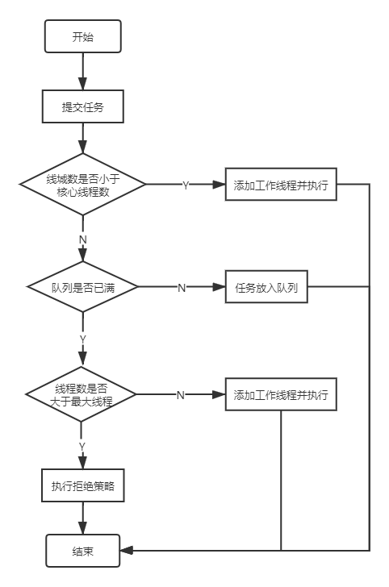

## 一 集合

### 1. HashMap

jdk1.7及之前版本，采用数组 + 链表的数据结构，线程扩容时采用头插法（作者认为后面的数据被查找的可能性更大），可能造成死循环。在1.8中，HashMap采用的时数组 + 链表 + 红黑树的结构，在扩容时，改用尾插法，避免了死循环的问题，但还是会造成数据覆盖。

链表转化为红黑树的条件：数组长度小于64时，先扩容（原长度的2倍），数组长度大于64且链表长度大于8时，转化为红黑树，链表长度小于6时，重新转为链表。

> ### 负载因子为什么要用0.75

负载因子选择0.75是对时间和空间的一种很好的权衡，比较大的值会减少空间开销，但是会增加查找的时间成本。

根据泊松分布，在负载因子默认为0.75的时候，单个hash槽内元素个数为8的概率小于百万分之一。

> ### 为什么容量要设置为2的n次方

为了数据的均匀分布，最直接的办法就是采用取模运算，而在HashMap中采用位运算`hash & (length - 1)`计算索引位置，是因为使用位运算的效率远高于取模运算。

位运算(&)效率要比代替取模运算(%)高很多，主要原因是位运算直接对内存数据进行操作，不需要转成十进制，因此处理速度非常快。

如果容量是2的n次方，那么 `(length - 1)`所有位都变成了1，索引的位置取决于hashCode后几位的值，实现了均匀分布。

1.8中hash的计算方式`(key == null) ? 0 : (h = key.hashCode()) ^ (h >>> 16)`。

> ###  HashMap中主要参数

```java
// 数组的初始化大小，
static final int DEFAULT_INITIAL_CAPACITY = 1 << 4; // aka 16
// 数组最大容量
static final int MAXIMUM_CAPACITY = 1 << 30;
// 负载因子
static final float DEFAULT_LOAD_FACTOR = 0.75f;
// 链表转红黑树的默认节点数
static final int TREEIFY_THRESHOLD = 8;
// 红黑树退回链表的默认节点数
static final int UNTREEIFY_THRESHOLD = 6;
// 链表转红黑树时数组最小长度
static final int MIN_TREEIFY_CAPACITY = 64;
// 存放数据的数组
transient Node<K,V>[] table;
```

### 2. 线程安全的Map

> **Collections.synchronizedMap(new HashMap<>())**

```java
// 在synchronizedMap中维护了一个map和互斥锁mutex，其他方法通过synchronized(mutex)加锁保证线程安全
private final Map<K,V> m;     // Backing Map
final Object      mutex;        // Object on which to synchronize

SynchronizedMap(Map<K,V> m) {
    this.m = Objects.requireNonNull(m);
    mutex = this;
}

SynchronizedMap(Map<K,V> m, Object mutex) {
    this.m = m;
    this.mutex = mutex;
}
```


> #### Hashtable

Hashtable 保证线程安全是在方法上加锁`synchronized`来完成的。

> #### Hashtable 和 HashMap的区别

- **实现方式不同：**Hashtable 继承的是 Dictionary，而 HashMap 继承的是 AbstractMap。
- **初始化容量不同：**Hashtable 的初始化容量是11，而 HashMap 是16。
- **扩容机制不同：**Hashtable 的扩容规则是容量翻倍 +1，而 HashMap 是容量翻倍。
- **迭代器不同：**Hashtable 的迭代器`Dictionary`是安全失败机制（fail-safe），正是这种机制不允许键或值为 null，HashMap 的迭代器快速失败（fail-fast）。

> #### fail - safe 和 fail -fast

**快速失败（fail -fast）**，在迭代器遍历中，若修改集合，则会报错。在遍历过程中，每次遍历下一个元素前，会先比较 `modCount`（集合中元素数量）和开始遍历时记录的元素数量。

**安全失败（fail - safe）**：在遍历时不直接访问集合上的元素，而是先复制集合，然后遍历复制的集合，若值为 null 时，无法判断是不存在还是为 null。


> **ConcurrentHashMap**

- **在1.7中，把 table 分成了 n 个 Segment，Segment 继承了 ReentrantLock。**

put 方法的大致流程是：

1. 先定位到 Segment，
2. 然后再定位到 table 数组，
3. 不断尝试给头节点加锁，获取到锁后，再 put 元素。

- **在1.8中，重构了1.7，虽然还保留了 Segment（兼容1.7），但是没有用到，而是通过给数组中的头节点加 synchronized 锁。**

put 方法的大致流程为：

1. 先判断是否初始化，未初始化时保证只有一个线程完成初始化，`sizeCtl`值为 -1，表示其他线程在初始化，小于 -1时，表示几个线程在帮助扩容。
2. 数组头节点为空，CAS操作放入。
3. 如果正在扩容，线程会帮助转移数据，每个线程从后往前负责几个数组上的数据转移。
4. 头节点不为空，synchronized 锁住头节点，然后插入。
5. 统计 map 中元素数量，在并发下，不同线程统计自己的数据，最后进行相加。

在1.7和1.8中，都采用 volatile 关键字修饰了数组、值和下一个节点 。

```java
volatile V val;
volatile Node<K,V> next;
transient volatile Node<K,V>[] table;
```


### 3. List

> ArrayList

底层是数组实现的，查找效率高（内存连续），增删效率慢（取决于元素距离末尾的距离），默认初始长度为10，扩容为1.5倍。

在不指定index时，插入若需扩容，会通过`arraycopy()`方法将原数组复制到新的数组中，若指定index，需要扩容的情况下，会先通过`arraycopy()`进行扩容，之后会复制index之后的数组并后移，若不需要扩容，index之后的数组也会通过复制后移。

虽然 ArrayList 可以初始化长度，但是`set()`方法校验是和`size`比较大小。size是数组中元素的个数。


## 二 spring 

### 1. IOC

控制反转（IOC）是依赖倒置原则的一种思路，而 DI 是其中一种实现方式。

IOC是为了删除对象间的直接依赖关系，避免因底层类的改动，导致所有依赖它的类都要改变，就是我们常说的解耦。

在 Spring 中的体现就是将 bean 的创建、管理交给容量。

**依赖倒置原则**：高层模块不应该依赖低层模块，两者都应该依赖其抽象；抽象不应该依赖细节，细节应该依赖抽象。

关于IOC更详细解释可以看看这两篇文章：


### 2. 循环依赖

```java
// 循环依赖的两个类，若都采用构造函数注入，就会报错，但是只有一个通过构造函数注入，并不一定会报错。
@Component
class A {
    @Autowired
    B b;
}

@Component
class B {
    @Autowired
    A a;
}
```

在Spring 中 通过三级缓存来解决循环依赖的问题：

- `singletonObjects`：缓存创建完成的 bean；
- `earlySingletonObjects`：存储早期的 bean；
- `singletonFactories`：bean 的早期引用，不是一个完整的 bean，只是一个 Instance。

在 A 完成实例化后，会先将 A 放入`singletonFactories`，之后开始填充属性，在这里发现依赖 B，然后开始创建 B，在 B 填充属性时，发现依赖 A，但是可以从三级缓存中去拿，之后 B 完成创建，继续去创建 A，其实为了解决循环依赖，两级缓存也可以实现，采用三级缓存主要时为了将**延迟对实例化阶段生成的对象的代理，只有真正发生循环依赖的时候，才去提前生成代理对象**。


### 3. 事务

```java
// 事务管理器，提供了事务管理功能
interface PlatformTransactionManager;

// 事务定义，定义了事务的隔离级别、传播行为等
// 隔离级别：读未提交、读已提交、可重复读、串行化
// 传播行为：
// PROPAGATION_REQUIRED（支持当前事务，没有则新建一个事务,有的话加入）
// PROPAGATION_SUPPORTS（如果当前有事务，加入当前事务；若没有，则以非事务的方式执行）
// PROPAGATION_MANDATORY（如果当前有事务，加入当前事务；若没有则抛出异常）
// PROPAGATION_REQUIRES_NEW（创建一个新的事务，若当前有事务，则将当前事务挂起）
// PROPAGATION_NOT_SUPPORTED（以非事务的方式执行，若当前有事务则将事务挂起）
// PROPAGATION_NEVER（以非事务方式运行，当前存在事务抛错）
// PROPAGATION_NESTED（若当前存在事务，则在嵌套事务中执行）
interface TransactionDefinition;

// 获取事务状态
interface TransactionStatus    
```


## 三 springboot

### 1. @SpringBootApplication 注解

主要包括三个核心注解：

- <font color="red">@SpringBootConfiguration</font>：定义配置类，包含了`@Configuration`注解；
- <font color="red">@EnableAutoConfiguration</font>：开启自动装配功能，springboot中很重要的一个注解，通过`@Import`注解导入了`AutoConfigurationImportSelector`，该类会去扫描`META-INF/spring.factories`中的组件，注入到容器中；
- <font color="red">@ComponentScan</font>：扫描包的注解，默认的路径是启动类下的包，这也是为什么启动类一般会放在最外层包。


## 四 并发

### 1.  缓存一致性协议

在多处理器系统中，每个处理器都有自己的高速缓存，而它们又共享同一主内存 （MainMemory）。基于高速缓存的存储交互很好地解决了处理器与内存的速度矛盾，但是 也引入了新的问题：缓存一致性（CacheCoherence）。为了解决一致性的问题，需要各个处理器访问缓存时都遵循一些协议。

> ### MESI（缓存一致性协议的一种）状态的转化

1. 当CPU1从主内存中读取变量（该变量触发了MESI协议，例如加了`volatie`关键字）时，若没有其他CPU读取过时，会将该缓存行置为E(独占)状态，同时通过嗅探机制监听是否有其他CPU操作该内存；
2. 在CPU1将变量写回主存前，CPU2读取该变量时，CPU1监听到有其他CPU操作该内存，此时会将该缓存行置为S(共享)状态；
3. 当CPU1修改完该变量后，在写回主存前，会将锁住该缓存行，并将该变量置为M(修改状态)，同时向主线中发送消息，将CPU2中的状态变为I(无效)状态；
4. CPU1将变量同步回主存，同时将该变量置为E(独占)状态。

当CPU1和CPU2中变量修改后，同时要更新回主存，此时会经过裁决，最终选定一个写回主存。


### 2. 用户线程、内核线程

- **用户线程(User-Level Thread)**：指不需要内核支持而在用户程序中实现的线程，其不依赖于操作系统核心，应用进程利用线程库提供创建、同步、调度和管理线程的函数来控制用户线程。另外，用户线程是由应用进程利用线程库创建和管理，不依赖于操作系统核心。不需要用户态/核心态切换， 速度快。操作系统内核不知道多线程的存在，因此一个线程阻塞将使得整个进程（包括它的所有线程）阻塞。由于这里的处理器时间片分配是以进程为基本单位，所以每个线程执行的时间相对减少。
- **内核线程(Kernel-Level Thread))**：线程的所有管理操作都是由操作系统内核完成的。内核保存线程的状态和上下文信息，当一个线程执行了引起阻塞的系统调用时，内核可以调度该进程的其他线程执行。


**线程生命周期：**


### 3. JMM

Java内存模型(Java Memory Model，简称JMM)是一种抽象的概念，并不真实存在，它描 述的是一组规则或规范。

JMM中规定所有的共享变量都存储在主内存中，所有线程都可以访问，但线程操作变量必须在工作内存中进行，先将变量从主内存中拷贝到自己的工作内存，然后对变量进行操作，完成操作后在将变量写回主内存。


### 4. volatile

**volatile 可以保证有序性和可见性。**

> #### 可见性

对于被`volatile`修饰的变量，处理器在读取时会触发缓存一致性原则，操作的变量时共享变量时，再修改变量后，会想总线中发送消息，并将变量同步会主存，其他处理器通过嗅探发现变量被修改，会将自己缓存的变量置为无效状态，重新从内存中读取。

由于缓存一致性协议会导致不断的从主存嗅探和cas操作，若大量的使用 volatile 关键字会频繁的无效交互，到这总线带宽达到峰值，造成总线风暴。


> #### 有序性

**为了提高性能，再不影响指令执行结果的前提下，编译器和处理器会对指令进行重排优化。**


- **编译器优化重排：**编译器在不改变单线程程序语义的前提下，重排语句的执行顺序。
- **指令集并行重排：**现代处理器采用了指令级并行技术来将多条指令重叠执行。如果不存在数据依赖性，处理器可以改变语句对应机器指令的执行顺序;
- **内存系统重排：**由于处理器使用缓存和读/写缓冲区，这使得加载和存储操作看上去可能是在乱序执行的。


> **as-if-serial语义**

**as-if-serial语义的意思是：不管怎么重排，都不能改变执行结果。**


> happens-before原则

​		从JDK 5开始，Java使用新的JSR-133内存模型，提供了 happens-before 原则来辅助保证程序执行的原子性、可见性以及有序性的问题，它是判断数 据是否存在竞争、线程是否安全的依据，happens-before 原则内容如下：

1. **程序顺序原则**：即在一个线程内必须保证语义串行性，也就是说按照代码顺序执行；
2. **锁规则**： 同一个锁的解锁操作必然发生在后续的加锁之前；
3. **volatile规则** ：`volatile`修饰变量的写，先发生于读；
4. **线程启动规则**：线程的start()方法先于它的每一个动作；
5. **传递性**： A先于B ，B先于C ，那么A必然先于C ；
6. **线程终止规则**： 线程的所有操作先于线程的终结； 
7. **线程中断规则**： 对线程 interrupt()方法的调用先行发生于被中断线程的代码检测到中断事件的发生，可以通过Thread.interrupted()方法检测线程是否中断；
8. **对象终结规则**: 对象的构造函数执行，结束先于finalize()方法。


> #### 内存屏障

​	`volatile`关键字实现禁止指令重排是通过插入**内存屏障**来实现的。

内存屏障，又称内存栅栏，是一个CPU指令，它的作用有两个：**一是保证特定操作的执行顺序**，**二是保证某些变量的内存可见性**。

JMM中volatie的重排规则表：

 


> #### volatile写操作插入内存屏障


> #### volatile读操作插入内存屏障


### 5. synchronized

​	`synchronized`内置锁是一种对象锁，是基于JVM内置锁来实现的，基于内部对象**Monitor**（监视器锁）的进入（monitorenter）和退出（monitorexit）实现同步功能，监视器锁依赖底层操作系统的Mutex lock（互斥锁），它是一个重量级的锁。

> #### 对象内存布局

在JVM中对象布局分为三块：

- **对象头**：比如 hash码，对象所属的年代，对象锁，锁状态标志，偏向 锁（线程）ID，偏向时间，数组长度（数组对象）等
- **实例数据**：对象中成员变量，方法等
- **对齐填充**：JVM中规定对象的大小必须是8字节的整数倍


> #### 锁升级

在JDK1.6之后，对JVM内置锁进行了重大优化，引入锁消除、锁粗化、轻量级锁、偏向锁、适应性自旋等等。锁的状态共有四种，分别为：**无锁状态**、**偏向锁**、**轻量级锁**和**重量级锁**。随着锁的竞争，锁会从偏向锁升级为轻量级锁，再升级为重量级锁，且**锁的升级时单向的**。


### 6. AQS

AQS全程为AbstractQueuedSynchronizer，位于java.concurrent.util包，它定义了一套多线程访问共享资源的同步器框架，是一个依赖状态（state）的同步器，JUC中大多数同步器实现都是围绕等待队列、条件队列、独占、共享等行为，而AQS就是对这种行为的抽象。	


> #### 队列

AQS中定义了两种队列，分别是：

- **同步队列**：基于双向链表，FIFO的数据结构队列，Java中的CLH队列是原CLH队列的一个变种，线程有原来的自旋变为了阻塞。
- **条件队列**：是一个多线程间协调通信的工具类，使得某个或者某些线程一起等待某个条件（Condition），只有当该条件具备时 ，这些等待线程才会被唤醒，从而重新争夺锁。


> #### 公平锁和非公平锁

- **公平锁**：新线程会进入等待队列中，等待被唤醒，遵循FIFO。

  优点是所有线程都能获得资源，不会被饿死；缺点是吞吐量会下降，队列里除了第一个线程其他都会被阻塞，CPU唤醒线程消耗较大。

- **非公平锁**：新线程会先尝试获取锁，若失败进入等待队列，与公平锁相同，CPU需要唤醒的线程+1；若成功，则直接获取锁。

  优点是可以减少CPU唤醒线程消耗，提高吞吐量；缺点是队列中的线程可能会被饿死。

**AQS组件：

- `ReentrantLock`
- `Semaphore`：信号量，可以做单机限流
- `CountDownLatch`：允许 count 个线程阻塞在一个地方。
- `CyclicBarrier`：与 CountDownLatch 类似。


### 7. BlockingQueue

`BlockingQueue`阻塞队列，通常用链表或数组实现，主要有`FIFO`和`LIFO`两种，其实现是基于**AQS（CLH+条件队列+ReentrantLock）**。最经典的应用场景就是生产者-消费者。

```java
// ********* 入队 ***********
boolean add(E e); // 向队列尾插入元素，若队列已满，则抛错
boolean offer(E e); // 向队列尾插入元素，若队列已满，返回fasle
void put(E e) throws InterruptedException; // 向队列尾插入元素，若队列已满，则阻塞
//  ********* 出队 ***********
E take() throws InterruptedException; // 从队列头取出元素，若没有则阻塞
E poll(long timeout, TimeUnit unit) throws InterruptedException; // 从队列头取出元素，等待指定时间
int drainTo(Collection<? super E> c);  // 将队列中的全部元素放入指定集合中
```


### 8. 线程池

线程是稀缺资源，频繁的创建和销毁会大大降低系统的效率，为了降低获取线程的消耗，提高资源利用率，引入池化技术，而线程池正是其中之一。

使用线程池的好处：

- **降低资源消耗**：通过重复利用已创建的线程降低线程创建和销毁造成的消耗；
- **提高响应速度**：当任务到达时，任务可以不需要的等到线程创建就能立即执行。
- **提高线程的可管理性**。线程是稀缺资源，如果无限制的创建，不仅会消耗系统资源，还会降低系统的稳定性，使用线程池可以进行统一的分配，调优和监控。


> #### ThreadPoolExecutor

**ThreadPoolExecutor的属性**

```java
int corePoolSize, // 线程池的核心线程数
int maximumPoolSize, // 线程池的最大线程数
long keepAliveTime, // 线程数大于核心线程时，空闲线程存活时间
TimeUnit unit, // 时间单位
BlockingQueue<Runnable> workQueue, // 等待执行任务的阻塞队列
ThreadFactory threadFactory,  // 线程工厂
// 拒绝策略
// 1、AbortPolicy：直接抛出异常，默认策略；
// 2、CallerRunsPolicy：用调用者所在的线程来执行任务；
// 3、DiscardOldestPolicy：丢弃阻塞队列中靠最前的任务，并执行当前任务；
// 4、DiscardPolicy：直接丢弃任务；
RejectedExecutionHandler handle
```


> #### 线程池的状态

线程池内部使用一个`AtomicInteger`类型的变量`ctl`维护两个值：运行状态(runState)和有效线程数量 (workerCount)。其中高3位保存runState，低29位保存workerCount。

|      状态      |                             说明                             |
| :------------: | :----------------------------------------------------------: |
|  **RUNNING**   | 线程池的初始状态就是RUNNING，在该状态时，线程池会接受新任务，处理阻塞队列中的任务 |
|  **SHUTDOWN**  |       不接受新提交任务，但是会继续处理阻塞队列中的任务       |
|    **STOP**    | 不接受新任务，也不处理阻塞队列中的任务，且会中断正在执行的任务 |
|  **TIDYING**   |           所有任务都已经执行完了，且有效线程数为0            |
| **TERMINATED** | 线程池处在TIDYING状态时，执行完terminated()之后，进入该状态需要有效线程为0，阻塞队列为空 |


> ### ExecutorService执行任务的流程图




## 五 JVM


## 六 数据库


## 七 缓存

### 1. redis基本数据类型

string、list、hash、set、zset。


### 2. redis线程模型

操作基于内存，文件事件处理器 `file event handler`，采用 **epoll** 实现了 **IO 多路复用**。

文件事件处理器的结构包含 4 个部分：

- 多个 **Socket**
- IO 多路复用程序
- 文件事件分派器
- 事件处理器（连接应答处理器、命令请求处理器、命令回复处理器）

多个 **Socket** 可能会并发产生不同的操作，每个操作对应不同的文件事件，但是 IO 多路复用程序会监听多个 **Socket**，会将 **Socket** 产生的事件放入队列中排队，事件分派器每次从队列中取出一个事件，把该事件交给对应的事件处理器进行处理。


### 3. redis 过期策略和内存淘汰机制

- **过期策略：**惰性+定期。
- **内存淘汰机制：**lru、random、ttl、no-enviction。


### 4. redis持久化

- **RDB：**存储某一时刻的数据，恢复较快，可能丢失较多数据，数据量比较多时，客户端可能会产生暂停，COW。
- **AOF：**append-only 方式追加，少了磁盘寻址，写入性能好，文件大，回复较慢，两个都开启时优先使用aof。

在4.0中redis加入了混合持久化，AOF在重写时会将这一刻之前的做RDB快照处理，并将RDB和增量AOF写入新的文件，在重写完成后，覆盖原来的AOF文件。


### 5. redis高可用

- **哨兵**：客观、主管下线，选举哨兵 leader 进行故障转移，完成之后通知其他从节点同步数据，更新哨兵中元数据。
- **集群**：槽位（数据分区）；收到其他过半主节点的ack当选。


### 6 redis数据同步

- **全量复制：**第一次连上主节点，或者重新选举主节点；fork 子进程RDB持久化，发送给从节点，之后同步缓存数据。 在同步rdb期间，若缓存满了，主节点则会关闭连接，造成同步失败，重新进行全量同步。
- **部分复制**：重连；根据主节点 id 和偏移量 offset 决定是否需要进行全量复制。


### 7. 缓存穿透、雪崩

-  **穿透**：访问不存在的key，大量请求落在数据库上；存储控制，针对恶意请求使用布隆过滤器（大的位数组，有时可能存在，没有时肯定没有）。
- **雪崩**：大量缓存失效，服务级联崩溃；过期时间随机，服务熔断降级。


### 8. 分布式锁

- **setnx**
- **锁并发和误删：**锁过期，其他线程拿到锁，执行结束后删除锁；lua脚本加时、redsion、redlock（GC或者时钟跳跃）。
- **集群下锁：**主从数据同步不及时，重新选举、集群脑裂。


### 9. 数据库和缓存一致

对于强一致性可以采用**内存队列**，将读写请求都放入内存队列中，性能较差。

对于可以偶尔不一致的情况，可以采用**消息队列订阅binLog异步更新**，或者延时双删，经典的Cache Aside Pattern（先更新数据，然后删除缓存，懒加载思想，用到是才重新生成缓存）等。


### 10. 热点key

- **热点key失效：**并发量大，重新构建复杂，通过互斥锁只允许一个线程重建，防止高并发下多个线程重复构建。
- **尽量保证缓存中都是热点key：**通过内存淘汰机制（LRU）。


### 11. Redis和Memcached的区别

redis支持更多的数据结构，并且支持原生集群，而Memcahced没有原生集群，依赖客户端实现集群分片。

在性能方面：redis只能使用单核，而Memcahced可以使用多核，在单核存储数据量较小时，redis的性能更好，而数据量较大时，memcached的性能较高。


## 八 分布式

### 1. zk节点类型和监听

**zk的节点类型：**

- 持久节点
- 持久顺序节点
- 临时节点
- 临时顺序节点

监听（watch）：通过实时监听节点与子节点的变化，并且实时收到通知。非常适用保障分布式情况下的数据一至性。zk上的监听是一次性的。


### 2. zk集群

**集群中的角色：**

| 角色     | 说明                                                         |
| -------- | ------------------------------------------------------------ |
| Leader   | 主节点，也叫领导者。提供读和写，通过选举产生                 |
| Follower | 为客户端提供读服务，如果是写服务则转发给 Leader。在选举过程中参与投票。 |
| Observer | 为客户端提供读服务器，如果是写服务则转发给 Leader。不参与选举过程中的投票，也不参与“过半写成功”策略。在不影响写性能的情况下提升集群的读性能。此角色于 ZooKeeper3.3 系列新增的角色。 |


> #### 选举

在**集群启动**或者**Leader挂掉**时，会触发Leader选举机制，在Leader选举中有几个比较重要的属性：

- myid：搭建集群时设置的服务器id；
- zxid：ZXID是一个长度64位的数字，其中低32位是按照数字递增，记录数据更次的次数。高32位是leader周期编号，每当选举出一个新的leader时，新的leader就从本地事物日志中取出ZXID,然后解析出高32位的周期编号，进行加1，再将低32位的全部设置为0。

**从3.4.10版本之后，默认的 Leader 选举算法是 FastLeaderElection。**

**zk启动时选举过程比较简单，即节点会先投自己一票，当发现有 myid 大于自己的节点时，会将票投给大于自己myid的节点，直到有超过半数投票的节点产生，选举结束，新加入的节点都会成为Follower。**

**当在运行中Leader宕机或失去连接后，同样会触发选举机制，但是和启动时有所不同：**

1. 每个节点状态更新为 LOOKING ，会发送投票信息（myid，zxid）；
2. 接受其他节点的的投票，判断有效性；
3. 先对比 zxid ，若相同再对比 myid；
4. 统计投票，有节点获取超过半数节点投票结束，该节点当选 Leader；
5. Follower 与 Leader 同步集群的所有副本，同步完成后，Leader进行消息广播，并对外提供事务服务。


> #### 消息同步机制

当客户端发送一个写请求时，若接收的请求的节点是 Leader，那么会接受请求，并同步给各个子节点，若接收请求的是 Follower，那个会将请求转发给 Leader 进行同步处理，(采用的是两阶段提交的方式)。

 


> ### ZAB 协议介绍

ZAB（ZooKeeper Atomic Broadcast 原子广播） 协议是为分布式协调服务 ZooKeeper 专门设计的一种支持崩溃恢复的原子广播协议。 在 ZooKeeper 中，主要依赖 ZAB 协议来实现分布式数据一致性，基于该协议，ZooKeeper 实现了一种主备模式的系统架构来保持集群中各个副本之间的数据一致性。

**ZAB 协议两种基本的模式：崩溃恢复和消息广播**

- **崩溃恢复** ：当整个服务框架在启动过程中，或是当 Leader 服务器出现网络中断、崩溃退出与重启等异常情况时，ZAB 协议就会进入恢复模式并选举产生新的Leader服务器。当选举产生了新的 Leader 服务器，同时集群中已经有过半的机器与该Leader服务器完成了状态同步之后，ZAB协议就会退出恢复模式。其中，**所谓的状态同步是指数据同步，用来保证集群中存在过半的机器能够和Leader服务器的数据状态保持一致**。
- **消息广播** ：**当集群中已经有过半的Follower服务器完成了和Leader服务器的状态同步，那么整个服务框架就可以进入消息广播模式了。** 当一台同样遵守ZAB协议的服务器启动后加入到集群中时，如果此时集群中已经存在一个Leader服务器在负责进行消息广播，那么新加入的服务器就会自觉地进入数据恢复模式：找到Leader所在的服务器，并与其进行数据同步，然后一起参与到消息广播流程中去。


## 九 消息队列


### 1. 消息队列的共通问题

> #### 消息队列的主要使用场景

**异步、削峰、解耦**


> #### 消息队列模型

- **队列模型：**生成发送消息到队列中，队列中的消息可以被多个消费者消费，但是每条消息只能被一个消费者消费，RabbitMQ采用的该模型。
- **发布订阅模型：**将消息发送到一个主题（Topic）中，订阅该主题的消费者都可以消费这条消息，RocketMQ、Kafka采用的该模型。


> #### 消息可靠性

- 生产者端：发送消息后通过 Broker 的响应进行对应的处理，失败重试。例如 RabbitMQ 中的 confirm 机制，RocketMQ 的同步发送或异步发送回调。
- 消息中间件：开启消息的持久化，消息刷盘后再响应。
- 消费者端：业务逻辑执行完之后再 ack。


> #### 防止消息重复消费（保证幂等性）

- 记录关键的 key，消费消息前，先判断是否消费过。
- 利用数据库的唯一约束。


> #### 保证消息的有序性

- **全局有序：**一个生产者，一个队列，一个消费者单线程消费。
- **局部有序：**把消息根据一定策略发到固定的队列，然后由单个消费者单线程消费。


> #### 消息堆积

往往因为生产者生产速度和消费者消费速度不匹配造成的，可能是因为发送消息失败重试，也可能是消费本身消费速度慢。

1. 先定位消费慢的原因，优化消费逻辑，比如批量处理，多线程处理；
2. 如无法解决，可以进行扩容，增加消费者或者队列。


### 2. RabbitMQ

> #### AMQP协议


**AMQP模型几个核心概念：**

- **Message Queue**：消息队列；用作存储消息的缓冲区；
- **Exchanges**：交换器；生产者的消息会被投递到交换器上，然后又交换器根据路由 key 发送到对应的队列上。
- **Binding**：绑定；交换器和队列的虚拟绑定，可以通过路由 key 来绑定指定的队列；
- **Messages**：消息；生产者和消费者之间传递的数据信息，包括 properties(消息属性，例如优先级、存活时间等)和 body(消息体)；
- **Connection**：连接；程序和 broker 之间的连接，例如 TCP；
- **Channel**：通道；是连接内部的虚拟连接，用于向队列投递消息或者消费消息，是多路复用的；
- **Virtual Hosts**：虚拟机；一个逻辑上的概念，包含多个交换机和队列。


### 3. RocketMQ

相较于 RabbitMQ，RocketMQ的吞吐量、可用性、消息可靠性都更好，但是延时性较低。

RocketMQ 支持事务消息，采用了2PC的思想来实现了提交事务消息，同时增加一个补偿逻辑来处理二阶段超时或者失败的消息：


## 十 微服务